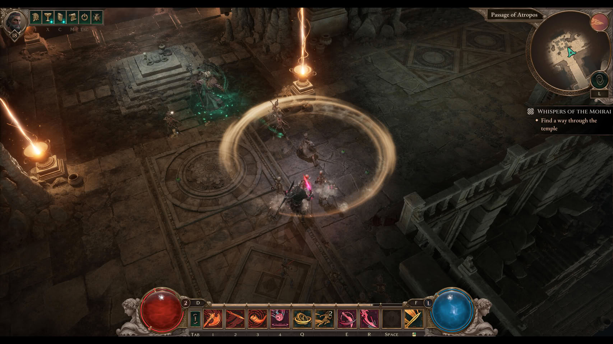
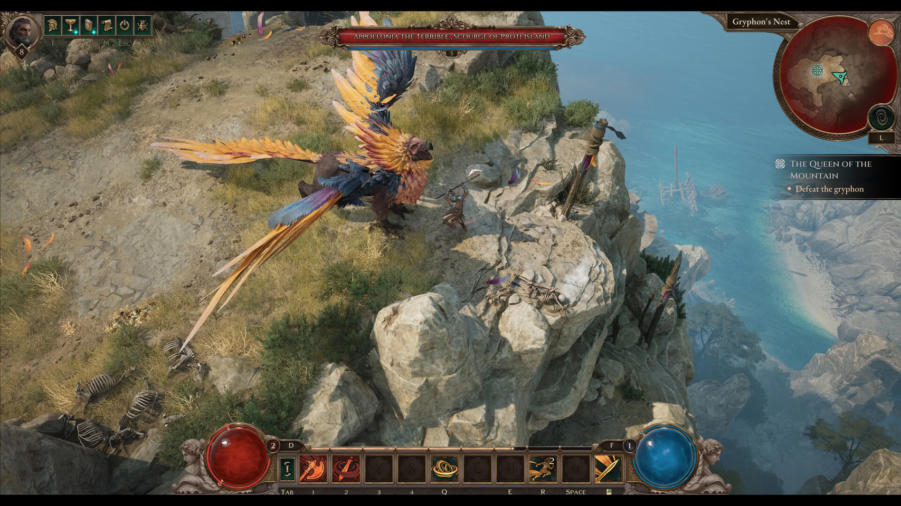
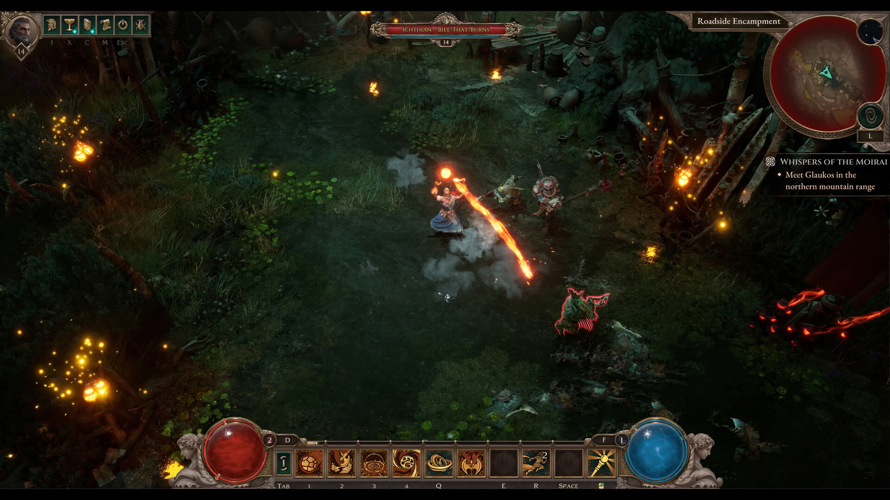

**Titan Quest II** ya tiene fecha de salida definitiva. El RPG de acción de Grimlore Games dejará atrás el acceso anticipado y lanzará su versión 1.0 el **19 de enero de 2027** en PC, PlayStation 5 y Xbox Series X/S. El anuncio lo ha confirmado THQ Nordic, que publica el juego, y llega después de aproximadamente año y medio de desarrollo abierto al público.

## Un RPG de acción con raíces en la mitología griega

Titan Quest II es un RPG de acción (ARPG) de perspectiva isométrica ambientado en la Grecia clásica y su mitología. El estudio responsable es Grimlore Games, un equipo alemán que ya trabajó en la saga SpellForce, y la publicación corre a cargo de THQ Nordic.

El pilar jugable que la propia desarrolladora destaca es su **sistema de maestrías**: el jugador combina varias escuelas de habilidad para construir un héroe propio en lugar de elegir una clase cerrada. Esa libertad para mezclar poderes, junto con el botín y la progresión típicos del género, es lo que da forma a la propuesta. En lo visual, el juego apuesta por escenarios de templos, costas y ruinas poblados de criaturas mitológicas, desde grifos a enemigos humanos.

## Qué cambia en Titan Quest II respecto al acceso anticipado

La versión 1.0 no es un simple cambio de etiqueta. Durante el acceso anticipado, Titan Quest II ha ido creciendo mediante actualizaciones que añadieron nuevas regiones, poderes y objetos. El lanzamiento oficial reúne todo ese material en una única entrega completa y, según el anuncio, incorpora contenido adicional que no había aparecido en las versiones previas del acceso anticipado.

En otras palabras: quien haya seguido el juego en fase abierta encontrará en enero la versión cerrada y definitiva, y quien no lo haya probado todavía podrá entrar directamente en el producto terminado, sin pasar por un desarrollo en curso.

## Precio, plataformas y qué llegará después

El precio de salida recomendado será de 49,99 dólares o euros en PC y de 59,99 dólares o euros en consolas. El estreno abarcará PC, PlayStation 5 y Xbox Series X/S, tres plataformas que reciben la versión 1.0 al mismo tiempo.

El soporte no termina con el lanzamiento: la desarrolladora ha adelantado que seguirá ampliando el juego después de 2027 con nuevas tierras, funciones y tramas. Para los próximos meses también se ha insinuado la llegada de reservas con bonificaciones, además de alguna criatura mítica y un tesoro oculto aún sin detallar. Conviene tratar esos apuntes como lo que son: avances sin confirmación de contenido.

El género de acción y rol vive un momento de reencuentros con el formato clásico. Otro ejemplo reciente es [Guild Wars 3, que también prepara su salto a consola con una interfaz rediseñada](/noticias/guild-wars-3-console-hud/), una tendencia que empuja a los ARPG a ampliar su público más allá del PC.

Quien quiera seguir el estreno de cerca puede añadir el juego a su lista de deseados, o bien unirse ahora al acceso anticipado para llegar a enero con parte del camino recorrido.
