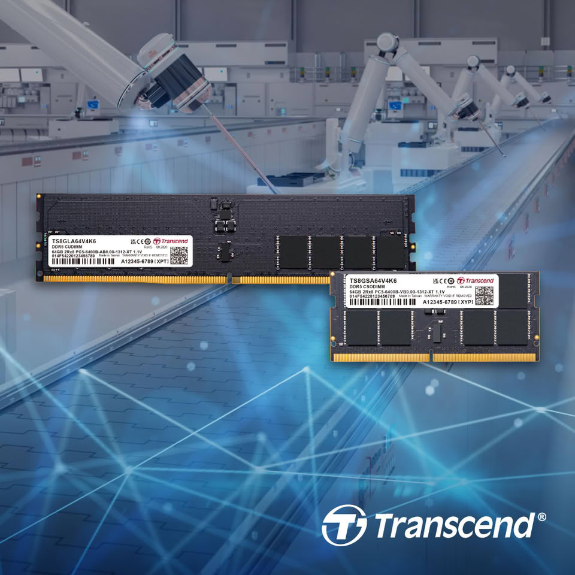

Transcend Information, fabricante especializado en soluciones de memoria y almacenamiento, ha presentado sus nuevos módulos de DRAM integrados DDR5-6400 en formato CUDIMM y CSODIMM. La novedad llega con capacidades de hasta 64 GB por módulo y está pensada para entornos exigentes como la IA en el borde, la fabricación inteligente, la automatización industrial y los sistemas embebidos de alto rendimiento.

La compañía describe el lanzamiento en una nota de prensa en la que destaca dos pilares técnicos de la generación DDR5: la arquitectura de doble canal y una tensión de funcionamiento reducida de 1,1 V. Sobre esa base, Transcend añade una serie de componentes orientados a la estabilidad y la fiabilidad que diferencian a estos módulos del catálogo de consumo.

## Hasta 64 GB por módulo para cargas industriales exigentes

Los módulos CUDIMM y CSODIMM DDR5-6400 de Transcend llegan con capacidades de hasta 64 GB por unidad, un salto relevante para ordenadores industriales, dispositivos de computación en el borde y sistemas embebidos que manejan grandes volúmenes de datos en tiempo real.

La arquitectura de doble canal de DDR5 mejora la eficiencia del acceso a los datos y el rendimiento de transferencia, mientras que la velocidad de 6.400 MT/s acelera los intercambios de información a gran escala y el procesamiento en tiempo real. En la práctica, esto se traduce en más ancho de banda y más capacidad para aplicaciones que no pueden permitirse cuellos de botella de memoria.

## Driver de reloj integrado para estabilizar la señal a alta velocidad

Uno de los puntos que Transcend subraya es la incorporación de un Client Clock Driver (CKD), un componente que amortigua y regenera las señales de reloj que envía el host. Su función es reducir la interferencia provocada por el ruido y el jitter durante el funcionamiento a alta velocidad, mejorando la integridad de la señal.

Este tipo de solución es especialmente relevante en plataformas industriales que operan de forma prolongada, con cargas pesadas y transferencias de datos de gran volumen, donde mantener una señal estable marca la diferencia entre un funcionamiento fiable y fallos intermitentes.

## Diseño de bajo voltaje y protección frente a fallos

El funcionamiento a 1,1 V contribuye a reducir el consumo y la generación de calor, una ventaja para equipos industriales con limitaciones de espacio, energía o refrigeración. Transcend integra además un circuito de gestión de energía (PMIC) que regula y distribuye la alimentación directamente sobre el módulo, mejorando la eficiencia y la precisión del control de voltaje.

La fiabilidad se refuerza con varios mecanismos de protección. El chip SPD incorpora un sensor de temperatura que permite supervisar la temperatura de la memoria en tiempo real, mientras que un supresor de tensión transitoria (TVS) protege los componentes frente a fluctuaciones de voltaje. A esto se suma el On-Die ECC, integrado en los propios chips DDR5, que detecta y corrige errores de un solo bit para preservar la integridad de los datos durante el funcionamiento prolongado.

Transcend desarrolla y fabrica estos módulos en Taiwán, con controles estrictos en diseño, fabricación y validación de calidad, y los respalda con una garantía limitada de por vida.

