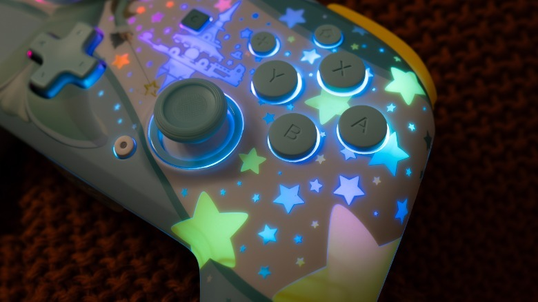

Engadget ha publicado su análisis del mando inalámbrico Turtle Beach Rematch para Nintendo Switch 2 y le otorga un 8 sobre 10. El veredicto destaca dos pilares: los diseños oficiales de Nintendo con iluminación RGB y unos sticks analógicos con tecnología TMR que, según la reseña, no desarrollan deriva con el uso.

El Rematch es un gamepad inalámbrico ligero con sticks descentrados al estilo del mando Pro de Switch 2, controles de movimiento integrados, botón dedicado para GameChat y botones traseros reasignables. La batería recargable ofrece hasta 40 horas de autonomía, que se reducen a 12 horas con los efectos RGB activados, y el alcance inalámbrico llega a los 30 pies (unos 9 metros).

## Sticks TMR sin deriva y un formato cómodo para manos pequeñas

El detalle técnico más relevante del análisis son los sticks con tecnología TMR (magnetorresistencia de túnel): precisos y, en teoría, inmunes a la deriva, un problema bien conocido en los mandos de Nintendo [que un técnico constató al desmontar más de mil Joy-Con 2](/noticias/joy-con-2-drift-teardown/). La reseña subraya que ni siquiera el mando Pro oficial de Switch 2 incluye esta tecnología.

La redactora lo probó con *Hello Kitty Island Adventure*, *Mario Kart World* y *Resident Evil Requiem* y lo describe como reactivo y de baja latencia. Pesa 0,79 libras (unos 358 gramos), tiene un tamaño comparable al Pro oficial y un agarre con textura rugosa frente a un frontal liso. Los botones frontales son de plástico duro con las letras grabadas, y los gatillos y topes resultan agradablemente táctiles. Para manos pequeñas, apunta, el formato fino y ligero evita calambres incluso tras varias horas seguidas de juego.

## Diseños oficiales del Rematch con iluminación RGB

El principal argumento de compra, según Engadget, es el apartado estético: el Rematch se vende en varios diseños con licencia oficial —Mario, la princesa Peach, Rosalina y K.K. Slider, entre otros— y la mayoría incluye efectos RGB con cuatro modos. La edición de Rosalina, con una cascada de estrellas iluminadas en turquesa y amarillo, es la que protagoniza el análisis.

El catálogo incluye las ediciones K.K. Slider, Timmy y Tommy, Rosalina, Mario Kart World, Koopa Troop, Mario y Luigi, además de Super Mario Jump y un modelo negro mate (Charcoal Black) sin iluminación para quienes prefieren un acabado sobrio. Existe también una variante especial de *Fortnite* (Kevin the Cube) por 70 dólares que incluye un gesto para el juego.

## Lo que falta: sin vibración y sin encendido de la consola

La reseña también señala tres renuncias claras. El Rematch no tiene vibración ni respuesta háptica, no puede encender la consola por sí solo y su carcasa produce un sonido hueco que algunos pueden percibir como barato, aunque a cambio resulta muy ligero.

En precio, el modelo estándar cuesta 65 dólares y suele encontrarse en oferta por 50 dólares o menos. Para el jugador español que busque un segundo mando con personalidad para Switch 2 —sobre todo para sesiones multijugador locales de *Mario Kart*—, el Rematch se presenta como una alternativa asequible al Pro oficial, siempre que la vibración no sea una prioridad.
