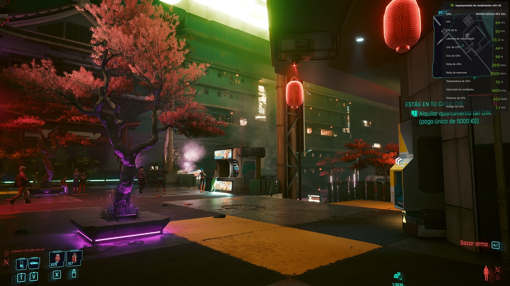
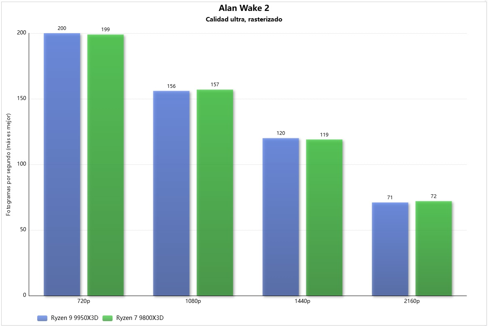
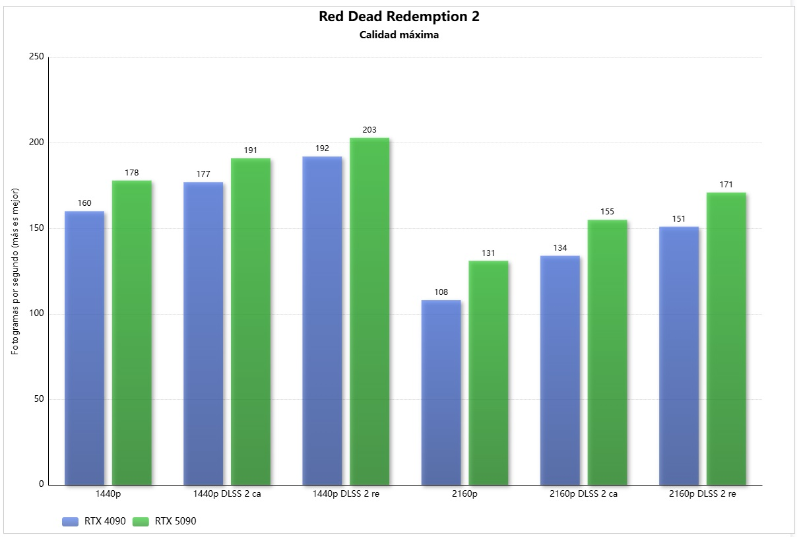
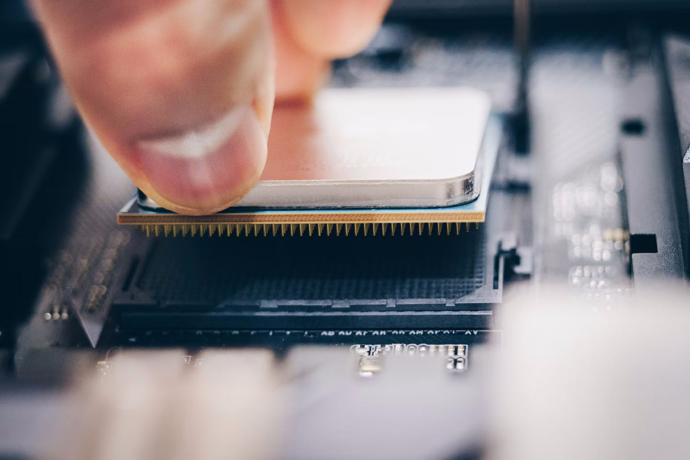
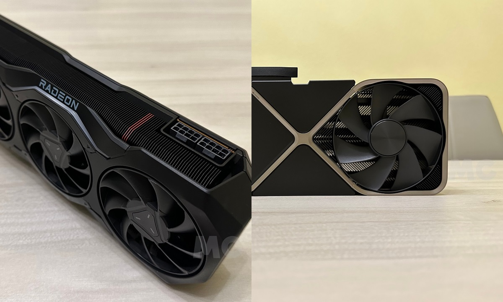
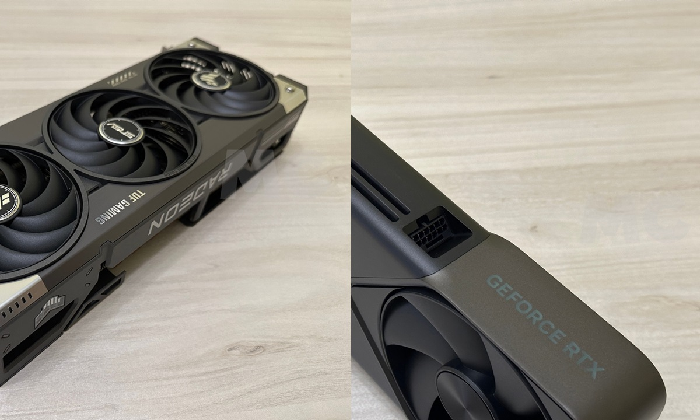
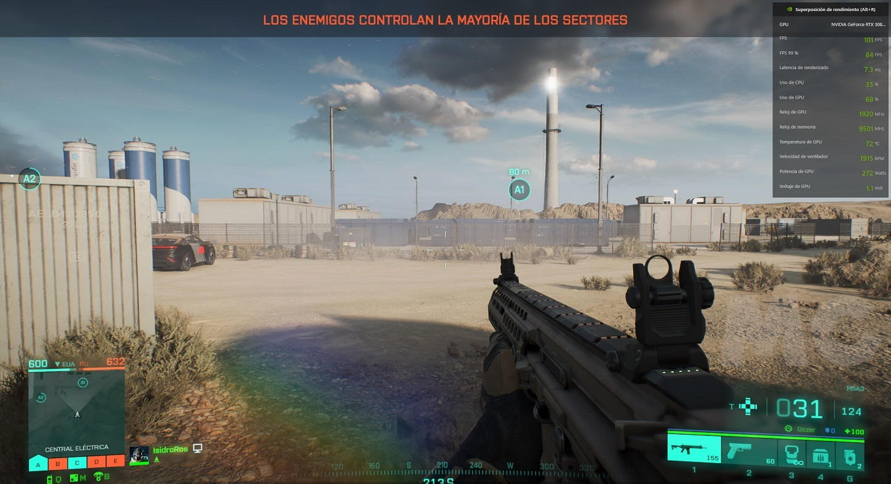

Montar o actualizar un PC no se limita a elegir la tarjeta gráfica más potente que
entre en el presupuesto. El procesador marca el techo de lo que esa GPU puede llegar a
dar, y una CPU que no le siga el ritmo deja sobre la mesa una parte importante del
rendimiento por el que has pagado. Esta guía explica, paso a paso, cómo detectar un
cuello de botella y qué procesador necesita cada tarjeta gráfica a día de hoy, con
recomendaciones para las generaciones de NVIDIA y AMD más recientes.

Está pensada para quien va a montar un equipo nuevo o a cambiar de gráfica y quiere
comprobar que ambos componentes están equilibrados. Si todavía estás decidiendo el
modelo, ten en cuenta que la elección de la tarjeta condiciona todo lo demás: en un PC
nuevo, [la RX 9070 XT es la única GPU que merece la pena comprar ahora mismo](/noticias/xda-one-gpu-worth-buying-right-now/).

## Requisitos previos

- Un PC con la tarjeta gráfica instalada, o el modelo concreto que piensas comprar.
- Conocer la **resolución** a la que juegas habitualmente.
- Una forma de **monitorizar el uso de CPU y GPU** mientras juegas, para poder leer las
  cifras de las que hablamos en el primer paso.

## Paso 1. Comprueba si tu procesador está limitando a la GPU

Un cuello de botella se produce cuando un componente acaba limitando el rendimiento de
otro. En este caso es el procesador el que lastra a la tarjeta gráfica porque no es
capaz de trabajar lo bastante rápido como para suministrarle todos los datos e
instrucciones que necesita, de modo que la GPU se queda con fases ociosas demasiado
largas y no desarrolla su máximo potencial.

Para saber si tienes un cuello de botella grave, mira las **tasas de uso**: se produce
cuando la CPU está muy alta y la GPU se queda por debajo del **85 %**. Hay además dos
grados menos severos:

- **Cuello de botella menos grave:** la CPU va a tope, pero la GPU se mantiene en torno
  al **90 %**.
- **Cuello de botella leve:** la GPU se mantiene al menos en el **95 %**.

En la imagen de Cyberpunk 2077 con una RTX 3090 Ti y un Ryzen 7 5800X, en 1440p con
trazado de rayos y DLSS en modo calidad, no se produce ningún cuello de botella: la
gráfica va al máximo.

Conviene recordar que también existen cuellos de botella **ocasionados por un bajo uso
de la CPU**, menos frecuentes, pero reales. Se deben normalmente a una pobre
optimización del juego, que no aprovecha bien un procesador con muchos núcleos e hilos
y acaba dependiendo más de su rendimiento monohilo.

## Paso 2. Ten en cuenta la resolución de pantalla

La resolución determina la carga de trabajo de la GPU y, por tanto, cuánto pesa la CPU
en el resultado. A menor resolución, menos carga asume la gráfica y **mayor peso tiene
el rendimiento del procesador**; a la inversa, cuanto más alta es la resolución, menos
depende del procesador.

Estos son los píxeles que se manejan en cada nivel:

| Resolución | Píxeles |
| --- | --- |
| 720p (HD) | 921.600 |
| 1080p (FHD) | 2.073.600 |
| 1440p (QHD) | 3.686.400 |
| 2160p (UHD) | 8.294.400 |

El efecto es fácil de ver con un caso concreto: un Core i5-10400F puede hacer un enorme
cuello de botella a una RTX 4090 en 1080p, y con una RTX 5090 lo tendrás incluso en
1440p. Sin embargo, ese cuello de botella **se reduce muchísimo en 4K**, porque la GPU
tiene que trabajar con cuatro veces más píxeles y no necesita que la CPU vaya tan
rápido.

Un buen ejemplo de escalado es Alan Wake 2, un título tan exigente que tiene una
dependencia enorme de la GPU y puede escalar con una RTX 5090 incluso al pasar de 720p a
1080p, sin cuello de botella grave ni siquiera en 720p.

## Paso 3. Valora la calidad gráfica y el trazado de rayos

Los ajustes gráficos afectan directamente a la relación de dependencia entre GPU y CPU.
Bajar la calidad hace que la tarjeta asuma menos trabajo y **aumenta el peso del
procesador**; subirla hace lo contrario. Activar el **trazado de rayos** incrementa
enormemente la carga de la GPU y reduce el peso de la CPU, hasta el punto de eliminar
cuellos de botella a nivel de procesador incluso en resoluciones bajas.

Un ejemplo claro es Quake 2 RTX, capaz de poner de rodillas a cualquier GPU actual con
una dependencia mínima de la CPU. Ocurre porque el trazado de rayos añade una carga
extrema para la tarjeta, que además se intensifica al aumentar la resolución.

En el lado opuesto está la optimización. En Batman Arkham Knight sí aparece un cuello de
botella importante en 1440p con una RTX 3090 Ti y un Ryzen 7 5800X, pero se debe a cómo
está optimizado el juego.

Por eso no es raro que las reviews de procesadores en juegos se midan en **720p y
calidad baja**: se fuerza una reducción de carga gráfica tan grande que es el
procesador el que acaba marcando la diferencia.

## Paso 4. Considera el reescalado y la generación de fotogramas

Activar tecnologías como **NVIDIA DLSS, Intel XeSS o AMD FSR** reduce la resolución a la
que se renderiza cada fotograma y, con ello, la carga gráfica. El efecto secundario es
que **aumenta el peso del procesador** y puede aparecer un cuello de botella. Por
ejemplo, un juego en 4K con DLSS en modo rendimiento se renderiza en 1080p y luego se
reescala, así que no trabaja con la misma cantidad de píxeles que en 4K nativo.

En la gráfica se ve cómo mejora el rendimiento al reescalar desde una resolución
inferior: cuanto más alta es la resolución base, mayor es la mejora. En 1440p, DLSS 2 en
modo rendimiento da 25 FPS más; en 2160p, 40 FPS más.

Dos advertencias importantes:

- **No bajes de ciertas resoluciones.** Aunque bajar la resolución mejora el rendimiento,
  el procesador gana peso y en resoluciones muy bajas se genera un cuello de botella
  enorme, así que no compensa.
- Por eso NVIDIA, AMD e Intel **no van más allá de los modos ultra rendimiento**, que
  solo se recomiendan para reescalar a resoluciones muy elevadas. Ese modo renderiza un
  **33 % de los píxeles**; algunos juegos permiten bajar más, pero no es nada
  recomendable por la pérdida de nitidez y el cuello de botella que provoca.

Para seguir mejorando la fluidez sin ese problema se ha extendido la **generación de
fotogramas**, que no depende del procesador: los fotogramas se generan en la GPU a
partir de información de fotogramas previos y se intercalan entre los renderizados de
forma tradicional.

## Paso 5. Consulta el mínimo recomendado para tu tarjeta gráfica

Llegamos al núcleo de la guía. Las recomendaciones que siguen son un **mínimo general**
para evitar un cuello de botella grave incluso en 1080p, dando por hecho que la meta es
jugar con calidad máxima. Ten presente que hay juegos que, por una simple cuestión de
optimización, pueden acabar sufriendo cuello de botella incluso en una configuración de
gama alta.

### Tarjetas gráficas GeForce GTX 10, Radeon RX Vega y anteriores

Con estas generaciones es complicado encontrar un cuello de botella a nivel de CPU salvo
que el procesador sea muy antiguo:

- **GTX 970, GTX 1060, Radeon R9 390 y RX 580:** a partir de un **Ryzen 5 1500X o un
  Core i7-4770** se mueven sin problemas y siguen ofreciendo un rendimiento aceptable en
  1080p.
- **GTX 1080, GTX 1080 Ti, Radeon RX Vega 56 y 64 y Radeon VII:** el mínimo recomendable
  sube a un **Ryzen 5 2500X o un Core i7-6700**.
- **GTX 600, GTX 700 y Radeon HD 7000:** basta un **Core i5-2500 o un Ryzen 3 1200**,
  aunque son tarjetas obsoletas y sin soporte, con un rendimiento pobre en juegos
  actuales.

### GeForce RTX 20 y Radeon RX 5000

Todavía ofrecen un buen nivel de rendimiento, sobre todo en las gamas altas, y piden un
procesador bastante potente para desarrollar todo su potencial:

- **RTX 2060, RTX 2060 Super y RTX 2070:** al menos un **Ryzen 3 3100 o un Core i3-10100**.
- **Radeon RX 5600 XT, RX 5700 y RX 5700 XT:** igual que las anteriores, un **Ryzen 3 3100
  o un Core i3-10100**.
- **RTX 2070 Super, RTX 2080, RTX 2080 Super y RTX 2080 Ti:** un **Ryzen 5 3600 o un Core
  i7-8700** evita el cuello de botella grave. Para la RTX 2080 Ti, lo ideal es un **Ryzen 5
  5600 o un Core i5-11600K**.

### GeForce RTX 30 y Radeon RX 6000

Aquí hay un salto importante en potencia bruta, y eso obliga a subir el listón del
procesador:

- **RTX 3050 de 6 GB y Radeon RX 6500 XT:** son de gama baja, así que a partir de un
  **Ryzen 5 2500X o un Core i7-6700** hay más que suficiente.
- **RTX 3050 de 8 GB y Radeon RX 6600:** con un **Ryzen 3 3100 o un Core i3-10100** no
  habrá cuello de botella grave; si juegas en 1080p con DLSS o FSR activados, mejor un
  **Ryzen 5 3600 o un Core i7-8700**.
- **RTX 3060, RTX 3060 Ti, RX 6600 XT, RX 6650 XT y RX 6700:** el salto de potencia es
  importante, así que conviene al menos un **Ryzen 5 3600 o un Core i7-8700**. En 1080p
  con DLSS o FSR, los compañeros ideales son un **Ryzen 5 5600 o un Core i5-11600K**.
- **RTX 3070, RTX 3070 Ti, RTX 3080, RX 6700 XT, RX 6800 y RX 6800 XT:** a partir de un
  **Ryzen 5 5600 o un Core i5-11600K** no habrá cuello de botella grave, ni siquiera en
  1080p.
- **RTX 3080 Ti, RTX 3090, RTX 3090 Ti y RX 6900 XT-6950 XT:** también un **Ryzen 5 5600
  o un Core i5-11600K** para evitar cuellos de botella, aunque lo ideal es un **Ryzen 5
  7600 o un Core i5-12600K**.

### GeForce RTX 40 y Radeon RX 7000

Estas generaciones sentaron un nuevo techo de rendimiento. La RTX 4090 sigue siendo tan
potente que incluso en 4K puede mostrar cierto cuello de botella con procesadores que
antes se apañaban bien en la gama alta:

- **RTX 4060 y Radeon RX 7600, RX 7600 XT:** a partir de un **Ryzen 5 3600 o un Core
  i7-8700** no habrá cuello de botella grave. Con DLSS o FSR, es recomendable un **Ryzen 5
  5600 o un Core i5-11600K**.
- **RTX 4060 Ti y Radeon RX 7700 XT:** en la RTX 4060 Ti basta un **Ryzen 5 3600 o un
  Core i7-8700**; en la RX 7700 XT conviene un **Ryzen 5 5600 o un Core i5-11600K**.
- **RTX 4070 y Radeon RX 7800 XT:** rinden de forma similar a una RTX 3080, así que basta
  un **Ryzen 5 5600 o un Core i5-11600K**.
- **RTX 4070 SUPER, RTX 4070 Ti, RX 7900 GRE y RX 7900 XT:** al nivel de una RTX 3090 o
  3090 Ti, piden un **Ryzen 5 5600 o un Core i5-11600K**, aunque lo ideal es un **Ryzen 5
  7600 o un Core i5-12600K**, sobre todo por debajo de 4K.
- **RTX 4070 Ti SUPER, RTX 4080, RTX 4080 SUPER y RX 7900 XTX:** en 4K basta un **Ryzen 5
  5600X o un Core i5-12400F**, pero al activar DLSS o FSR, o al jugar por debajo de 4K,
  hace falta un **Ryzen 7 7700X o un Core i5-13600K**.
- **RTX 4090:** a partir de un **Ryzen 7 7700X o un Core i5-13600K** no hay cuellos de
  botella graves en 4K. Con DLSS o a menos de 4K conviene un **Ryzen 7 7800X3D o un Intel
  Core Ultra 7 270K Plus**.

### GeForce RTX 50 y Radeon RX 9000

Son las generaciones más avanzadas y actuales de NVIDIA y AMD. AMD cubre gama de
entrada, media y alta con la RX 9070 XT, mientras que NVIDIA ha lanzado un nuevo tope de
gama, la **RTX 5090**, la tarjeta más potente del mercado de consumo ([la RTX 5070 ya es
la GPU más popular de Steam](/noticias/tarjetas-graficas/rtx-5070-gpu-mas-popular-steam/)):

- **Radeon RX 9050:** disponible con 4 GB de VRAM y bus de 64 bits o con 8 GB y bus de
  128 bits; la segunda rinde entre un 20 % y un 30 % más y equivale casi a una RX 6600,
  así que un **Ryzen 5 3600 o un Core i7-8700** van sobrados.
- **Radeon RX 9060:** rinde como una RX 6700 XT cuando no la limitan sus 8 GB. Con un
  **Ryzen 5 3600 o un Core i7-8700** ya va bien; con un **Ryzen 5 5600 o un Core i5-11600K**
  no habrá cuello de botella.
- **Radeon RX 9060 XT:** las versiones de 8 GB y 16 GB rinden igual y están a la altura de
  una RX 7700 XT, así que desde un **Ryzen 5 5600 o un Core i5-11600K** no hay cuello de
  botella.
- **Radeon RX 9070 GRE:** rinde por encima de una RTX 5060 Ti y por debajo de una RTX 5070.
  Con un **Ryzen 5 5600 o un Core i5-11600K** no hay cuello de botella grave; para el
  óptimo, un **Ryzen 5 5600X o un Core i5-12400F**.
- **Radeon RX 9070:** algo por encima de una RTX 4070 Ti y de una RTX 5070 en rasterización.
  Mínimo un **Ryzen 5 5600 o un Core i5-11600K**, e ideal un **Ryzen 5 7600 o un Core
  i5-12600K** para menos de 4K o reescalado.
- **Radeon RX 9070 XT:** rinde menos que una RTX 5070 Ti y algo más que una RTX 3090 Ti.
  Al menos un **Ryzen 5 5600X o un Core i5-12400F**, e ideal un **Ryzen 7 7700X o un Core
  i5-13600K**.
- **GeForce RTX 5050:** gama de entrada, rinde algo menos que una RX 7600 y una RTX 4060.
  Con un **Ryzen 5 3600 o un Core i7-8700** va bien.
- **GeForce RTX 5060:** entrada a la gama media con buen rendimiento en 1080p. Mínimo un
  **Ryzen 5 3600 o un Core i7-8700**, e ideal un **Ryzen 5 5600 o un Core i5-11600K**.
- **GeForce RTX 5060 Ti:** en versiones de 8 GB y 16 GB que rinden igual cuando la memoria
  no limita. Recomendado un **Ryzen 5 5600 o un Core i5-11600K**.
- **GeForce RTX 5070:** rinde casi como una RTX 4070 Ti. Al menos un **Ryzen 5 5600 o un
  Core i5-11600K**; para menos de 4K o reescalado, un **Ryzen 5 7600X o un Core i5-12600K**.
- **GeForce RTX 5070 Ti:** rinde prácticamente como una RTX 4080. Mínimo un **Ryzen 5 5600X
  o un Core i5-12400F**, e ideal un **Ryzen 5 7600X o un Core i5-12600K**.
- **GeForce RTX 5080:** la tercera más potente, solo por detrás de la RTX 5090 y la RTX
  4090. Necesita un **Ryzen 5 7600 o un Core i5-12600K**, e ideal un **Ryzen 7 7700X o un
  Core i5-13600K**.
- **GeForce RTX 5090:** la más potente del mercado. Pide un **Intel Core Ultra 5 250K Plus
  o un Ryzen 7 9700X** para evitar cuellos de botella graves, e ideal un **Ryzen 7 7800X3D**;
  lo más cercano de Intel sería el **Core Ultra 7 270K Plus**.

## Paso 6. Prioriza IPC, frecuencia y caché L3 sobre el número de núcleos

La mayoría de los juegos actuales solo escalan bien en procesadores de **seis núcleos y
doce hilos**. Algunos empiezan a aprovechar los ocho núcleos, pero no es la norma. Un
procesador con más de ocho núcleos y dieciséis hilos no marcará una diferencia en juegos
porque no están optimizados para aprovecharlo. Lo que sí marca una diferencia grande es
el **IPC**, las **frecuencias de trabajo** y la **caché L3**.

Un ejemplo lo deja claro: entre un Ryzen 7 2700X (8 núcleos y 16 hilos con bajo IPC) y
un Ryzen 5 5600 (6 núcleos y 12 hilos con mayor IPC), el segundo es la mejor opción para
jugar sin dudarlo. Por el peso de la caché L3, un Ryzen 7 7800X3D también es mejor
opción que un Intel Core i9-13900K. Eso sí, no hay que menospreciar la cantidad de
núcleos: los procesadores de 4 núcleos y 8 hilos ya dan problemas en cada vez más
juegos, y lo ideal es una configuración mínima de **6 núcleos y 12 hilos**. Los de 8
núcleos y 16 hilos o más solo tienen sentido si juegas y haces otras cosas en segundo
plano, como hacer streaming.

El lanzamiento de los **Intel Core Ultra 200S Plus** ha cambiado el panorama: el Core
Ultra 5 250K Plus es de lo mejor dentro de su rango de precios, y el Core Ultra 7 270K
Plus es muy recomendable si el PC se usa para algo más que jugar.

## Cómo verificar que funcionó

Abre un juego exigente en la resolución y la calidad que uses habitualmente y observa
las tasas de uso mientras juegas:

- Si la **GPU se mantiene en el 95 % o más** y la CPU no está al límite, la pareja está
  equilibrada.
- Si la **GPU se queda por debajo del 85 %** con la CPU muy alta, el procesador sigue
  limitando a la gráfica y toca subir de CPU (o bajar de resolución, ajustes o
  reescalado, con las salvedades de los pasos 2, 3 y 4).

## Advertencias y limitaciones

- Estas recomendaciones son un **mínimo general para 1080p y calidad máxima**. Cuanto
  más bajen la resolución o la calidad, o cuanto más se use reescalado, más peso tendrá
  la CPU y más exigente será el mínimo real.
- Existen cuellos de botella por **bajo uso de la CPU** (juegos poco optimizados para
  varios núcleos), pero son menos frecuentes que los provocados por una CPU lenta.
- Algunos juegos hacen cuello de botella incluso en equipos de gama alta por una mala
  optimización. En esos casos no hay nada que puedas hacer por tu parte.
- No conviene bajar demasiado la resolución "para ganar rendimiento": en resoluciones muy
  bajas el cuello de botella se dispara y el resultado empeora.
