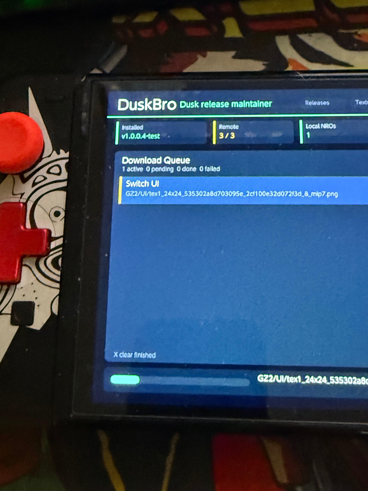
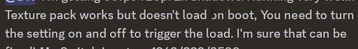

Desde el pasado 12 de mayo, el foro **GBAtemp** mantiene abierto el hilo *Dusk for switch (TLoZ Twilight Princess port)*, dedicado a **Dusk**, el port no oficial de **The Legend of Zelda: Twilight Princess** a **Nintendo Switch**. El mensaje de apertura, firmado por el usuario josete2k, apunta a las descargas públicas de la versión `1.0.0.4-test` y avisa ya en la primera línea de que la consola «necesita algo de overclock». La conversación acumula 95 respuestas y más de 21.000 visitas, con usuarios de media docena de países probando el ejecutable en consolas concretas.

## Qué es Dusk, la reimplementación de Twilight Princess

Dusk no es una copia del juego de Nintendo ni una emulación: es una **reimplementación por ingeniería inversa** que vuelve a construir la aventura a partir de su código, tal y como describe la documentación del propio proyecto, que lleva el nombre de Dusklight. De ahí que la primera condición de uso sea que **el proyecto no distribuye ningún material con copyright**: quien quiera probarlo tiene que aportar su propia copia del juego original.

Solo se admiten, comprobados por su hash SHA-1, los volcados de las versiones de GameCube de Estados Unidos y de Europa; las demás están pendientes de soporte. El repositorio reconoce su deuda con la descompilación de *Twilight Princess* (zeldaret/tp), con la comunidad de descompilación de GameCube y Wii y con el motor Aurora, sobre el que se apoya.

El enlace que abre el hilo apunta al repositorio `givethesourceplox/dusk`, hoy renombrado como `dusklight-NX`, un port específico para la consola de Nintendo.

## Qué necesita la Switch para ejecutar Dusk

La instalación sigue el circuito habitual del homebrew de la consola: descargar el archivo `.nro` desde la página de releases, copiarlo en la carpeta `switch/` de la tarjeta SD, arrancarlo desde el cargador de homebrew que se esté usando y, en el primer arranque, seleccionar el volcado del juego. A partir de ahí, el botón de juego.

El propio repositorio advierte de dos límites que conviene tener presentes. El primero: como mínimo se necesita una GPU con soporte de D3D12, Vulkan o Metal. El segundo: **en Nintendo Switch el rendimiento y la compatibilidad pueden variar según el hardware y la versión del sistema**, algo que se nota mucho en un parque instalado tan heterogéneo como el de la Switch original.

Las fotos que ilustran el hilo muestran además *DuskBro*, una utilidad firmada por StonedModder que se presenta como «Dusk release maintainer» y que descarga tanto las últimas versiones del port como los paquetes de texturas, sin tener que ir a buscarlos a mano en el navegador.

Quien prefiera el camino oficial de la consola encontrará el ecosistema homebrew de la Switch en plena forma: [Atmosphere 1.12.0 ya funciona con el firmware 23.0.0 de Nintendo Switch](/noticias/atmosphere-1-12-firmware-23/).

## Rendimiento medido y problemas aún abiertos

Los números que circulan por el hilo son de usuarios, no del desarrollador, y varían bastante según la resolución y el overclock. Un probador con una Switch V1 de la familia Mariko informa de **540p en portátil con relojes de fábrica y los 30 fps estables**. Otro usuario detalla el escalonado completo: entre 15 y 60 fps a 720p sin overclock; 30 fps fijos a 540p con la tasa de refresco bloqueada; 60 fps a 360p con un overclock ligero; y 60 fps mayoritariamente estables a 480p con overclock completo y la GPU a 768 MHz enchufada a la corriente.

Los fallos también están descritos con detalle. Varios participantes refieren pantallas negras al entrar o salir de zonas —pueblos y caminos, concretamente— sin que el error siempre se reproduzca. Otro usuario cree haber encontrado la causa de algunos cierres abruptos: arrancar el programa desde el menú de homebrew en modo applet. Además, hay opciones que existen en la versión para PC y todavía no aparecen en la de Switch, como el remapeo de botones, el eje Y invertido o la cámara en primera persona.

Las texturas HD funcionan, pero cuestan caras: el propio desarrollador resume el problema con una frase, «a la Switch no le hace demasiada gracia». El directorio de sustitución es `sdcard/dusk/texture_replacement/GZ2`, y una captura de Discord compartida en el hilo recuerda que el pack **no se carga al arrancar**: hay que activar y desactivar la opción para forzar su carga.

## Qué queda por delante tras la llegada de Dusklight 2.0

El repositorio del port para Switch publicó su última release, `v1.4.1.0-test`, el 20 de junio de 2026. En el repositorio principal, en cambio, el proyecto no se ha detenido: la versión 2.0.0 llegó el 19 de septiembre y la 2.0.2 el 25 de septiembre de 2026.

Ese salto ya se ha dejado notar en el hilo. A mediados de septiembre se compartió allí otro port para Switch construido sobre la nueva base, que usa Vulkan mediante NXVK y que, en su propio hilo, promete 720p a 30 fps con relojes de fábrica y el doble de rendimiento que el port anterior. Los usuarios todavía están cruzando impresiones sobre si compensa saltar de una versión a otra: el cambio de generación trae mejoras, pero también dudas sobre la ubicación del volcado y sobre la compatibilidad con mods.

Conviene cerrar con la idea que recorre todo el hilo: esto es un port comunitario, ajeno a Nintendo y ajeno a cualquier lanzamiento oficial, que solo funciona si cada jugador aporta su propia copia del juego. Hubo quien pidió un archivo NSP en el hilo, y otro participante le respondió sin rodeos que eso es piratería y que no se pide en el sitio. Para el lector hispanohablante, el contexto es el mismo que en otros ports de la consola, como [Cemu-nx, que lleva el emulador de Wii U a Nintendo Switch](/noticias/cemu-wii-u-switch-port/): software libre o abierto por delante, y el material original siempre por cuenta del usuario. Que la franja Zelda esté tan viva también encaja con [el 40.º aniversario de la saga que Nintendo celebró en septiembre](/noticias/zelda-40-aniversario/).
