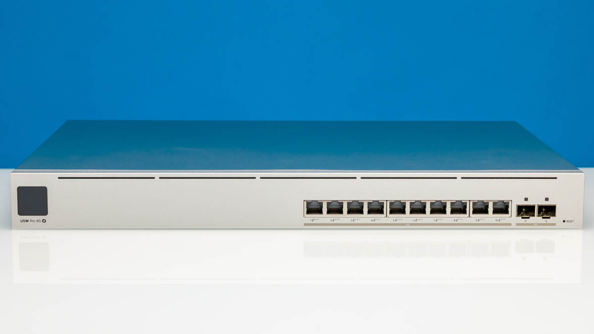
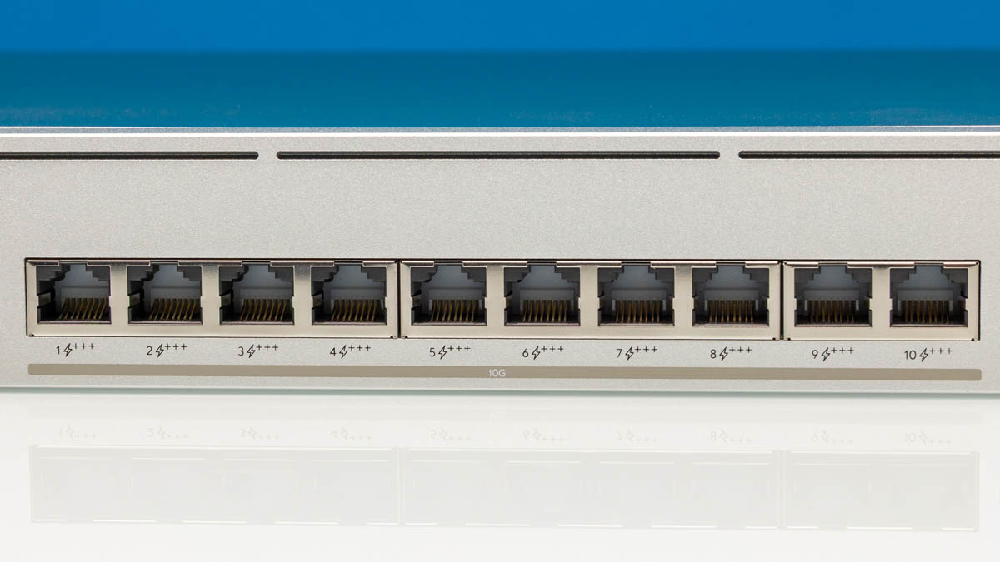
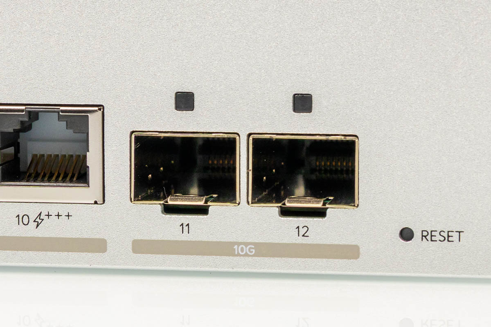
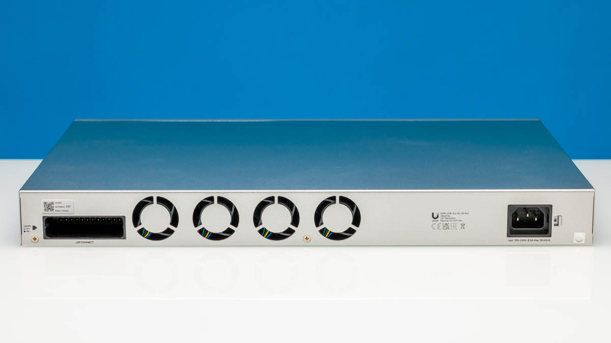
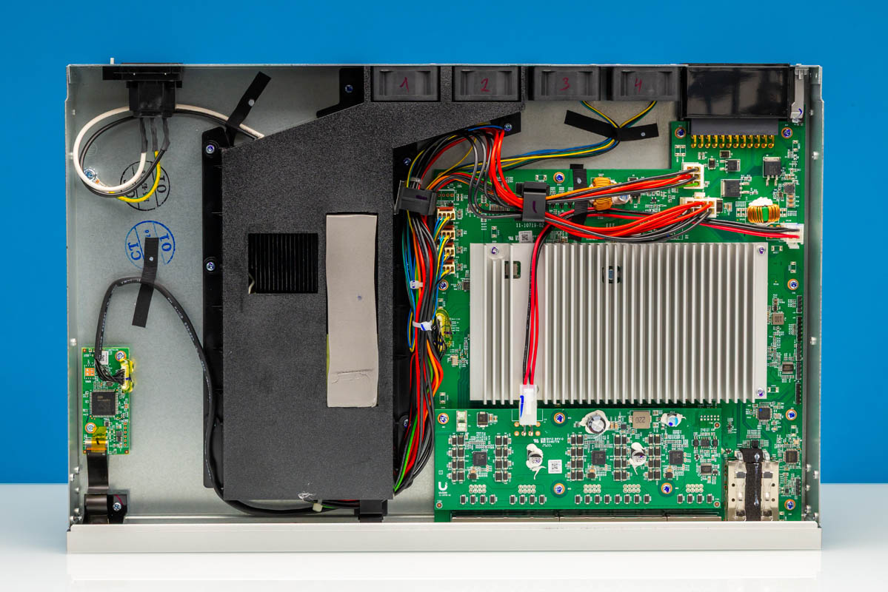
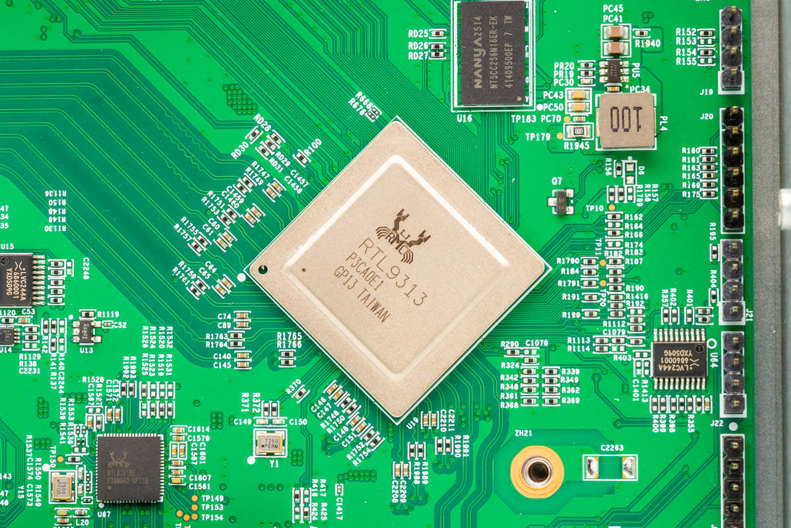
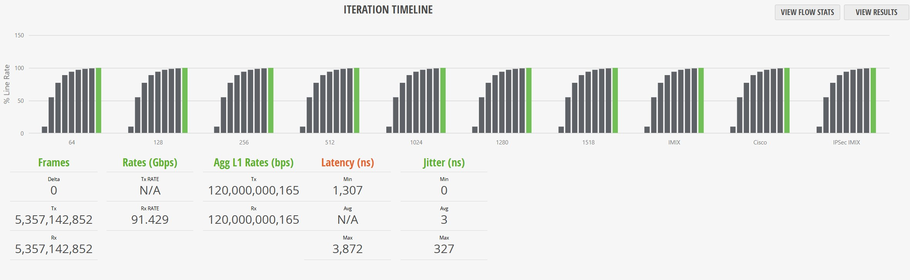
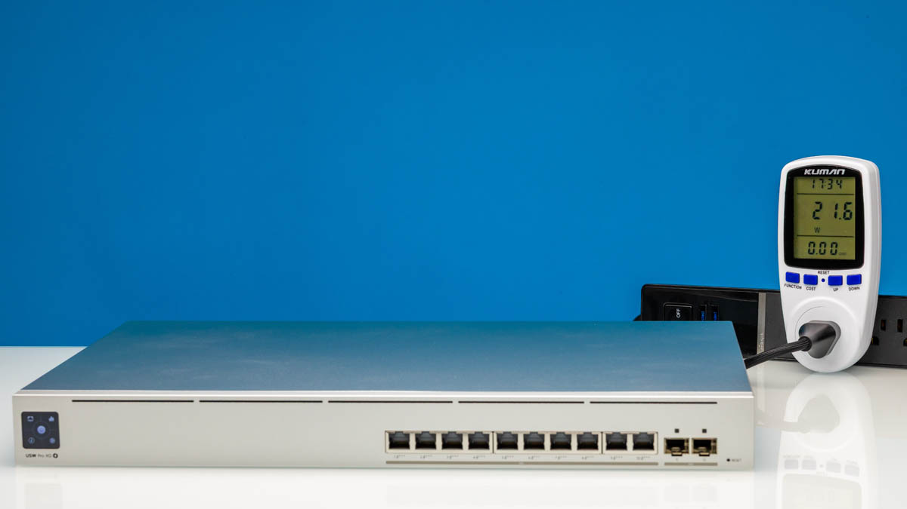
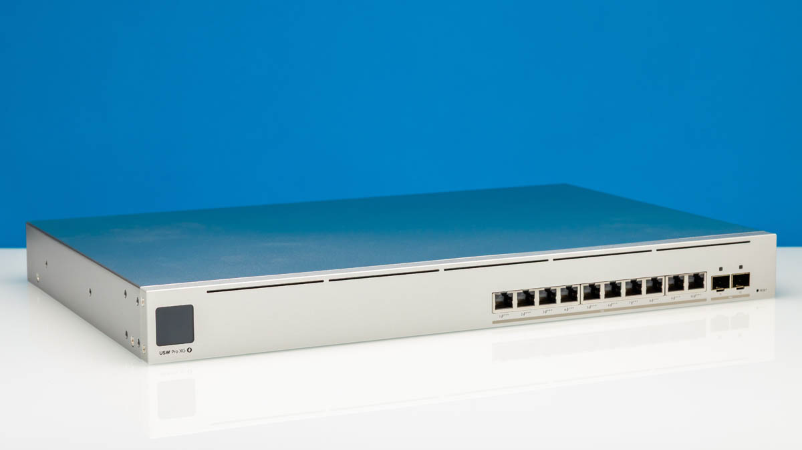

Ubiquiti sigue ampliando su catálogo de conmutadores UniFi y su última incorporación apunta directamente a quien quiere pasar su red local al 10 GbE sin renunciar al suministro por Ethernet. El USW-Pro-XG-10-PoE, analizado por ServeTheHome, se vende por 699 dólares y llega como una evolución del USW-Pro-XG-8-PoE de 499 dólares: más puertos, más potencia PoE y un formato de rack de 1U que cambia por completo la propuesta respecto al modelo pequeño.

El medio estadounidense compró la unidad para su análisis y la sitúa como una de las opciones más completas para quien ya vive dentro del ecosistema UniFi. La pregunta que sobrevuela toda la review es si esos 200 dólares de diferencia frente al modelo de ocho puertos están justificados.

## Un 1U con doce puertos y PoE+++ de 400 W

A diferencia del USW-Pro-XG-8-PoE, que tenía un formato de sobremesa, este modelo adopta un chasis de 1U con orejas de rack incluidas y orificios de montaje a ambos lados. En el frontal encontramos una pantalla táctil de 1,3 pulgadas con gestión AR y Etherlighting, la iluminación configurable de los puertos que Ubiquiti popularizó en sus switches.

La conectividad es el punto central: diez puertos 10Gbase-T compatibles con PoE+++ y dos puertos SFP+ de 10 Gbps. Aunque Ubiquiti lo comercializa como un switch de diez puertos, en la práctica son doce, un matiz que el análisis subraya. El PoE+++ cumple con 802.3bt Type 4 Clase 8 y, según la review, el equipo maneja un presupuesto total de 400 W, una cifra poco habitual en este segmento de precio.

En la parte trasera hay cuatro ventiladores, la entrada de corriente alterna, un conector de alimentación DC para engancharlo a las soluciones de energía de Ubiquiti y un pequeño seguro para el cable de corriente. El paquete incluye tuercas de jaula, tornillos para las orejas de rack y patas de goma por si se prefiere montarlo sobre la mesa.

## Realtek por dentro y rendimiento a velocidad de línea

Al abrir el chasis, ServeTheHome identifica el chip de conmutación Realtek RTL9313, el mismo que ya usaba el modelo de ocho puertos y que también aparece en switches de bajo coste como el Sodola SL-SWTGW2C48NS de 205 dólares. Lo acompañan dos PHY Realtek RTL8264B y dos RTL8261BE, además de un GigaDevice GD32F470 con núcleo Arm que se encarga de la pantalla frontal. La fuente de alimentación interna es más grande de lo habitual en switches de 12 puertos precisamente por el presupuesto PoE+++.

El rendimiento, medido con un Keysight XGS2 y el software IxNetwork, alcanza el 100 % de la velocidad de línea L1: 120 Gbps repartidos entre los doce puertos de 10 Gbps y sin pérdida de tramas. Con paquetes de 64 bytes la cifra útil ronda los 92,4 Gbps por el sobrecoste de cabeceras, mientras que con tramas de 1518 bytes supera los 118 Gbps. Los perfiles IMIX, Cisco IMIX e IPSec IMIX se comportan de forma similar, con una latencia y un jitter muy parecidos a los del USW-Pro-XG-8-PoE.

En consumo, el switch arranca en 21,6 W en reposo, suma 1,7 W con un único puerto 10Gbase-T conectado y 1,4 W adicionales al añadir un adaptador SFP+ a 10Gbase-T. Las pruebas con el Fluke LinkIQ-Duo y el MicroScanner PoE confirman la entrega PoE+++ y validan los enlaces a 2,5 y 5 GbE.

## Luces y sombras: ¿merece la pena el desembolso?

El veredicto del análisis es matizado. Por 699 dólares, un switch de doce puertos basado en un chip Realtek no sería una gran compra por sí solo: la review recuerda que ese tipo de silicio es el que se encuentra en conmutadores gestionados por web de 200 a 300 dólares. El valor real, sostiene, está en los detalles de Ubiquiti —la integración con UniFi, la pantalla de estado, el Etherlighting, la segunda entrada DC— y, sobre todo, en el PoE+++.

ServeTheHome reconoce que los 200 dólares de sobreprecio frente al modelo de ocho puertos parecen elevados, pero los justifica al recordar que hablamos de un switch PoE+++ de 400 W: "699 dólares por un PoE+++ de 400 W es una pasada". Su recomendación es clara: quien tenga uno o dos dispositivos PoE de bajo consumo y vaya a usar pocos puertos encontrará mejor compra el modelo de 8+2 por 499 dólares; quien necesite mucha potencia y 10 GbE en todos los puertos encontrará bien invertidos esos 200 dólares extra.

## Qué significa para el comprador hispanohablante

El USW-Pro-XG-10-PoE refleja una tendencia que interesa especialmente a los homelabs y a las pequeñas oficinas: el 10 GbE y el PoE de alta potencia han dejado de ser coto exclusivo del equipamiento empresarial. Puntos de acceso Wi-Fi 7, cámaras con funciones avanzadas o estaciones de trabajo con almacenamiento en red se benefician de un único conmutador capaz de alimentarlos y de darles ancho de banda de sobra.

La letra pequeña está en el chip. Que Ubiquiti recurra a Realtek mantiene el precio a raya, pero también significa que buena parte de lo que se paga no es el hardware de conmutación, sino el ecosistema de software y gestión. Para quien ya tiene dispositivos UniFi, esa integración es un argumento sólido; para quien busque solo prestaciones puras de red, conviene comparar con alternativas basadas en Marvell antes de decidir. La conclusión de la review es que, dentro del ecosistema de Ubiquiti, el salto al modelo de doce puertos está justificado, siempre que el presupuesto PoE sea realmente necesario.
