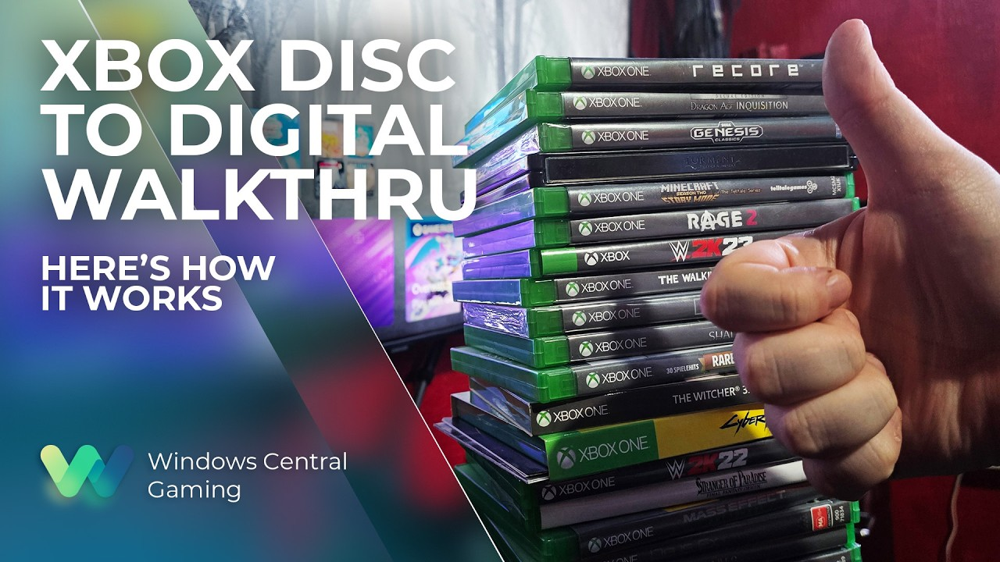

Ubisoft ha activado sus juegos en el programa *disc-to-digital* de Xbox, la iniciativa con la que Microsoft permite convertir una copia física en una licencia digital vinculada a la cuenta del jugador. La entrada de la compañía francesa llega después de que varios medios señalaran su ausencia en las pruebas y pone fin, al menos de momento, a una de las críticas más repetidas contra el sistema.

El programa, que arrancó en fase de testeo la semana anterior, ya reúne más de 1.000 juegos compatibles. Según recoge Windows Central, la lista de títulos de Ubisoft disponibles para los probadores de Xbox Insider incluye nombres como *Far Cry Primal*, *Far Cry 4*, *Trials Fusion* y varias entregas de *Assassin's Creed*, entre muchos otros.

## Cómo funciona la conversión

El mecanismo es sencillo para el usuario: basta con insertar un disco compatible en una Xbox One o una Xbox Series X para que la consola asocie la licencia digital a la cuenta. A partir de ahí, el juego se puede instalar, descargar, transmitir desde la nube y aprovechar el soporte de Xbox Play Anywhere sin necesidad de volver a usar el disco.

El detalle más interesante es que el disco no queda inutilizado tras la conversión. Si el jugador lo vende o lo regala, el siguiente propietario puede obtener su propia licencia digital, y las partidas guardadas en la nube se conservan. En la práctica, esto convierte la copia física en una llave reutilizable en lugar de un soporte de un solo uso.

## El giro de Ubisoft y la letra pequeña

La polémica estalló cuando algunos medios publicaron titulares que acusaban a Ubisoft —y a otros editores— de boicotear el sistema. El argumento tenía cierto recorrido: la compañía francesa arrastra un historial delicado en materia de preservación, con el cierre de *The Crew* y otros títulos que alimentaron las reclamaciones por los derechos digitales. Negar la conversión de discos ya vendidos encajaba con esa imagen.

Sin embargo, Microsoft nunca presentó esta fase como el alcance definitivo del programa. Muchos editores, entre ellos SEGA, Square Enix y Bandai Namco, seguían revisando contratos y detalles legales antes de dar el paso, algo habitual en cualquier corporación de gran tamaño. La reacción contra Ubisoft parece haber sido, cuando menos, precipitada.

Windows Central apunta además que Square Enix podría sumarse pronto, dado su respaldo a iniciativas de Xbox como Play Anywhere y el juego en la nube. Otros editores estarían ultimando los flecos antes de comprometerse.

## Por qué importa

Más allá del catálogo concreto, el movimiento tiene una lectura estratégica. El *disc-to-digital* fue esbozado en 2013 como parte de la Xbox One y se presentó tan mal entonces que acabó enterrado por la reacción del público. Rescatarlo ahora, con un mercado mucho más acostumbrado a lo digital, es una forma de reconocer que el jugador quiere conservar lo que compró sin renunciar a las ventajas de las licencias digitales.

El contraste con la competencia es inevitable. PlayStation ya ha confirmado que dejará de fabricar discos de juegos hacia 2028, mientras que Xbox mantiene abierta la duda de si conservará el soporte físico en su próxima consola, conocida por ahora como Project Helix. Si el programa termina de consolidarse, Microsoft podría presentar la preservación como su principal diferencia frente a Sony.

Queda por ver hasta qué punto llega el catálogo y cuántos editores grandes se animan a participar. Por ahora, la incorporación de Ubisoft desactiva el argumento más incómodo de las últimas semanas y devuelve el foco a lo que de verdad importa al jugador: que sus discos sigan sirviendo de algo.
