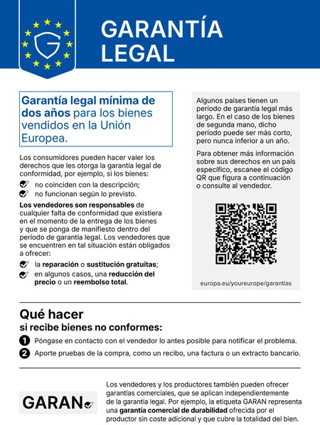
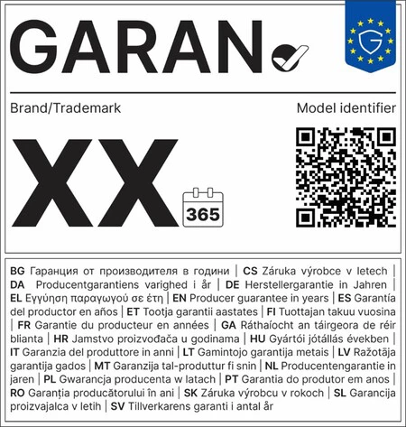

Quien renueve el móvil a partir del próximo domingo 27 de septiembre se encontrará con algo nuevo en la tienda. Ese día empieza a aplicarse el Reglamento de Ejecución (UE) 2025/1960, que obliga a los comercios a exhibir un aviso armonizado sobre la garantía legal y habilita la etiqueta europea GARAN para señalar los dispositivos con garantía comercial de durabilidad. La medida se enmarca en la Directiva (UE) 2024/825, conocida como directiva de empoderamiento de los consumidores para la transición ecológica.

## Un cartel obligatorio en toda la UE

El aviso sobre la garantía legal deja de ser opcional. Tanto las tiendas físicas como las online deben mostrarlo de forma visible: en el comercio de calle, impreso en un formato no inferior a A4 y colocado en la pared o junto al mostrador; en la tienda electrónica, en color y como recordatorio antes de cerrar el pedido. El documento incorpora un código QR que enlaza con información sobre garantías en el idioma del comprador y recuerda que todos los bienes vendidos en la Unión Europea cuentan con al menos dos años de garantía legal. En España ese mínimo es mayor: tres años para los productos nuevos.

El aviso también resume qué se puede exigir. Si un producto presenta un defecto o no es conforme con lo pactado, el consumidor tiene derecho, sin coste, a su reparación o sustitución durante el periodo de garantía. Solo cuando esas soluciones no son posibles o resultan desproporcionadas cabe pedir una reducción del precio o resolver el contrato con el correspondiente reembolso.

## La etiqueta GARAN, en años y sin coste

Junto al aviso debuta la etiqueta GARAN, que no es obligatoria para todos los teléfonos, sino para quienes ofrezcan una garantía comercial de durabilidad que supere la legal. Para poder lucirla, el fabricante debe cubrir la totalidad del producto, extender la cobertura más allá del mínimo legal y ofrecerla sin ningún coste adicional para el comprador. La etiqueta se expresa en años e implica un compromiso concreto: si el dispositivo deja de mantener las funciones y el rendimiento esperados en un uso normal dentro de ese plazo, la marca debe repararlo o sustituirlo gratis.

Si una garantía solo cubre una parte del aparato, como la batería, la etiqueta queda descartada para ese producto. El fabricante puede colocarla en el propio dispositivo o en su embalaje, y el vendedor debe mostrarla con claridad cuando disponga de la información.

## Qué cambia al comprar un móvil

La norma no amplía por sí sola los plazos de garantía ni concede derechos que antes no existieran. Lo que hace es sacarlos a la luz y evitar confusiones: el aviso aclara qué cubre la ley y la etiqueta GARAN permite comparar qué marcas se comprometen a mantener la durabilidad de un modelo concreto durante más tiempo. En ese sentido, la garantía legal deja de poder presentarse como un extra exclusivo del producto, porque es un derecho que ya ampara a cualquier compra.

La iniciativa se suma a otras piezas del ecosistema europeo de consumo, como la etiqueta energética para móviles y tabletas, obligatoria desde junio de 2025, o el futuro pasaporte digital de producto. Para el comprador, la recomendación es sencilla: mirar el aviso de garantía en la tienda, escanear su código QR si hay dudas y comprobar los años que indica la etiqueta GARAN cuando una marca presuma de durabilidad. Tener claros esos derechos resulta especialmente útil cuando algo sale mal, como ocurrió en el caso de [la falsificación de un Ryzen 7 9800X3D cuyo reembolso fue denegado](/noticias/fake-9800x3d-official-store/).
