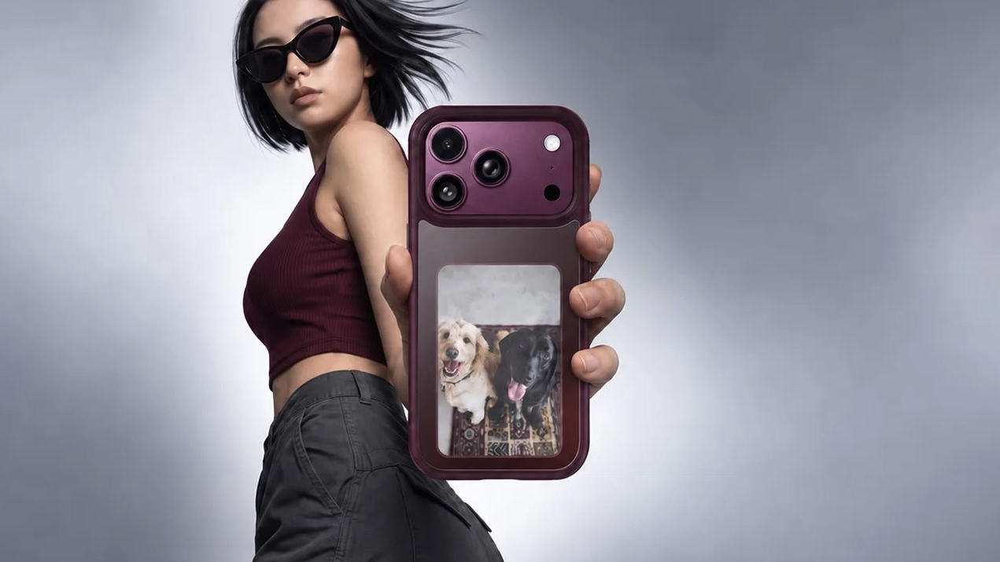
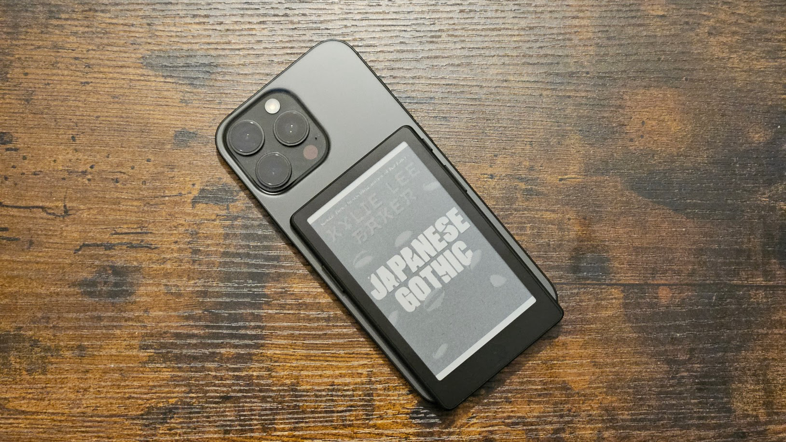

Ugreen ha anunciado una funda para el iPhone 18 Pro que incorpora una pantalla E Ink en color en su parte trasera. El accesorio, bautizado como Magic E Ink Screen Case, se presentó a través del canal de Weibo de la compañía y, según la información publicada hasta ahora, está pensado para mostrar fotografías, no para leer libros electrónicos ni para replicar widgets del sistema.

## Una segunda pantalla que apunta a las fotos

El concepto de añadir una pantalla a la espalda del teléfono no es nuevo, pero Ugreen lo enfoca hacia un uso concreto: la fotografía. La funda combina la protección habitual de una carcasa con una pantalla de tinta electrónica en color a la que se pueden sincronizar imágenes, de modo que funcionaría como un marco de fotos permanente en la parte trasera del dispositivo.

La propuesta se distancia de otros accesorios de tinta electrónica con pantalla secundaria, que suelen centrarse en la lectura de libros o en mostrar información del sistema. Ugreen no ha detallado la resolución de la pantalla, el método de sincronización ni si habrá una aplicación específica para gestionar las imágenes.

En cuanto a compatibilidad, el anuncio cubre los modelos iPhone 18 Pro y iPhone 18 Pro Max. La compañía tampoco ha confirmado el precio ni la fecha de lanzamiento: por el momento, el producto se ha presentado únicamente para el mercado chino, por lo que no está claro si llegará a otros países.

## La opinión de TechRadar: útil, pero con dudas sobre la calidad de imagen

El medio que dio a conocer el anuncio, TechRadar, firma el análisis como impresión personal de su redactor James Rogerson. Su valoración es escéptica respecto al apartado visual: recuerda que las imágenes y, sobre todo, el color en las pantallas de tinta electrónica dejan bastante que desear, incluso en productos de gama alta como el Kindle Colorsoft, que ofrece tonos apagados. En su opinión, accesorios anteriores enfocados a mostrar imágenes, como los imanes de nevera con E Ink de VidaBay, reproducen la mayoría de las fotos con poca calidad.

El autor compara la funda con el Xteink X4 Pro, un lector de tinta electrónica que él mismo lleva adherido a la parte trasera de su iPhone y que TechRadar describe como un dispositivo de 99 dólares. A su juicio, ese formato sí tiene sentido para leer libros en una pantalla cómoda para la vista, aunque renuncia al color y no sería adecuado para fotos.

Pese a las reservas, Rogerson no descarta el accesorio: señala que podría sorprenderle y que, si el precio fuera competitivo, resultaría más atractivo que una funda convencional.

## Qué cambia para el comprador

Para el usuario hispanohablante, la principal pregunta sigue sin respuesta: cuánto costará y cuándo, si acaso, se podrá comprar fuera de China. Hasta que Ugreen publique esos datos, la Magic E Ink Screen Case es una propuesta de nicho que apela a quienes quieren personalizar la parte trasera del teléfono con fotos, pero que arrastra la limitación conocida de la tinta electrónica en color: una reproducción cromática discreta en comparación con una pantalla convencional.

Conviene tratar la información con la cautela habitual ante un anuncio sin precio ni disponibilidad: lo confirmado es el concepto, la compatibilidad con los dos modelos iPhone 18 Pro y el carácter fotográfico de la pantalla. El resto está por ver.
