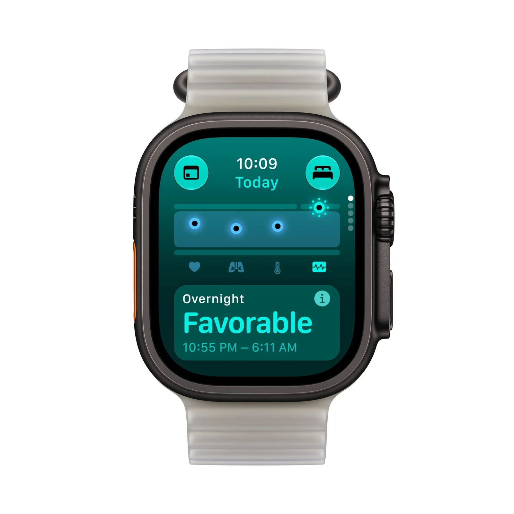
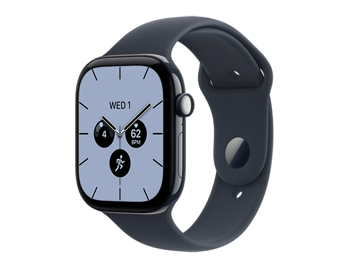

El Apple Watch Ultra 4 y el Apple Watch Series 12 comparten chip S11, sistema de sensores de salud, aplicación de readiness e inteligencia de audio, según la comparativa publicada por the5krunner. No hay diferencias de software ni de funciones de salud entre ambos: la decisión de compra se juega entera en el hardware, y para la mayoría de los compradores se reduce a tres factores: batería, resistencia y tamaño.

## Ultra 4 y Series 12: el mismo reloj por dentro, dos relojes por fuera

La comparativa constata que los dos modelos ofrecen idéntico seguimiento de salud y entrenamiento, con 64 GB de almacenamiento y las mismas funciones de ECG, oxígeno en sangre y temperatura cutánea. Todo lo que los separa está en la ficha técnica del hardware.

El Ultra 4 monta una caja de titanio de 49 mm con cristal de zafiro y 3000 nits de brillo, frente a las cajas de 42 o 46 mm del Series 12 en aluminio, titanio o cerámica, con 2000 nits. El modelo base de aluminio usa Ceramic Shield 2 en lugar de zafiro. En autonomía, el Ultra 4 ofrece hasta 50 horas de uso normal y 18 horas de GPS con modos extendidos de 25 y 45 horas, mientras que el Series 12 se queda en 24 horas y 10 horas de GPS sin modos extendidos. Una carga de 15 minutos rinde 18 horas en el Ultra 4 y 12 horas en el Series 12.

Hay cuatro funciones exclusivas del Ultra 4 que el software no puede llevar al Series 12: mensajes SOS y bidireccionales por satélite, certificación de buceo EN13319 hasta 40 metros, GPS de doble frecuencia L1+L5 y el botón de acción físico. El Series 12, en cambio, es el único de los dos que cabe en muñecas pequeñas: pesa bastante menos de la mitad que el Ultra 4, que según datos de Apple recogidos por la prensa especializada ronda los 63 gramos frente a los 39,5 del Series 12 de aluminio de 46 mm.

## Por qué importa: la brecha de precio es menor de lo que parece

El Ultra 4 parte de 799 dólares (899 euros) y el Series 12 de 399 dólares (449 euros), cifras confirmadas por medios como The Verge tras la presentación de Apple. Pero la comparativa advierte de que esos 400 dólares de diferencia son engañosos: el modelo de 399 dólares es de aluminio con GPS sin conexión móvil, y la versión comparable al Ultra 4 cuesta mucho más.

El aluminio se raya con el uso normal, mientras que el titanio y el zafiro aguantan hasta la renovación, según la experiencia de uso prolongado del autor. El Series 12 de titanio parte de 699 dólares y la versión de cerámica de 46 mm con móvil alcanza los 949, de modo que en el tramo resistente el Series 12 iguala o supera el precio del Ultra 4 con menos batería, menor tamaño y sin satélite. A eso se suma que el Ultra 4 incluye conexión móvil en todos los modelos y en el Series 12 base cuesta unos 100 dólares extra. La prensa internacional coincide en el diagnóstico: WIRED señala que la distancia entre ambos se estrecha cada año y PCMag y Tom's Guide han publicado sus propias comparativas con la misma conclusión.

## Qué cambia para el lector: cuál comprar según el uso

La recomendación de la comparativa es directa. El Ultra 4 es la elección para quien entrena o compite más de 10 horas seguidas, no quiere cargar cada noche, necesita el satélite o el buceo, o busca durabilidad de titanio y zafiro sin pagar el precio del Series 12 de gama alta. El Series 12 conviene a quien entrena menos de 10 horas por sesión, acepta la carga nocturna y prefiere una caja más pequeña, con el consejo de optar por el titanio en lugar del aluminio para evitar un reemplazo de pantalla en un par de años.

Quien dude entre el Ultra 4 y un reloj de Garmin puede ampliar con [la comparativa entre el Garmin Fenix 9 y el Apple Watch Ultra 4](/noticias/garmin-fenix-9-ultra-4-cual-comprar/). La atribución de los datos de esta comparativa corresponde a the5krunner, medio especializado en tecnología de resistencia que ha probado ambos modelos.
