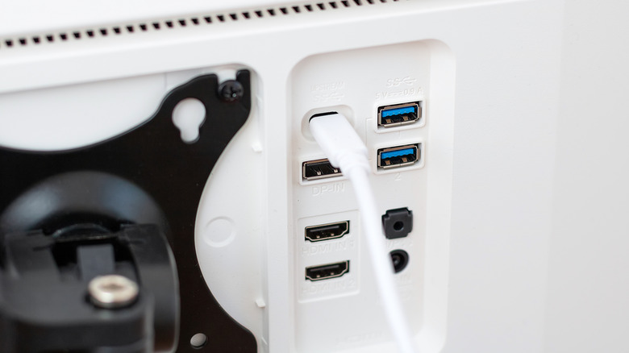
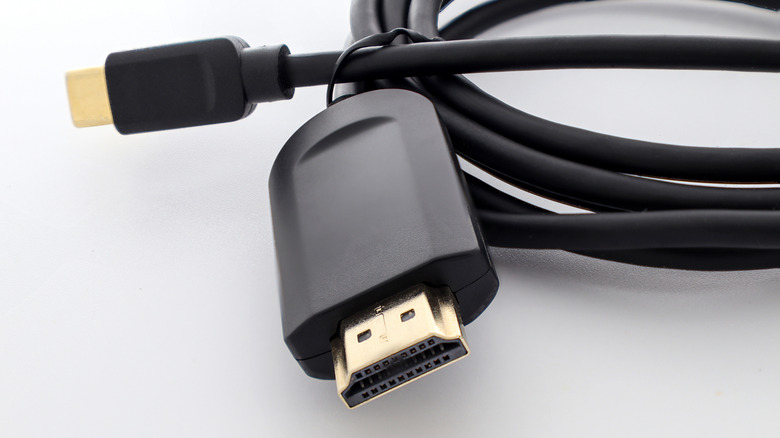

Desde su llegada en 2014, el USB-C se ha convertido en el conector principal de portátiles, móviles, tabletas y mandos de consola. La promesa es simple: un solo cable para casi todo. El problema es que no todos los puertos ni todos los cables USB-C son iguales, aunque compartan el mismo conector. Algunos pueden transportar una señal de vídeo y otros solo sirven para cargar el dispositivo.

Esta guía es para cualquiera que quiera conectar un monitor, un televisor o un proyector por USB-C y no sepa de antemano si funcionará. La respuesta no está en el aspecto del puerto, sino en las especificaciones del producto.

## Qué necesitás para comprobarlo

- El equipo del que quieres sacar la imagen (portátil, móvil, tableta o consola).
- El monitor, televisor o proyector de destino.
- El cable USB-C que piensas usar.
- Acceso al manual o a la ficha técnica de cada componente, aunque a veces basta con mirar los iconos del propio puerto.

## Paso 1: comprobá si el puerto admite DisplayPort Alternate Mode

La forma más fiable de saber si una instalación USB-C puede transmitir vídeo es verificar si soporta **DisplayPort Alternate Mode** (DP Alt Mode). Este modo, integrado en muchos accesorios USB-C, permite que el cable transporte señales de vídeo mediante el protocolo DisplayPort, la misma interfaz digital que se usa en monitores y PC de sobremesa, capaz de altas resoluciones y frecuencias de refresco elevadas. Con DP Alt Mode, un único cable puede llevar datos y señal audiovisual a la vez.

Un detalle crítico: DP Alt Mode exige que **las tres piezas** sean compatibles, es decir, el dispositivo de origen, la pantalla de destino y el cable que los une. Si una sola falla, no hay vídeo.

## Paso 2: buscá pistas físicas en el equipo

Conocer de antemano la compatibilidad no siempre es fácil, pero muchos fabricantes dejan pistas en el propio chasis:

- El **icono del rayo** junto a un puerto USB-C indica que es Thunderbolt.
- A veces aparece un **icono de DP** al lado del puerto para señalar que admite DP Alt Mode.

Si no encuentras ninguna marca visible, el siguiente paso es la documentación.

## Paso 3: revisá el manual o las especificaciones oficiales

Cuando el equipo y el cable no muestran ninguna pista, hay que ir al manual o buscar la ficha técnica del producto en línea. Ahí es donde se confirma si el puerto soporta DisplayPort Alternate Mode.

## Paso 4: verificá el estándar de conexión

El estándar del puerto también da pistas, aunque con matices:

- **USB 3.1 y USB 3.2**: pueden soportar DP Alt Mode, pero depende del fabricante.
- **USB4**: obliga a incluir soporte de DP Alt Mode, con transferencia de energía y vídeo integradas.
- **Thunderbolt 3, 4 y 5** (siempre sobre USB-C y marcados con el icono del rayo): ofrecen datos de alta velocidad y vídeo, incluido DP Alt Mode. Thunderbolt 3 es similar a USB4; Thunderbolt 4 y 5 añaden mejoras de rendimiento que permiten alimentar varios monitores con mejores frecuencias y resoluciones.
- Generaciones **antiguas** del estándar USB: en general no soportan DP Alt Mode.

## Cómo interpretar el resultado

Si el equipo, la pantalla y el cable son compatibles con DP Alt Mode, un solo cable USB-C debería bastar para llevar imagen y datos. Si el puerto no lo admite, no habrá señal de vídeo por más que el conector encaje: el problema no es el cable, sino la falta de esa función en el puerto.

## Si tu puerto USB-C no da vídeo, estas son las alternativas

- **Usar HDMI**: si el equipo tiene salida HDMI, un cable HDMI compatible con el dispositivo y la pantalla resuelve la salida. Los cables HDMI modernos suelen admitir hasta 8K y alto rango dinámico, así que el resultado puede ser comparable al de USB-C. Para las resoluciones y frecuencias más altas conviene al menos HDMI 2.0, y HDMI 2.1 o posterior en instalaciones modernas.
- **Adaptadores activos**: si la pantalla no tiene entrada HDMI, un adaptador activo puede generar salida HDMI desde un puerto USB que de otro modo no podría. Eso sí, dependen de software interno y ancho de banda, por lo que añaden sobrecarga y no son la mejor opción para jugadores ni para quien busque resoluciones o frecuencias muy altas.
- **Adaptadores pasivos**: los hubs USB-C con puerto HDMI o los cables USB-C a HDMI **no funcionan** si el equipo no soporta DP Alt Mode. Son adaptadores normales, no activos, y no crean una capacidad que el puerto no tiene.
- **Alternativas inalámbricas**: AirPlay o Miracast permiten enviar la imagen a un televisor o monitor sin cables, como último recurso.

## Limitaciones que conviene tener presentes

El conector USB-C dice muy poco por sí solo: la compatibilidad de vídeo depende del puerto, del cable y de la pantalla, y hay que confirmarla en cada caso. Antes de comprar un cable o un adaptador, verifica en la ficha técnica que el puerto admite DisplayPort Alternate Mode; de lo contrario, estarás gastando en una solución que no puede funcionar. Y si necesitas muchas pantallas o frecuencias altas, el estándar del puerto marca la diferencia: USB4 y Thunderbolt nacen con esa función integrada, mientras que en USB 3.1 y 3.2 queda en manos del fabricante.
