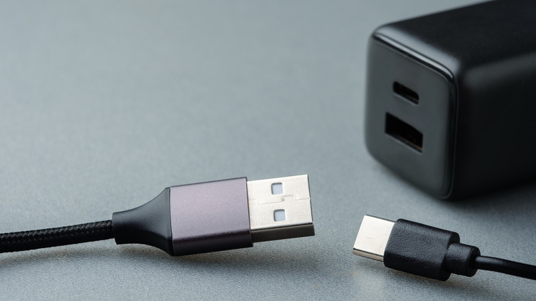

Un adaptador de USB-A a USB-C parece un accesorio trivial: una pieza pequeña con un conector USB-A macho en un extremo y un puerto USB-C hembra en el otro. El problema es que no todos rinden igual. Elegir mal puede traducirse en transferencias de archivos lentas, cargas interminables o, en el peor de los casos, un puerto dañado.

Esta guía está pensada para quien tiene un portátil o un equipo con puertos USB-A y necesita conectar dispositivos y cables USB-C: cargar auriculares, ratones o wearables, o mover datos desde una unidad externa. El caso típico es el de un portátil con un solo puerto USB-C, que se reserva para cargar el propio equipo, mientras que el resto de periféricos debe pasar por un puerto USB-A. Lo mismo ocurre con cargadores de pared antiguos o con el coche, que siguen ofreciendo puertos USB-A.

Antes de comprar conviene entender qué diferencias hay entre adaptadores y cuáles importan según el uso previsto. Si lo que necesitas es otra comprobación, la de si un puerto USB-C concreto puede dar salida de vídeo, lo tienes en la guía sobre [cómo saber si tus puertos USB-C admiten salida de vídeo](/noticias/usb-c-video-output-check/).

## Qué debes saber antes de comprar

No basta con fijarse en el precio ni en el aspecto del adaptador. Dos unidades casi idénticas pueden comportarse de forma muy distinta según tres factores:

- La especificación USB que soportan.
- La potencia que son capaces de entregar.
- La calidad de los componentes internos.

Además, hay dos datos que conviene comprobar de antemano:

- **La generación del puerto USB de tu equipo.** Si el ordenador es antiguo y solo tiene USB 2.0, un adaptador de generación más nueva no aumentará la velocidad de transferencia.
- **Para qué vas a usar el adaptador.** No es lo mismo alimentar un ratón o un teclado que conectar un disco externo o una memoria flash.

## Pasos para elegir el adaptador adecuado

### 1. Comprueba la generación del puerto de tu equipo

El primer paso es identificar qué versión de USB tiene el puerto donde vas a enchufar el adaptador. Ese puerto marca el techo real de rendimiento: si es USB 2.0, ningún adaptador posterior podrá superar sus límites.

### 2. Define el uso principal: datos o carga

Antes de mirar modelos, decide si el adaptador será para transferir archivos o para alimentar dispositivos. Un adaptador USB 2.0 básico es suficiente para periféricos de bajo consumo, pero si vas a conectar un disco externo o una memoria flash conviene optar por USB 3.0. De lo contrario, el tope de 480 Mbps del USB 2.0 hará que las copias se eternicen.

### 3. Elige la especificación USB que necesitas

La versión de USB que figura en el envase indica a la vez la velocidad de datos y la capacidad de carga. La diferencia entre generaciones es grande y conviene tenerla a mano:

| Especificación | Velocidad de datos | Potencia |
| --- | --- | --- |
| USB 2.0 | Hasta 480 Mbps | 5 V / 0,5 A (unos 2,5 W), hasta 7,5 W con cargador de pared |
| USB 3.0 | Hasta 5 Gbps | Hasta 12–15 W con cargador de pared dedicado |
| USB 3.2 Gen 2 | Hasta 10 Gbps | Hasta 12–15 W con cargador de pared dedicado |

El USB 3.0 multiplica por diez la velocidad del USB 2.0, y el USB 3.2 Gen 2 la vuelve a duplicar. Para un adaptador de bajo consumo, un USB 2.0 puede bastar; para datos, cuanto más alta sea la especificación, mejor.

### 4. Ajusta tus expectativas de carga

Aquí está el malentendido más habitual. El adaptador no crea potencia de la nada: se enchufa a un puerto USB-A, y ese puerto impone su propio límite. El USB-A de un portátil suele quedarse alrededor de los 7,5 W, mientras que un cargador de pared USB-A dedicado puede llegar a los 12–15 W.

Eso significa que un teléfono cargado a través de este adaptador irá lento, aunque uses el mismo cable que con un cargador rápido. El adaptador es perfecto para wearables, auriculares y periféricos, y solo deberías recurrir a él para cargar el móvil cuando no tengas ninguna otra opción.

### 5. Prioriza marca, certificaciones y protecciones

La marca importa tanto como las especificaciones. Los adaptadores baratos y sin certificar pueden no regular bien la potencia, lo que genera riesgo de sobrecalentamiento o de dañar el puerto de carga con el tiempo.

Al elegir, busca fabricantes con trayectoria, comprueba que tengan certificaciones de seguridad como UL o CE y valora funciones extra como la protección contra sobretensión. Ahorrar unos euros en un adaptador sin marca puede salir mucho más caro si hay que reparar un puerto del portátil.

## Cómo verificar que elegiste bien

Con el adaptador en casa, hay varias comprobaciones sencillas para confirmar que la elección fue la correcta:

- **Velocidad de datos:** copia un archivo grande desde o hacia el dispositivo conectado y observa si el tiempo de transferencia es coherente con la especificación del adaptador y del puerto.
- **Comportamiento de carga:** conecta un dispositivo de bajo consumo y comprueba que carga de forma estable, sin cortes y sin calentamiento anómalo.
- **Certificaciones y protecciones:** revisa que el producto incluya las certificaciones de seguridad anunciadas y la protección contra sobretensión.
- **Estabilidad del puerto:** tras varios usos, verifica que ni el conector ni el puerto del equipo se calienten en exceso.

## Advertencias y limitaciones

- **El adaptador nunca supera al puerto.** La velocidad y la potencia reales las fija el USB-A al que se conecta, no el adaptador.
- **La carga de teléfonos será lenta.** Es el precio de usar un puerto USB-A en lugar de un cargador rápido USB-C.
- **USB 2.0 tiene un tope de 480 Mbps.** Para discos y memorias, esa cifra se nota.
- **Los adaptadores sin certificar son un riesgo.** Pueden calentarse o dañar el puerto de carga, y la reparación cuesta más que un buen adaptador.
