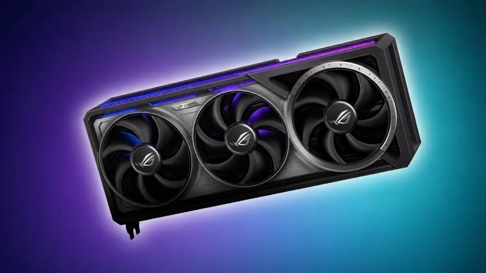
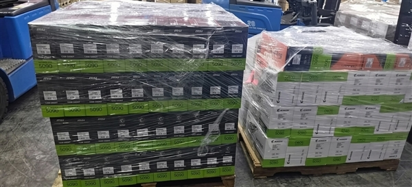

El mercado de segunda mano de tarjetas gráficas ha dejado de ser el refugio barato que era. Un seguimiento diario de los precios de venta en eBay Estados Unidos, recogido por TweakTown y difundido por el medio chino MyDrivers, muestra que las GPU usadas se encarecieron un **5,7 % en seis semanas**, entre el 7 de agosto y el 19 de septiembre. Es la subida más pronunciada de las 88 categorías analizadas y contrasta con el resto del mercado de segunda mano, que en el mismo periodo se mantuvo prácticamente plano, con una caída del 0,2 %.

## Cuánto han subido las tarjetas gráficas de segunda mano

El análisis compara 55 modelos que tenían precio registrado tanto al inicio como al final del periodo. Las cifras se mueven en un rango que va del 19 % al 27 % en los casos más llamativos, siempre en dólares y sobre el mercado estadounidense.

| Modelo | Precio el 7 de agosto | Precio el 19 de septiembre | Variación |
| --- | --- | --- | --- |
| GeForce RTX 5080 | 1.099 $ | 1.400 $ | +27 % |
| Radeon RX 7900 XTX | 706 $ | 900 $ | +27 % |
| Radeon RX 9070 | 500 $ | 620 $ | +24 % |
| GeForce RTX 3070 | 200 $ | 240 $ | +20 % |
| Radeon RX 6800 XT | 300 $ | 360 $ | +20 % |
| GeForce RTX 4060 Ti | 270 $ | 320 $ | +19 % |

Las dos únicas excepciones a la baja son las RX 6600 XT y RX 6750 XT, que cayeron un 16 % y un 9 % respectivamente. El resto de la gama de AMD y prácticamente toda la de NVIDIA acompaña la tendencia alcista, incluso en segmentos de entrada que hasta ahora se libraban de los movimientos bruscos.

## Por qué también sube lo usado

La segunda mano no se encarece por sí sola: lo hace porque el mercado de producto nuevo se ha descontrolado. Según los datos que maneja el sector, las tarjetas nuevas se venden de media un **28 % por encima de su precio recomendado**, y la RTX 5090 ha superado los **10.000 dólares**, cinco veces su precio de lanzamiento. La causa principal es la demanda de cómputo para inteligencia artificial: una parte importante de esas GPU acaba en servidores de IA y nunca llega al canal de venta para jugadores, como ya se vio cuando [la RTX 5090 desapareció del comercio estadounidense](/noticias/rtx-5090-us-shortage-price-surge/).

El fenómeno no afecta solo a las GPU. Las consolas también han subido: la PS5 Digital Edition cuesta más de un 50 % por encima de su precio original, y AMD planea un incremento del 10 % en algunos procesadores a partir del cuarto trimestre de 2026. En China la tendencia es la misma y [los precios de las tarjetas gráficas ya venían subiendo](/noticias/gpu-prices-china-rise/) por el giro de NVIDIA hacia el segmento profesional. Por ahora no hay plazos concretos para que los precios se relajen, y el mensaje que repiten fabricantes y analistas es el de acostumbrarse.

## El riesgo de comprar una GPU usada

Que la segunda mano se encarezca no la hace más segura. Muchas de estas tarjetas han pasado por granjas de minería o por entrenamiento de modelos de IA, un uso intensivo que deja secuelas que el vendedor no siempre declara: rodamientos de ventilador desgastados, ruido eléctrico de las bobinas y almohadillas térmicas agotadas.

El caso más extremo es el de las tarjetas huecas, anunciadas como funcionales pero con el chip gráfico ya extraído. Antes de pagar conviene revisar que la PCB conserve todos sus componentes, pedir fotos reales de la unidad —no imágenes de catálogo— y desconfiar de precios muy por debajo de la media del modelo.

## Qué significa para el comprador en España

Los datos proceden de eBay Estados Unidos y están expresados en dólares, así que no se trasladan de forma directa a lo que se paga en España. Comprar al otro lado del Atlántico añade envío, gestión aduanera e IVA, un sobrecoste que en muchos casos anula el ahorro. Para quien busque una tarjeta de segunda mano en el mercado nacional, la lectura útil es otra: la presión alcista es global y afecta a todos los canales, de modo que conviene comparar precios con calma y verificar el estado real de la tarjeta antes de cerrar cualquier operación.
