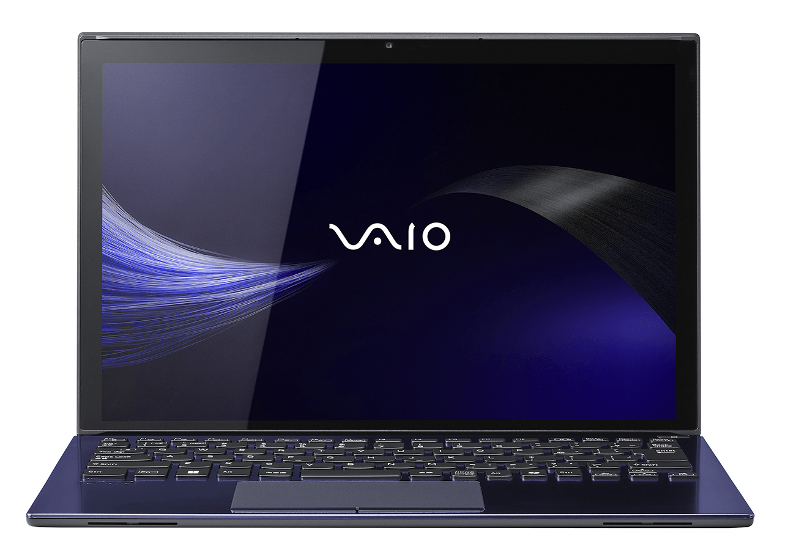
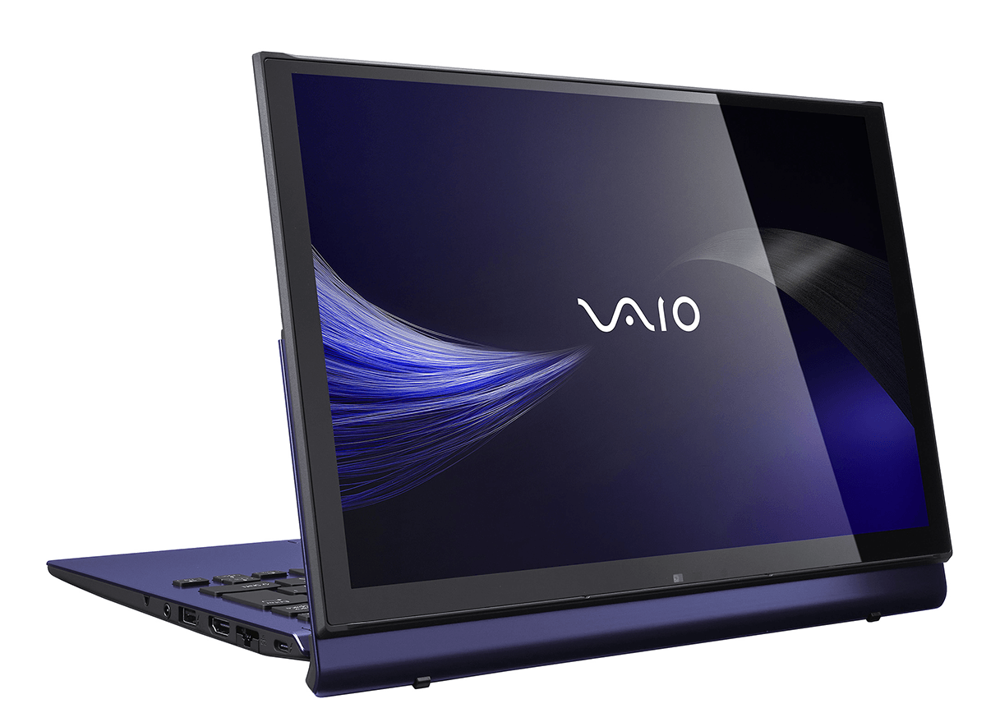
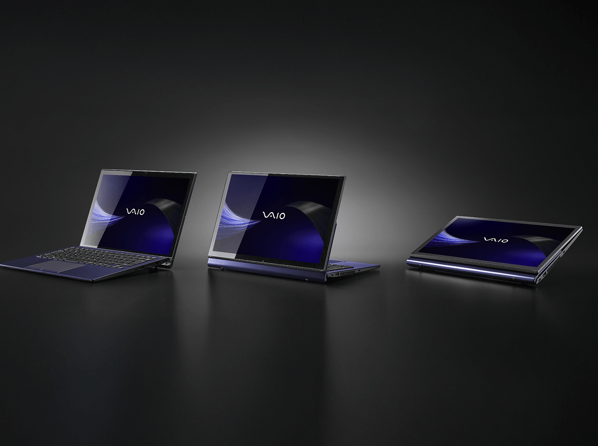

VAIO ha puesto a la venta en Japón la edición especial «Kachi-iro» de su portátil
convertible de la serie T, una variante de una sola coloración pensada para el
segmento profesional y de creación de contenido. El equipo se dirige a ejecutivos,
profesionales y creadores que trabajan en movimiento, y se comercializa de momento
exclusivamente a través de la tienda oficial de la marca en Japón.

## Una edición especial de VAIO con acabado índigo y teclado invisible

«Kachi-iro» (勝色) es el color corporativo de VAIO: un índigo profundo y saturado que
la marca aplica en la tapa superior y en las piezas de adorno del chasis. La edición
especial no admite otras combinaciones: se ofrece únicamente en esa tonalidad.

El detalle más llamativo es el teclado de grabado oculto. Las teclas negras no
muestran ningún carácter mientras la retroiluminación está apagada; las leyendas solo
aparecen en cuanto se enciende. Es un recurso estético que además reduce el ruido
visual en una máquina orientada a salas de reuniones y desplazamientos.

## Panther Lake en dos velocidades

La edición especial Kachi-iro se ofrece con dos procesadores Intel de la arquitectura
Panther Lake, fabricados en el nodo Intel 18A y con 16 núcleos e 16 hilos en ambos
casos:

| Característica | Core Ultra 7 356H | Core Ultra X7 358H |
| --- | --- | --- |
| Frecuencia máxima | 4,7 GHz | 4,8 GHz |
| Caché de tercer nivel | 18 MB | 18 MB |
| Potencia base / máxima | 25 W / 80 W | 25 W / 80 W |
| Gráfica integrada | Intel Graphics | Arc B390 (12 núcleos Xe) |
| NPU | 50 TOPS | 50 TOPS |

Ambos comparten una NPU de hasta 50 TOPS. Quien necesite más capacidad gráfica
integrada debe subir al X7 358H, que monta la Arc B390 con 12 núcleos Xe; la
diferencia de frecuencia entre ambos chips es de apenas 100 MHz. Ya hay otros equipos
de gama alta con esta misma arquitectura, como el
[Lenovo Yoga 9i 2026](/noticias/lenovo-yoga-9i-2026-review/), que también apuesta por
Panther Lake.

## Ficha, autonomía y precios

La pantalla es un panel táctil de 13,3 pulgadas con resolución WQXGA (2560 × 1600) y
relación 16:10, montado sobre la bisagra multi-posición de la serie T: el equipo
funciona como portátil, como tableta y en modo lectura. La memoria llega hasta 64 GB
de LPDDR5X soldados a la placa —no se pueden ampliar tras la compra— y el
almacenamiento hasta un SSD PCIe 5.0 x4 de 2 TB.

El equipo pesa entre 1,290 y 1,368 kg y mide entre 14,6 y
19,6 mm de grosor. Con la batería de alta capacidad opcional, la marca promete hasta
18 horas de reproducción de vídeo y hasta 29 horas en reposo. La cámara frontal es de
9,2 megapíxeles, incorpora un sensor de visión con IA y sirve para desbloquear el
equipo con Windows Hello.

Los precios en Japón son de 390.500 yenes (unos 18.600 yuanes) para la configuración
base con Core Ultra 7 356H y de 797.500 yenes (unos 38.000 yuanes) para la versión
tope de gama con X7 358H, 64 GB de memoria y 2 TB de almacenamiento. De momento no
hay disponibilidad anunciada fuera del mercado japonés. Quien busque una edición
limitada con presupuesto abierto puede mirar también el
[portátil HP y Ferrari](/noticias/hp-ferrari-ai-pc/), otra apuesta de gama alta por un
acabado diferenciado.
