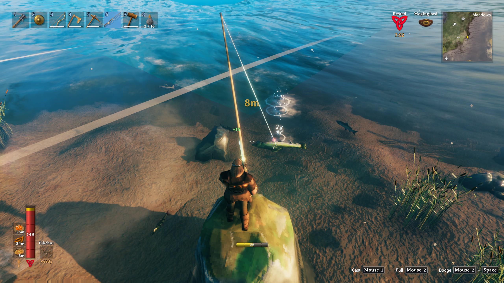
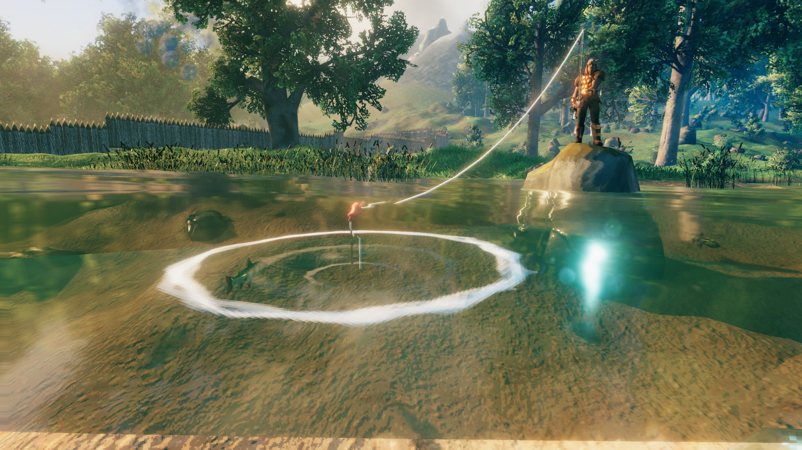

Pescar en Valheim es una forma de bajar el ritmo entre combate y combate, pero el juego
no explica bien cómo hacerlo y la caña de pescar no se puede fabricar. Esta guía reúne
los pasos reales para conseguir el equipo, lanzar el sedal, enganchar un pez y sacarlo
del agua, pensada para jugadores que ya están explorando el mundo y quieren añadir la
pesca a sus recursos.

## Requisitos previos

- Una **caña de pescar** (fishing rod) y **cebo básico** (basic bait).
- La barra de **aguante** (stamina) lo más llena posible: come antes de pescar y lleva
  contigo algunas **hidromieles de aguante** si quieres asegurar la recogida.
- Espacio libre en el inventario para el pescado que captures.

## Paso 1: consigue la caña de pescar

La caña no se fabrica con el yunque. Se compra a **Haldor, el vendedor** (Haldor, the
vendor), al que encontrarás en el **bosque negro** (Black Forest). Vende la caña por
**350 monedas** y **20 unidades de cebo básico por 10 monedas**.

Existe una alternativa poco fiable: la caña aparece **muy raramente como botín en las
cuevas de hielo** (frost caves) del **bioma de montaña** (mountains). No cuentes con ello.

## Paso 2: lanza el sedal

Equipa la caña y selecciona el cebo en el inventario haciendo **clic derecho** sobre él.
Después, **pulsa el botón de ataque** (ratón 1 por defecto) para lanzar el sedal al agua.

## Paso 3: engancha el pez

La pesca depende del aguante: nada más lanzar no ocurre nada hasta que un pez se acerca
a morder. Cuando lo haga, verás que el flotador se mueve. En ese momento **pulsa el botón
de bloqueo** (ratón 2 por defecto): el pez queda enganchado al instante.

## Paso 4: recoge el sedal

Para traer al pez, **mantén pulsado el botón de bloqueo** (ratón 2). Mientras recoges el
sedal el aguante se va consumiendo. Si se agota antes de terminar, el pez se escapa, así
que conviene haber comido antes y no empezar con la barra a medias.

## Paso 5: recoge el pez

Cuando el pez esté cerca de ti, apunta con la mira y **pulsa el botón de usar** (`E` por
defecto) para recogerlo. El pescado pasa entonces a tu inventario.

## Cómo verificar que funcionó

Si has completado el ciclo, el pez aparecerá en tu inventario y podrás usarlo como
comida o como material para fabricar más cebo. Si el sedal se recoge vacío o el pez se
suelta a mitad de trayecto, lo más probable es que se te haya agotado el aguante: come
algo para llenar la barra y vuelve a intentarlo.

## Consejos para encontrar peces

- Los peces son **entidades físicas** que aparecen en el mundo. Si no ves ninguno en el
  agua cercana, no capturarás nada: corre a lo largo de la orilla hasta localizar algunos
  y lanza allí.
- También puedes salir con una barca a buscar bancos de peces. Eso sí, cuidado con las
  **serpientes marinas**, demasiado grandes para sacarlas con la caña.
- Con los peces que captures puedes **fabricar cebo** en la **mesa de preparación de
  alimentos** (food preparation table), que se construye con **5 de hierro, 15 de retales
  de cuero y 20 de madera fina**.
- Si eres rápido, también puedes **atrapar peces a mano**; a veces aparecen varados en
  las playas.
- Existe un **sombrero de pesca** que se aprende a fabricar al **capturar al menos un
  ejemplar de cada pez** distinto de Valheim. Otorga **+20 a la habilidad de pesca**.

## Advertencias y limitaciones

La pesca no es instantánea: depende por completo del aguante, y el pez escapa si la barra
se agota a mitad de recogida. Tampoco hay garantía de encontrar peces cerca; si la zona
está vacía, hay que buscarlos a lo largo de la orilla o con una embarcación. Y aunque la
caña pueda aparecer como botín en cuevas de hielo, la vía práctica sigue siendo comprarla
a Haldor.
