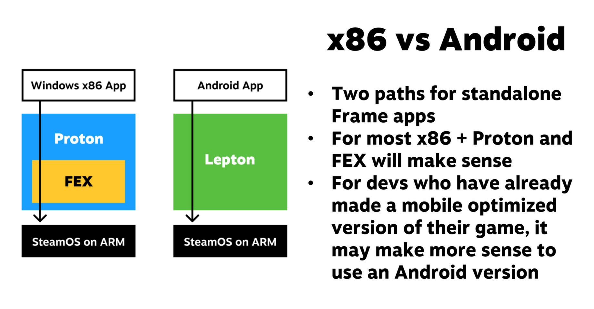

Valve ha publicado como código abierto Lepton, la capa de compatibilidad con la que su visor Steam Frame puede ejecutar juegos desarrollados para Android. El anuncio llega después del lanzamiento oficial del visor, cuyo precio de partida es de 1.059 dólares y cuyas reservas ya están abiertas. Lepton se presentó formalmente en marzo de 2026, cuando la compañía también detalló los requisitos del programa Steam Frame Verified.

El proyecto vive ahora en la instancia GitLab de Valve (`gitlab.steamos.cloud/frame-public/lepton`), donde la compañía explica en qué se diferencia de Android y qué decisiones de diseño ha tomado. La herramienta de compatibilidad se distribuye bajo licencia MIT, mientras que la imagen de Android que la acompaña queda sujeta a la GPL-3.0 por los componentes que incorpora.

## Qué es Lepton y por qué importa en el Steam Frame

Para entender su papel conviene mirar la comparación que hace el propio Valve. Un juego para Windows se ejecuta en SteamOS a través de Proton y, cuando hay que traducir instrucciones de otra arquitectura, de FEX. Lepton ocupa ese mismo lugar para las aplicaciones Android: se coloca entre el juego móvil y SteamOS, que en el Steam Frame corre sobre ARM. La idea es que un desarrollador que ya tiene una versión de su juego optimizada para móviles pueda llevarla al visor sin reescribirla.

Lepton no es un Android completo ni un emulador al uso. Combina código propio de Valve con partes del AOSP y toma parches y componentes de proyectos como Waydroid, Anbox, Halium e Hybris. Además, monta bibliotecas del sistema anfitrión —controladores gráficos como mesa y zink, bibliotecas de Steam y Steamworks, y capas de Vulkan, entre ellas un inyector de renderizado foveado y un optimizador de renderpass—, en lugar de arrastrar su propia pila gráfica. Según Valve, también desactiva servicios de Android que no son necesarios para jugar, lo que recorta peso y puede romper la compatibilidad con algunas aplicaciones.

## Un diseño pensado para juegos, no para Android en general

Las decisiones de diseño marcan el alcance de la herramienta. Lepton se ejecuta como un usuario sin privilegios, sin necesidad de configuraciones root ni de asistentes adicionales, y todos sus procesos corren bajo ese mismo usuario. No impone aislamiento entre aplicaciones: cada una debe lanzarse en su propio contenedor Android. La compañía cachea además parte del estado para acelerar el arranque del entorno de usuario de Android.

Valve es explícita sobre el público objetivo: Lepton está pensada para que los desarrolladores lleven sus juegos Android de realidad virtual al Steam Frame, y advierte de que otros usos son posibles pero no fueron el foco del desarrollo y pueden carecer de acabado. Para el trabajo de adaptación incorpora integración con depuradores como `strace`, `gdb`, `lldb` y RenderDoc, y con el perfilador Perfetto. Por defecto oculta la ventana plana del juego, aunque permite mostrarla durante el desarrollo.

## Qué cambia para el lector

La lectura práctica es que Lepton no es, por ahora, una vía para instalar APK sueltas en el Steam Frame. Valve recomienda que la mayoría de los usuarios utilice el Lepton que ya integra el propio cliente de Steam; la versión abierta está orientada a quien desarrolla o adapta juegos. Quien no siga este ecosistema puede pensar en Lepton como el equivalente Android de Proton: la pieza que permite que un catálogo ajeno funcione dentro del entorno de Valve.

Publicar el código tiene una consecuencia previsible. Al igual que ocurrió con Proton y sus derivados comunitarios CachyOS-Proton y Proton-GE, es probable que otros proyectos reutilicen el trabajo de Valve, lo modifiquen o lo bifurquen para añadir funciones, recortarlo u optimizarlo. Para el Steam Frame, eso amplía las posibilidades de que lleguen juegos Android de VR y de que la comunidad encuentre usos que la propia Valve no había previsto. También refuerza una estrategia reconocible en la compañía: liberar las capas de compatibilidad de sus plataformas para que terceros las mejoren, en lugar de mantenerlas cerradas.
