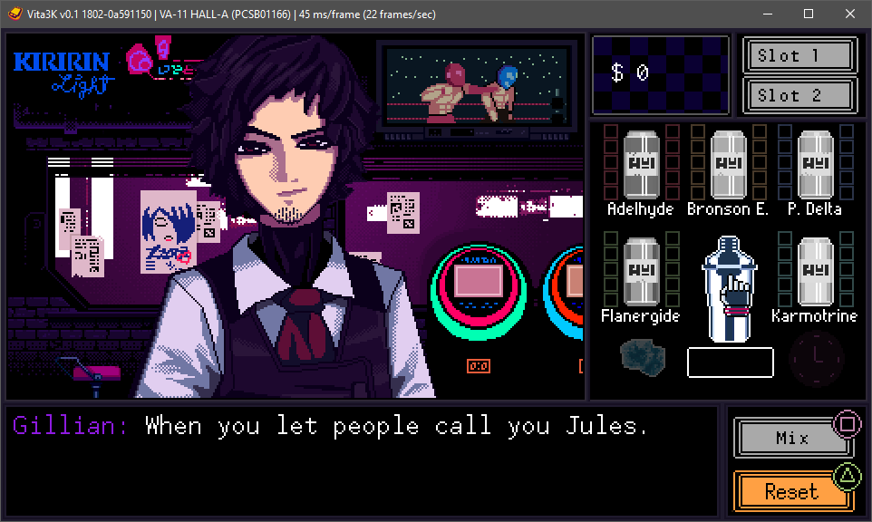

El emulador de PlayStation Vita Vita3K tiene una adaptación funcional para Nintendo Switch. El proyecto, publicado como Vita3K-nx por el desarrollador NaGaa95 a partir del código abierto de Vita3K, alcanzó la versión 1.3.1 el 16 de septiembre, con una actualización de la pila gráfica Mesa 26.2.2 del Horizon SDK. El anuncio circuló en el foro de Switch de GBAtemp, donde el hilo acumula más de un centenar de respuestas con pruebas de usuarios.

## Qué pasó

Vita3K-nx es un fork del emulador experimental de PS Vita orientado a la consola híbrida de Nintendo. Tras su primera versión pública a finales de agosto, encadenó tres actualizaciones en septiembre: la 1.1.0 centrada en rendimiento, la 1.2.0 en el instalador y la compatibilidad, y la 1.3.0 con novedades en el lanzador y el renderizado.

Entre los cambios documentados en las notas de la versión 1.3.0 destacan el soporte para unidades USB en NTFS, la corrección de los recursos compartidos SMB que aparecían vacíos, pasos de un cuarto en la escala de resolución, una opción para omitir la comprobación de red de PSN y que los juegos pasen a modo sin conexión en lugar de quedarse bloqueados, y un soporte experimental de trucos accesible desde el menú rápido en juego. En el renderizado OpenGL se corrigieron deformaciones de personajes en Dead or Alive 5 Plus y Ultimate Marvel vs Capcom 3, geometría estirada en Ratchet & Clank: QForce, el bloqueo de Borderlands 2 al arrancar y colores erróneos en escenas de Mortal Kombat y Tearaway, además de sumar soporte de texturas ETC1 para ports caseros basados en vitaGL.

## Por qué importa Vita3K-nx

Hasta ahora, la emulación de Vita en Switch era una asignatura pendiente: se trata de acercar el catálogo de una portátil de Sony a otra portátil, con sus propios límites de memoria y GPU. No es el primer experimento de este tipo en la consola —ya pasó [la emulación de PS2 en Switch con NetherSX2](/noticias/nethersx2-switch-port/)—, pero que un fork específico avance a este ritmo, incorporando además correcciones del proyecto paralelo Vita3K Plus, sugiere que la compatibilidad seguirá creciendo en lugar de estancarse en una prueba de concepto.

Conviene mantener las expectativas bajo control: el propio proyecto se declara experimental y los reportes del hilo muestran un estado desigual por juego. Algunos usuarios describen partidas fluidas en títulos como Tales of Hearts R o Trails in the Sky 3rd Evolution, mientras otros informan de bloqueos en Mortal Kombat o Sly Cooper: Ladrones en el tiempo. Son reportes de foro, no una lista oficial de compatibilidad, así que cada juego es una incógnita hasta probarlo.

## Qué cambia para el lector

Quien quiera probarlo necesita una Switch con homebrew, el firmware oficial de Vita instalado en el emulador y copias propias de sus juegos: el proyecto remite a métodos de volcado como NoNpDrm o FAGDec y a los programas caseros de VitaDB. El propio desarrollador recomienda instalar los juegos en formato .pkg junto a su archivo work.bin para el descifrado, o comprimidos NoNpDrm, y avisa de que la instalación del firmware puede parecer detenida en torno al 70 % cuando en realidad sigue trabajando.

La descarga se publica en la página de releases del repositorio, con tres artefactos por versión. Como todo software experimental, es previsible encontrar fallos de sonido, textos ausentes o bloqueos según el título, y el contenido adicional (DLC) aún presenta detecciones irregulares según varios reportes.
