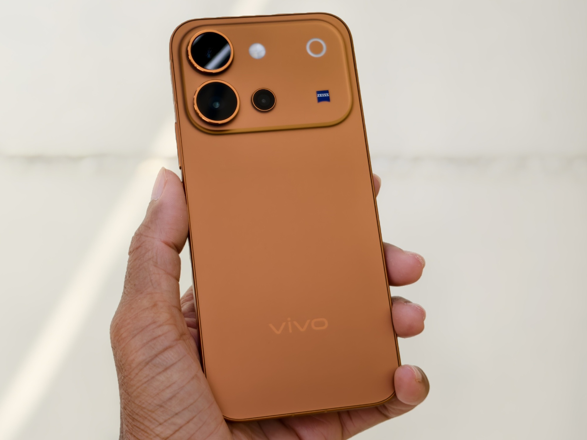
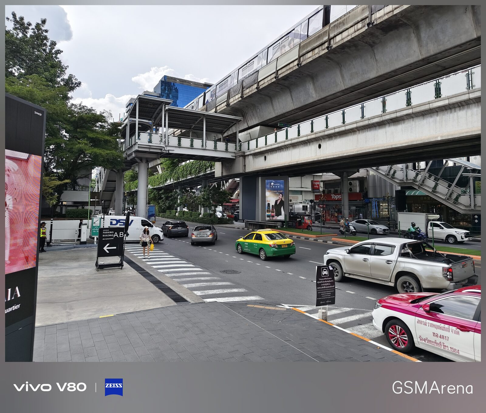
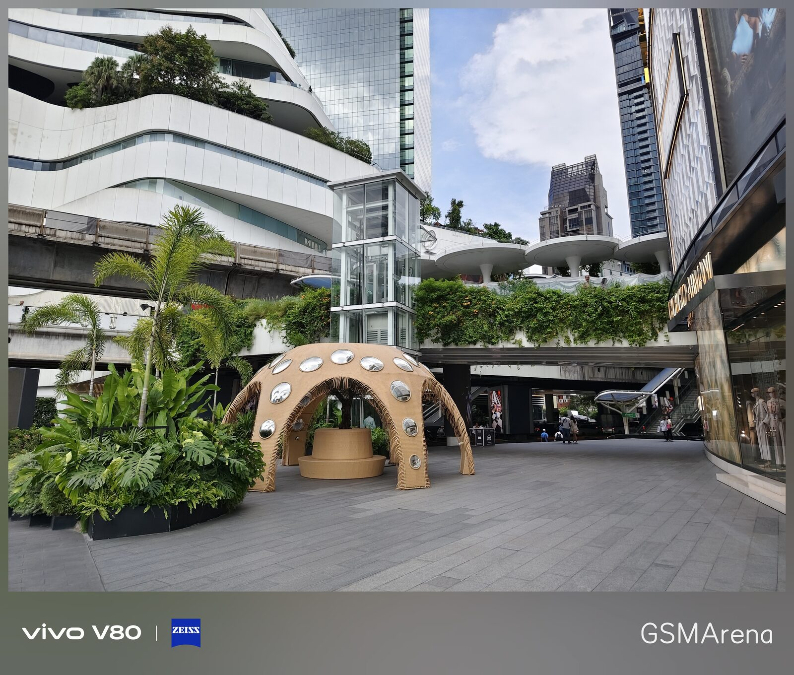
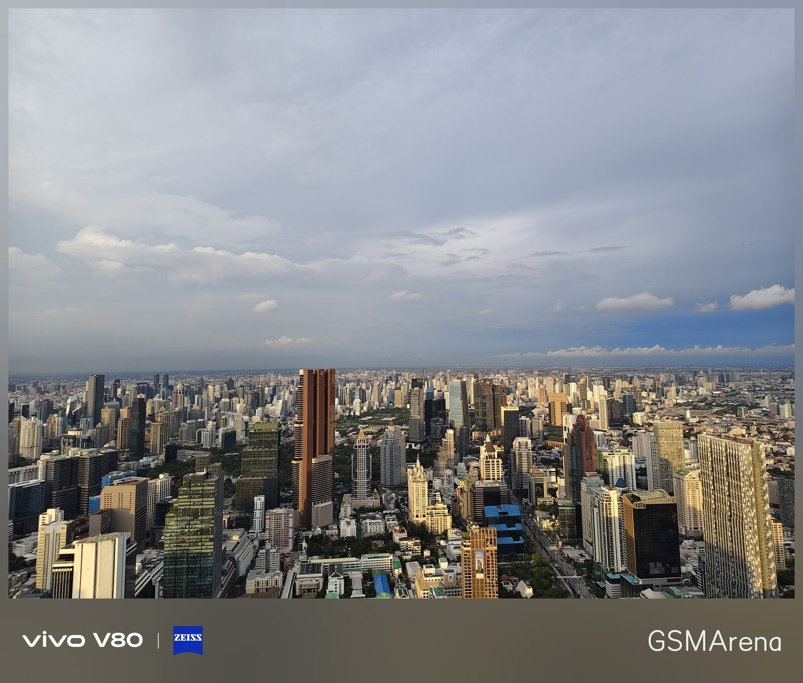
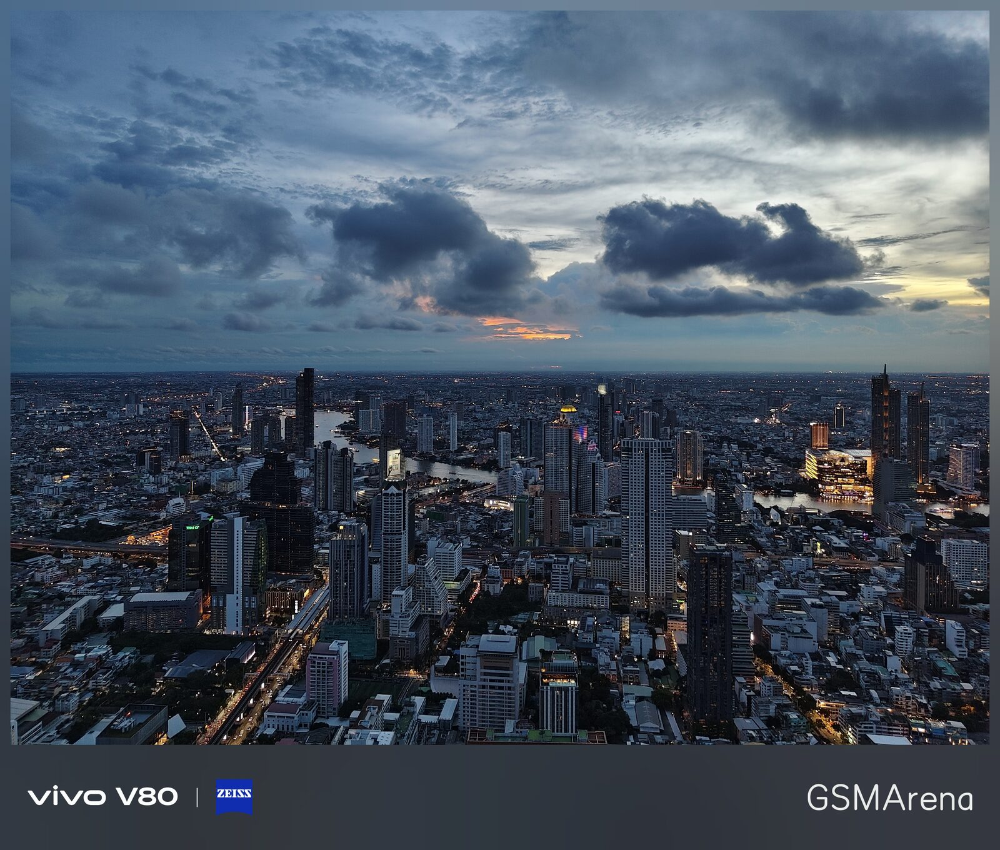
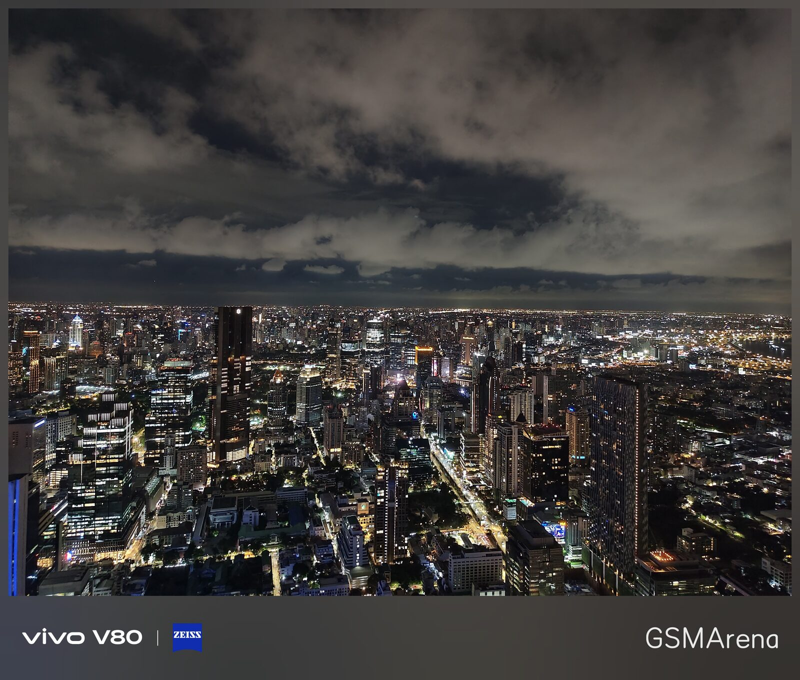
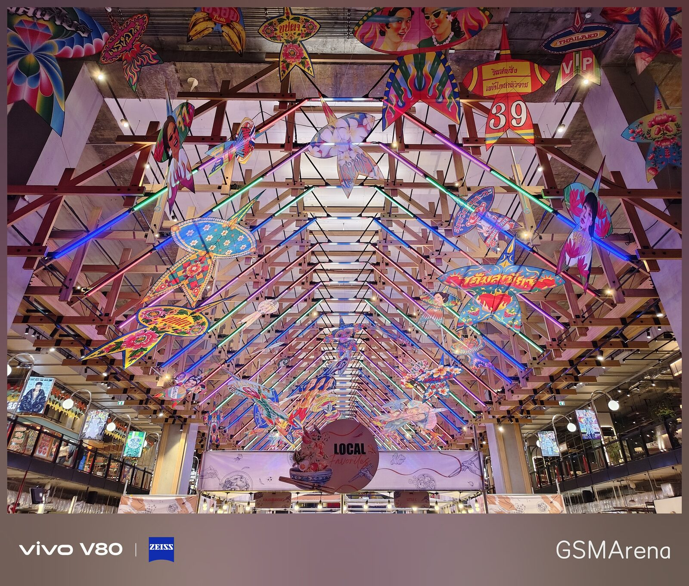
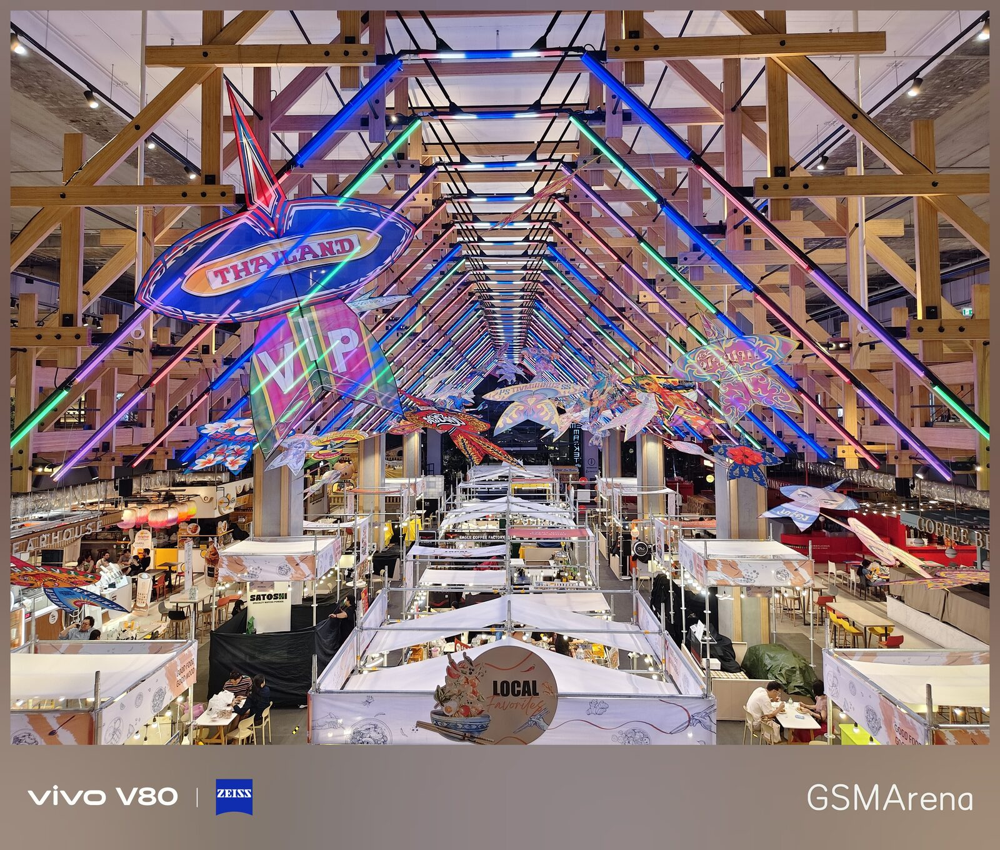
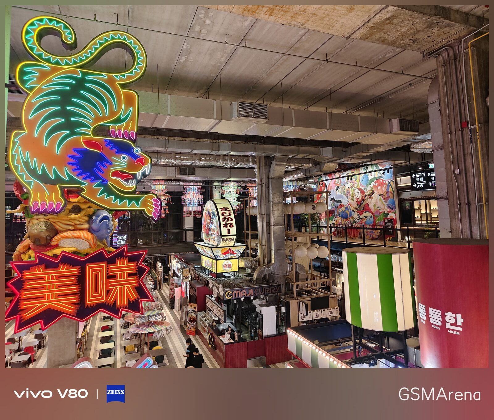

Vivo ultima los preparativos de su próximo terminal de la familia V, el Vivo V80, y ya ha dejado ver cómo será en la mano. GSMArena ha tenido acceso a una unidad en color Sunrise Anthem y ha publicado una toma de contacto junto a una primera batería de fotografías tomadas con el teléfono desde Bangkok (Tailandia). La marca presentará el dispositivo en India el 6 de octubre a las 12:00, hora local, en tres acabados: Sunrise Anthem, Horizon Blue y Stellar Black.

## Pantalla y diseño del Vivo V80

El V80 apuesta por un panel OLED de 6,59 pulgadas con resolución 1.5K y una tasa de refresco de 144 Hz. Vivo anuncia un pico de brillo de 5.000 nits, aunque lo llamativo está en el extremo opuesto: la pantalla puede bajar hasta 1 nit para no deslumbrar en entornos oscuros. El panel cubre 1.070 millones de colores, una cifra propia de pantallas de 10 bits.

En el frontal, un orificio centrado aloja la cámara de autofotos, que Vivo describe como un sensor ZEISS Group Selfie Camera de 50 megapíxeles. El acabado Sunrise Anthem que se ha dejado ver combina una parte trasera en tono cobrizo con un módulo de cámara en la esquina superior izquierda.

## Cámara triple con sello Zeiss

El sistema fotográfico trasero vuelve a contar con la colaboración de Zeiss y combina tres sensores. La cámara principal es de 50 megapíxeles y utiliza el sensor Sony LYTIA 700V; el teleobjetivo, también de 50 megapíxeles, ofrece un zoom óptico de 3 aumentos y recurre al sensor IMX882. Ambas lentes cuentan con estabilización óptica de imagen (OIS). El tercer módulo es un ultra gran angular cuya resolución Vivo todavía no ha confirmado de forma oficial.

Es una configuración coherente con la que la marca viene desplegando en su gama alta, donde la óptica Zeiss es el argumento diferencial. El fabricante ya había puesto ese mismo sello en el [X500 Pro Max](/noticias/vivo-x500-pro-max-camera/), el buque insignia fotográfico con el que comparte enfoque de imagen, aunque en un escalón de precio y prestaciones distinto.

## Muestras de cámara desde Bangkok

GSMArena ha compartido una selección de imágenes disparadas con la cámara principal del V80 durante su estancia en Bangkok. La serie permite ver cómo se comporta el sensor en condiciones muy distintas: desde escenas de calle a plena luz del día hasta cielos al atardecer y tomas nocturnas de la ciudad.

Entre las muestras hay paisajes urbanos con el tren elevado y el tráfico de la capital tailandesa, el acceso de un centro comercial con vegetación tropical, panorámicas del horizonte en la hora dorada y de noche, interiores de mercados cubiertos con decoración de colores y un puesto nocturno con carteles luminosos. Son fotografías de día y de noche que sirven como primera referencia del rendimiento de la cámara, aunque no sustituyen a una comparativa con imágenes sin editar ni a una prueba en profundidad.

## Disponibilidad y qué esperar

El V80 se presentará en India el 6 de octubre, y todo apunta a que ese será su primer mercado. La marca todavía no ha detallado el precio ni si el terminal llegará a Europa, así que por ahora conviene tomar las cifras de brillo, resolución y sensores como la carta de presentación que Vivo ha querido enseñar antes del lanzamiento.

Para quien siga de cerca la fotografía móvil, la lectura es doble. Por un lado, el teleobjetivo de 3 aumentos con OIS y el sello Zeiss apuntan a un terminal pensado para acercar al usuario a la experiencia de la gama alta sin su precio. Por otro, las muestras publicadas son un primer aviso, no una sentencia: hasta que no haya comparativas con imágenes sin procesar y una prueba exhaustiva, la cámara del V80 sigue siendo una incógnita razonable. Quien busque decidir una compra hará bien en esperar a las pruebas completas y, si el interés está en la gama alta de Vivo, en repasar antes [las diferencias entre los X500, X500 Pro y X500 Pro Max](/noticias/vivo-x500-vs-x500-pro-vs-pro-max/).
