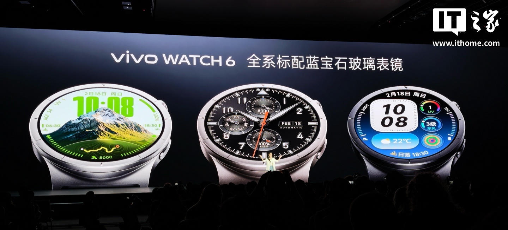
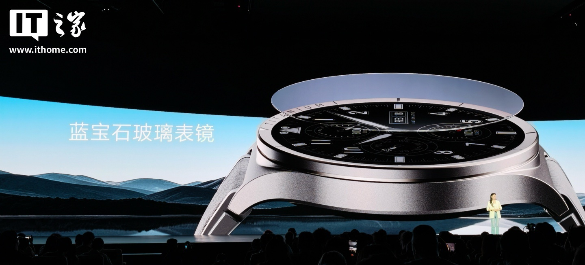
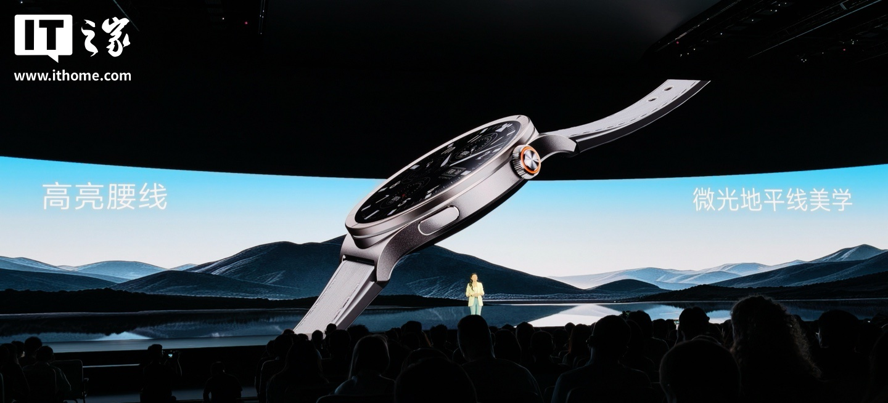
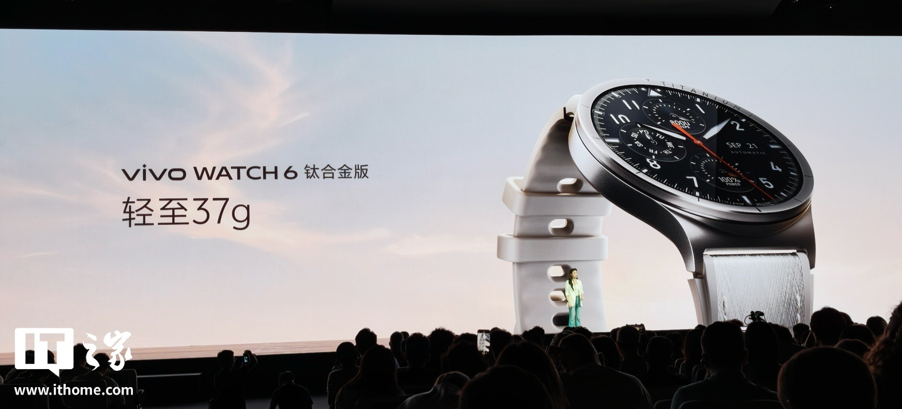
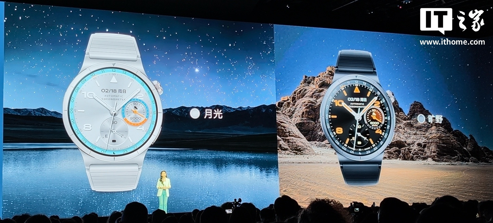
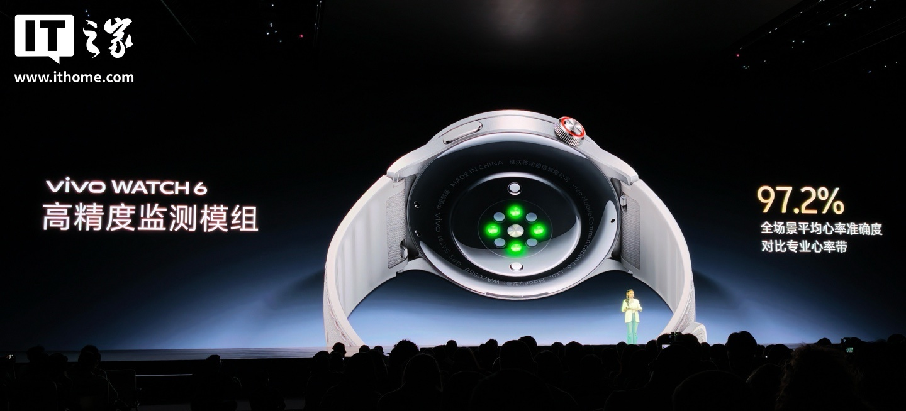
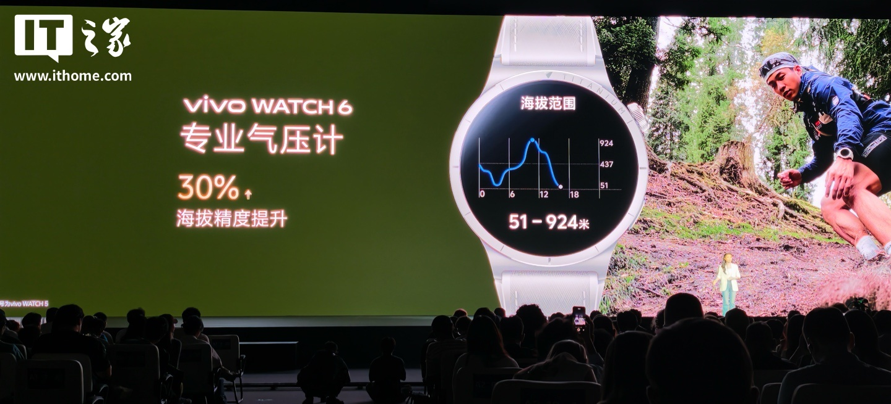
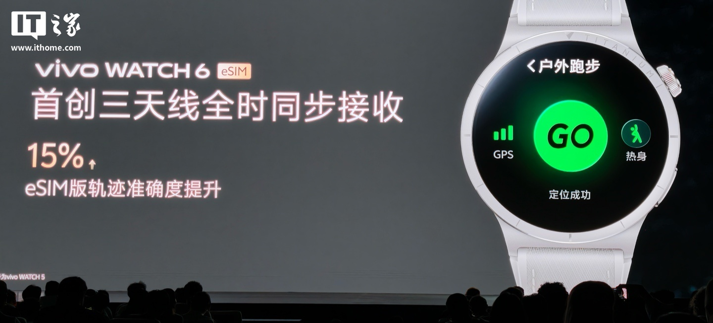
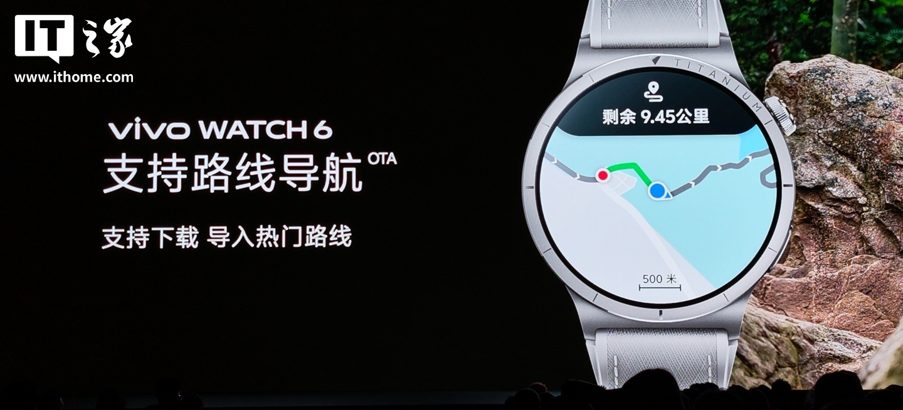
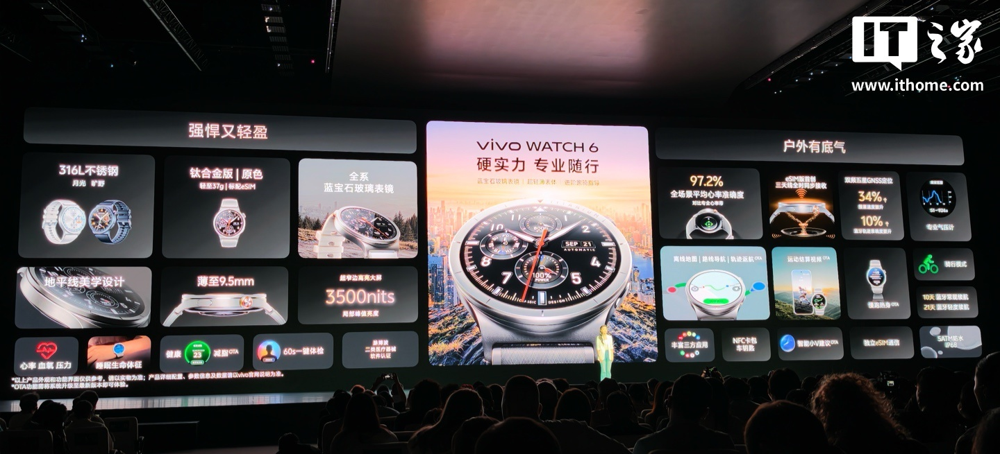

El **vivo WATCH 6** salió a la venta el 28 de septiembre en China. Se trata del nuevo smartwatch de la marca posicionado en el segmento de «outdoor ligero», y llega con dos argumentos que hasta hace poco se reservaban a la gama alta: cristal de zafiro en toda la gama y una versión de titanio que pesa 37 gramos. Los precios arrancan en 999 yuanes.

## Materiales y pantalla: zafiro en toda la gama

La principal novedad del vivo WATCH 6 es que el cristal de zafiro, mucho más resistente a los arañazos que el vidrio templado habitual, no se reserva para la versión tope de gama: lo llevan **las tres variantes**. El resto de la ficha coincide entre todas ellas: pantalla AMOLED de 1,47 pulgadas con una frecuencia de refresco de 60 Hz, borde local de hasta 3.500 nits y un grosor de 9,5 milímetros.

Las dos versiones estándar emplean acero inoxidable 316L y están disponibles en dos colores: 月光 (blanco) y 旷野 (azul oscuro). La tercera, la de titanio, monta una caja de titanio de grado aeroespacial TC4 con un grabado de precisión, se oferta en el acabado 原色 (titanio natural) y **pesa 37 gramos**.

## Salud, deporte y navegación sin móvil

En el apartado de sensores, vivo afirma que su módulo de monitorización alcanza una **precisión media del 97,2 % en frecuencia cardíaca** cuando se compara con una pulsera profesional de pecho, medido en todos los escenarios. El reloj incorpora además un barómetro profesional, con una mejora del 30 % en la precisión de altitud según la propia marca.

Para salir a la ruta sin llevar el móvil, la versión eSIM suma un sistema de tres antenas con recepción simultánea permanente, que vivo cifra en un 15 % más de precisión en la trayectoria. El posicionamiento es de doble frecuencia y cinco constelaciones, y el reloj admite **mapas sin conexión, navegación por ruta y regreso por la trayectoria**; esta última función llega, como otras del catálogo, por actualización OTA.

En software, la firma promueve el entrenamiento avanzado de carrera y ciclismo, una **revisión de salud de 60 segundos en un toque** y un asistente de control de peso. Conviene una advertencia que la propia imagen de lanzamiento incluye en letra pequeña: no es un dispositivo médico y los resultados de esa revisión son orientativos, no un diagnóstico.

## Versiones y precios del vivo WATCH 6

| Versión | Precio en China | Aproximado en euros |
| --- | --- | --- |
| Bluetooth (acero) | 999 ¥ | unos 130 € |
| eSIM (acero) | 1.399 ¥ | unos 180 € |
| eSIM (titanio) | 1.999 ¥ | unos 260 € |

Los tres importes son **precios de lanzamiento en China**, en yuanes, y la columna en euros es solo una conversión aproximada a tipo de cambio del momento: no es un precio europeo oficial ni incluye la fiscalidad de cada país. La nota de lanzamiento recogida por ITHome no menciona disponibilidad fuera de China.

Si estás comparando, el vivo WATCH 6 se sitúa en un tramo donde ya compiten el [Huawei Watch GT 7 de 46 mm](/noticias/huawei-watch-gt-7-46mm/) y, ya por debajo de los 100 euros, el [Redmi Watch 6](/noticias/xiaomi-reloj-menos-100-euros/): tres propuestas muy distintas en materiales, precisión de sensores y presupuesto.
