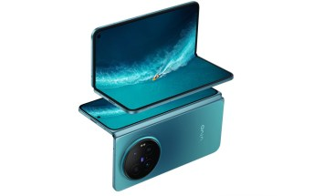
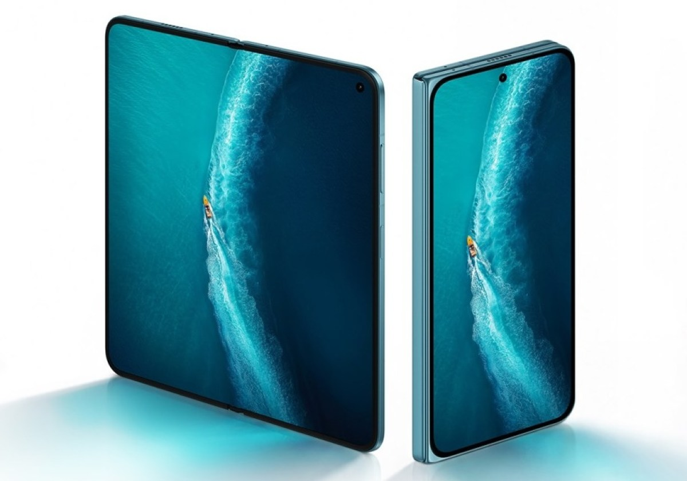

El **vivo X Fold6** se presentó en China en junio, pero fuera del país asiático todavía no tiene fecha oficial. Ese vacío es el que llena ahora una filtración: según el filtrador **Abhishek Yadav**, el plegable de vivo se presentaría fuera de China el **1 de octubre**, con India esperando hasta el **6 de octubre**. vivo no ha confirmado ninguno de los dos calendarios, así que conviene leerlos como rumores y no como anuncios.

## Lo que dice la filtración sobre las fechas del vivo X Fold6

En una publicación en X del 26 de septiembre, Abhishek Yadav afirmó que el debut global del X Fold6 sería el 1 de octubre, un poco más de cuatro meses después de su estreno chino, y que India lo seguiría el 6 de octubre a mediodía (hora local). GSMArena recoge ambas fechas y aclara la diferencia: **el 1 de octubre es la fecha global y el 6 de octubre es solo para India**. No son el mismo anuncio, y la filtración no da fechas para el resto de mercados.

El mismo mensaje detalla las versiones que llegarían al mercado indio: **12 GB de RAM con 256 GB de almacenamiento** y **12 GB con 512 GB**, en los colores **Nebula Teal** (azul verdoso) y **Prism Black**, con OriginOS 7 preinstalado. Ninguna de estas cifras está confirmada por vivo, y la filtración no dice nada sobre variantes, precios ni fechas para Europa y España.

## Qué ofrece el vivo X Fold6

Lo que sí está contrastado es la ficha técnica del modelo chino, presentado en junio. El X Fold6 monta una **pantalla plegable AMOLED de 8,02 pulgadas** y una **pantalla exterior AMOLED de 6,51 pulgadas**. En la parte trasera lleva una **triple cámara** encabezada por un sensor principal de **200 MP**, y dentro una batería de **7.000 mAh** con carga por cable de **80 W** y carga inalámbrica de **40 W**.

Estas especificaciones pertenecen a la versión china; si el modelo global llega el 1 de octubre, habrá que esperar al anuncio para saber si mantiene el mismo panel, la misma batería y el mismo conjunto de cámaras, algo habitual en los plegables que viajan de Asia al resto del mundo.

## Qué cambia para quien espera un plegable

El principal cambio es de calendario. Cuatro meses entre el lanzamiento en China y el resto del mundo es una espera larga en un segmento donde el hardware envejece rápido: para quien estuviera mirando el X Fold6 como alternativa a los plegables de Samsung, el dispositivo llega con retraso y sin fecha europea. El mercado sigue siendo exigente en este rango, como muestra [el análisis del Samsung Galaxy Z Flip 8](/noticias/samsung-galaxy-z-flip8-review/), y vivo viene de presentar su buque insignia de pantallas planas con [el X500 Pro Max y su cámara de 200 MP](/noticias/vivo-x500-pro-max-camera/).

Nada de lo anterior es oficial: tanto el 1 de octubre como el 6 de octubre proceden de una filtración, vivo no ha publicado ningún comunicado y las fechas pueden cambiar o no materializarse. La confirmación, si llega, tendrá que venir de la propia marca.
