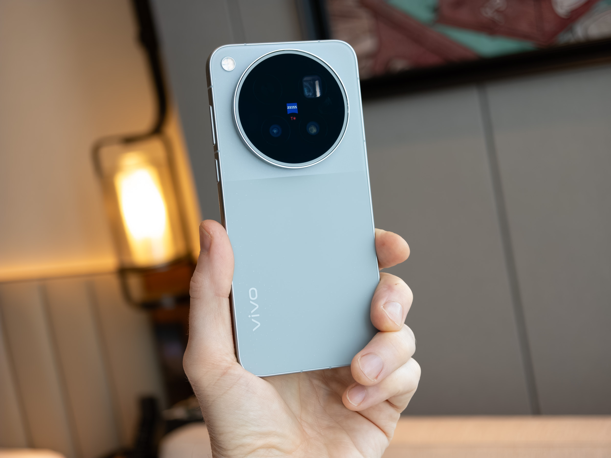
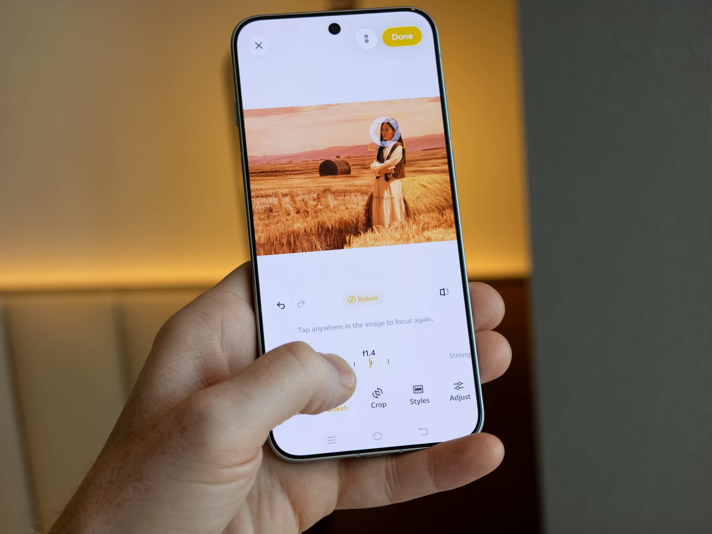
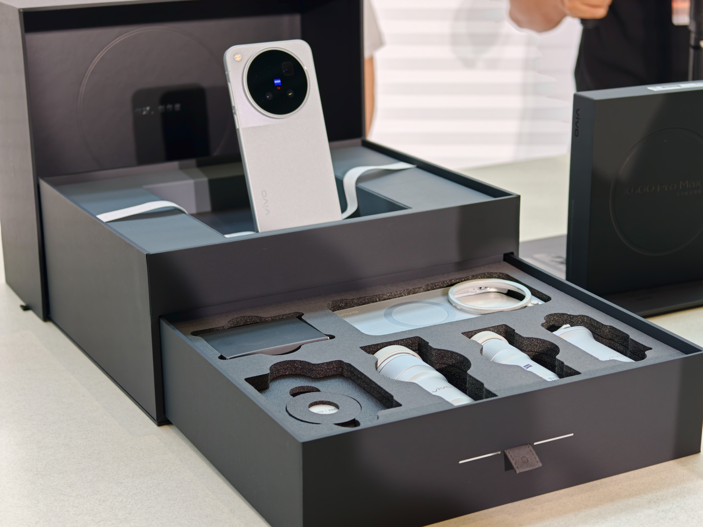
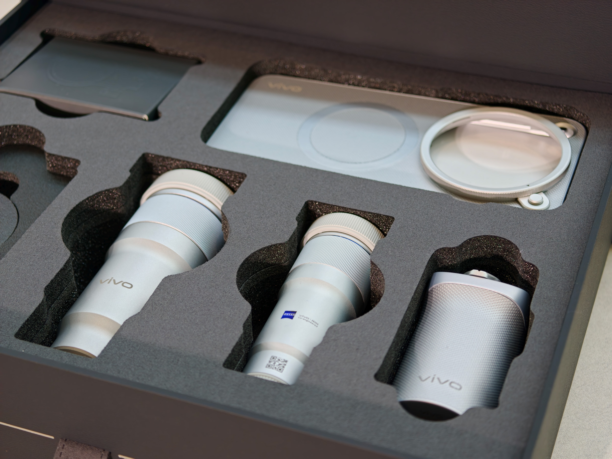
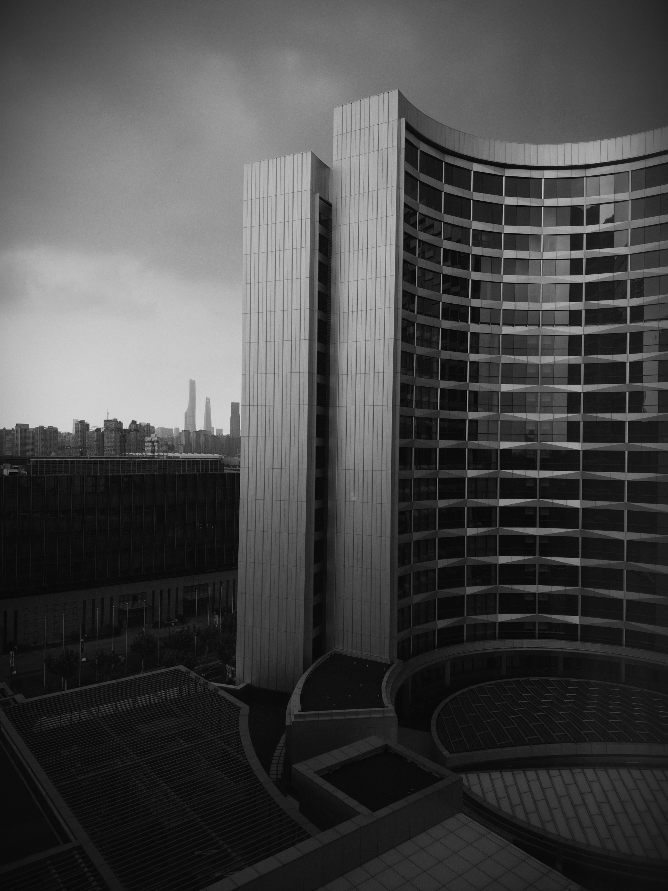
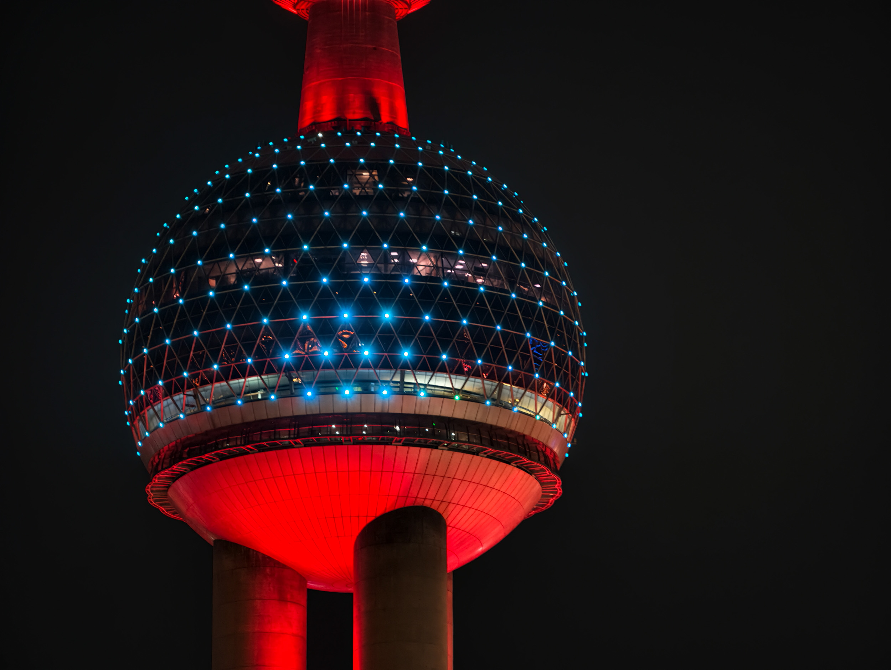
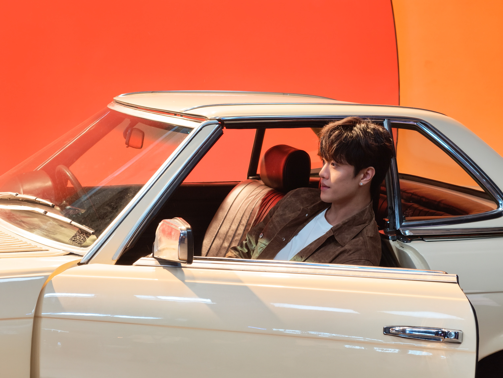
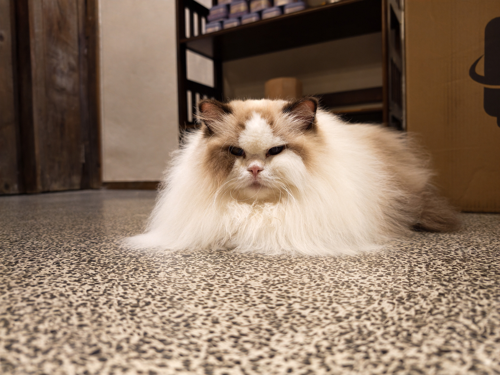

Vivo ha desvelado su nueva familia insignia X500, compuesta por tres modelos: el X500, el X500 Pro y el X500 Pro Max. El fabricante chino presentó la gama el 21 de septiembre en un evento celebrado en Shanghái, y sitúa al X500 Pro Max como el modelo más caro y el heredero directo del X300 Ultra del año pasado. La compañía vuelve a apoyarse en la óptica Zeiss para competir de tú a tú con OPPO y Xiaomi en el terreno de la fotografía móvil, el mismo pulso en el que la serie Find X10 de OPPO también ha puesto el foco en sus accesorios ópticos.

## La cámara del X500 Pro Max: triple lente Zeiss y hasta 200 MP

El X500 Pro Max mantiene el esquema de tres lentes que ya usaba su predecesor: ultra gran angular, cámara principal y teleobjetivo, todas con óptica Zeiss. El cambio más relevante está en la lente principal, que pasa a una distancia focal de 24 mm, en línea con la mayoría de los buques insignia actuales. El X300 Ultra se había desmarcado con una principal de 35 mm, más cerrada, así que Vivo vuelve a un encuadre más amplio y convencional.

El teleobjetivo ofrece un zoom óptico de 3.5 aumentos con una distancia focal equivalente de 85 mm, una longitud muy apreciada por los fotógrafos de retrato. Sobre esa lente, la marca habilita un modo que alcanza los 200 MP de resolución. La resolución ampliada de 50 MP queda disponible para la ultra gran angular y para la cámara principal.

## El kit fotográfico: dos teleconvertidores y una empuñadura

Junto al teléfono, Vivo comercializa un kit de fotógrafo que llega en una caja de presentación negra. El paquete incluye dos teleconvertidores, una empuñadura, fundas adicionales y otros accesorios. Los convertidores son un modelo de 4.7 aumentos y otro de 2.35 aumentos, que se acoplan a la óptica del terminal para estirar su alcance.

El teleconvertidor de 4.7 aumentos es el que más llama la atención: combinado con la cámara de zoom de 3.5 aumentos, permite alcanzar una distancia focal efectiva de 400 mm. La clave es que se trata de óptica física, no de un recorte digital, por lo que conserva detalle que un zoom por software perdería. Es la misma fórmula que [OPPO prepara para su serie Find X10](/noticias/oppo-find-x10-hasselblad-teleconverter/), con un kit óptico firmado por Hasselblad: lentes externas para ampliar el alcance sin depender del recorte.

## Qué se ve en las primeras muestras

TechRadar ha tenido 24 horas con el X500 Pro Max en el propio evento de lanzamiento y ha publicado una selección de fotografías tomadas con el terminal, con la idea de mostrar de qué es capaz antes de una comparativa de cámara más profunda. En el modo Retrato, el medio disparó con el efecto bokeh en natural y lo llevó al máximo de f/0.95; ese desenfoque puede ajustarse después sobre las fotos hechas en este modo. En el modo Paisaje y Noche, que habilita la captura de alta resolución, subió la resolución a 50 MP y aplicó el estilo de color en blanco y negro, midiendo la exposición en la parte más luminosa del cielo para conseguir un efecto de clave baja.

En el modo Foto convencional, el medio destaca un color agradable y un efecto HDR que no resulta agresivo en exceso. También probó la exposición larga sobre el perfil del Bund de Shanghái y, con el teleconvertidor de 4.7 aumentos, un primer plano a 400 mm efectivos que se mantuvo nítido a pesar de estar disparado a pulso.

El medio también documenta el salto entre el zoom óptico y el digital: la misma escena capturada con el teleobjetivo de 3.5 aumentos y, después, con el ajuste de 10 aumentos, que ya es un zoom digital sobre esa lente Zeiss.

## Disponibilidad: China primero

La serie X500 se anunció el 21 de septiembre y, en su lanzamiento, es exclusiva de China. Vivo espera ampliar su distribución más adelante, aunque es poco probable que llegue a Estados Unidos. El movimiento se produce en un momento en el que rivales como el OPPO Find X9 Ultra y el Xiaomi 17 Ultra ya están disponibles en el Reino Unido, lo que deja la puerta abierta a que Vivo mueva ficha fuera de su mercado doméstico.

Para el lector hispanohablante, la conclusión práctica es la de siempre con esta familia: la cámara parece estar a la altura de la gama alta, pero la disponibilidad fuera de China sigue siendo la incógnita. Quien esté pensando en un móvil con teleobjetivo potente hará bien en esperar a las comparativas de imagen sin editar y a que Vivo aclare sus planes de venta internacional. Si el interés está en el retrato y las distancias focales, conviene recordar que [85 mm es precisamente la longitud que mejor suele funcionar para rostros](/noticias/iphone-photos-focal-length/).
