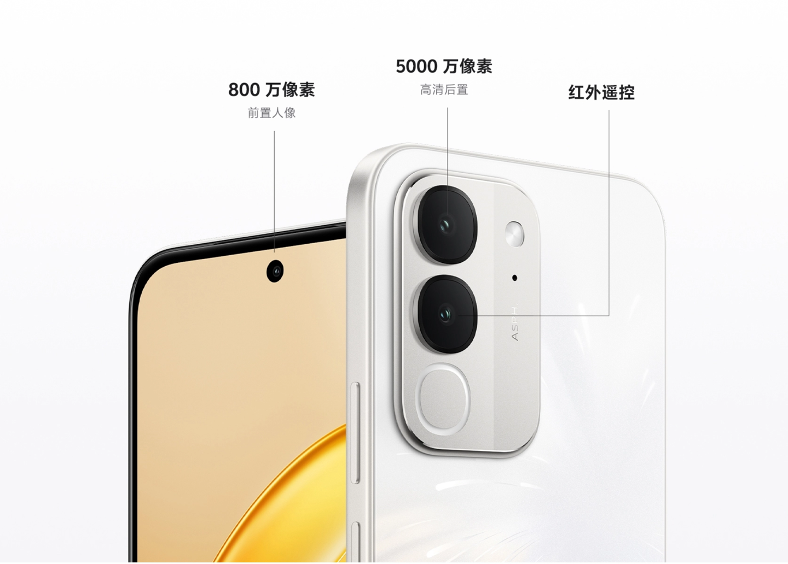
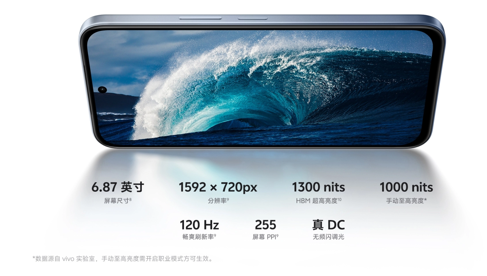
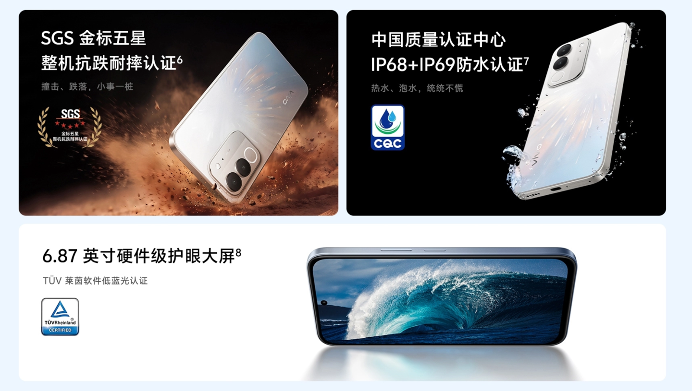
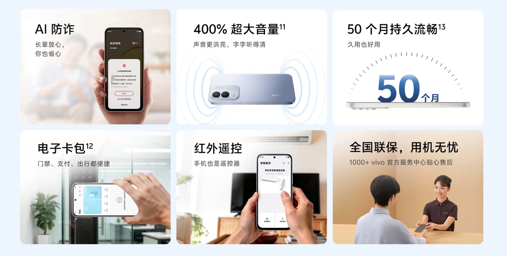

vivo ha presentado el Y600i, un teléfono de gama de entrada que aterriza en China con una de las baterías más grandes que se pueden encontrar en un móvil convencional. La compañía lo pondrá a la venta el 30 de septiembre desde 1699 yuanes en su versión de 6 GB de RAM y 128 GB de almacenamiento; la variante de 6 GB y 256 GB costará 1999 yuanes.

## Batería de 8000 mAh y carga de 44 W en el vivo Y600i

El dato que más destaca del Y600i es su batería de 8000 mAh, una capacidad que hasta hace poco quedaba reservada a tabletas y a algunos móviles de diseño robusto. La carga rápida se queda en 44 W, con un esquema de 11 V y 4 A, suficiente para reponer una celda de este tamaño sin dispararse en complejidad ni en precio.

El rendimiento corre a cargo de la plataforma Snapdragon 4 Gen 2, la segunda generación del chip de gama baja de Qualcomm. En el apartado fotográfico, la firma declara una cámara frontal de 8 megapíxeles y una trasera de 50 megapíxeles, además de un emisor de infrarrojos para usar el teléfono como mando a distancia de televisores y otros equipos del hogar.

## Pantalla de 6,87 pulgadas y resistencia IP68/IP69

El panel es un LCD de 6,87 pulgadas con resolución de 1592 × 720 píxeles y una tasa de refresco de 120 Hz. vivo declara un brillo máximo de 1300 nits en modo de alta luminancia y 1000 nits en el ajuste manual, además de atenuación DC para reducir el parpadeo y certificación TÜV Rheinland de baja luz azul.

En resistencia, el teléfono cuenta con certificación IP68 e IP69, lo que cubre tanto la inmersión en agua como los chorros a presión, y añade un sello SGS de cinco estrellas frente a golpes y caídas. El desbloqueo se resuelve con un lector de huellas capacitivo en el lateral. El peso es de 229 gramos en los acabados negro noche y azul cielo, y de 230 gramos en la variante estrellada.

## Qué significa para el lector

El Y600i se queda, de momento, en el mercado chino: vivo no ha anunciado planes de lanzamiento en España ni en el resto de Europa, por lo que su precio en yuanes no sirve como referencia directa de lo que costaría aquí. Aun así, la pieza apunta a una tendencia clara: los 8000 mAh dejan de ser una rareza de nicho y se cuelan en la gama de entrada, justo donde la autonomía pesa más que la potencia bruta. Un movimiento que ya se ha visto en otros fabricantes asiáticos, como el [OPPO K14 Plus](/noticias/oppo-k14-plus-8000mah-144hz/), que también recurre a esta capacidad.

La letra pequeña también importa: el terminal llega con funciones de prevención de fraude asistidas por IA, un refuerzo de volumen que la marca cifra en un 400 % y una promesa de mantenimiento de la fluidez del sistema durante 50 meses, además de garantía en más de mil centros de servicio oficiales dentro de China. Son extras pensados para el usuario local y no necesariamente trasladables a un hipotético lanzamiento internacional.
