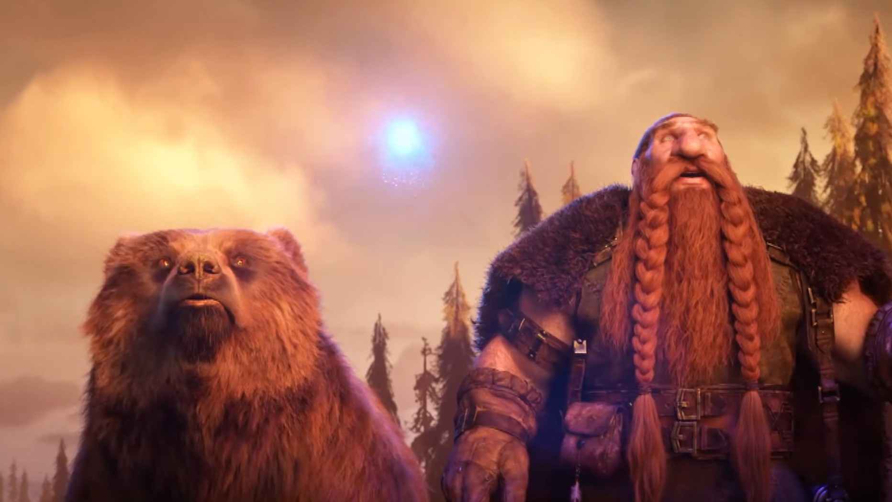
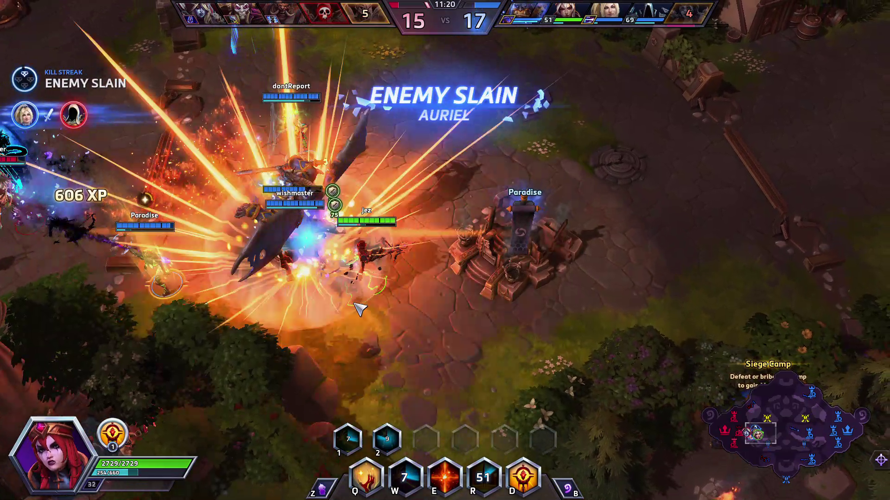
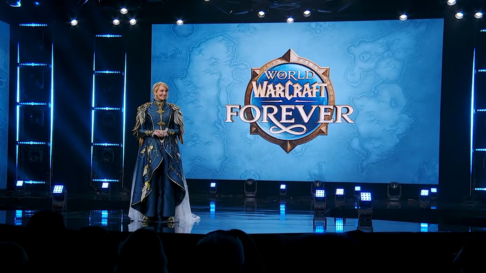

BlizzCon 2026 dejó varios anuncios para el ecosistema de Blizzard: el regreso de Warcraft 3 con la expansión Forsaken Kingdom —la primera en más de dos décadas—, la vuelta de Heroes of the Storm con el héroe Xal'atath y World of Warcraft: Forever, la apuesta de la compañía por revivir la experiencia clásica, que llegará en noviembre. En ese contexto, una de las preguntas más repetidas por la comunidad era si estos títulos, hoy exclusivos de PC, acabarán dando el salto a Xbox y a otras consolas.

El medio Windows Central trasladó esa duda directamente a los equipos de desarrollo durante la feria. Sus responsables ofrecieron variaciones de la misma respuesta, resumida en una frase que no confirma nada: «nunca digas nunca». Ninguna versión para consolas está anunciada ni prometida, y el foco declarado sigue siendo el PC.

## La misma evasiva en las tres mesas

Preguntado por una posible llegada del RTS a Xbox y otras consolas —género que ya se ha adaptado con mando en Halo Wars o Age of Empires—, el líder del proyecto de Warcraft 3, Brad Chan, dejó la puerta abierta sin comprometerse:

> «Vamos a hablarlo. Puede que sí, puede que no, no lo sé. Muchas cosas son posibles, pero ahora mismo estamos centrados [en PC]», declaró Chan.

El director del juego de World of Warcraft, Ion Hazzikostas, respondió en la misma línea cuando se le preguntó por una hipotética versión de consola. Según explicó, el soporte nativo para mando de Xbox en PC responde a una demanda real de la comunidad que lleva años recurriendo a complementos como Console Port:

> «Nuestro foco sigue siendo PC. No se trata solo de Xbox, es el mando en general. ¿Verdad? Hemos visto a muchísima gente de la comunidad usar complementos como Console Port durante años y hacer malabares para poder jugar a WoW con mando; queremos que eso sea más fácil», señaló Hazzikostas.

Sobre la posibilidad de que las eras Classic y Forever encajen mejor en consola por el ritmo más pausado del combate, el director añadió: «Nuestro foco sigue estando [en PC], pero en el futuro existen muchas posibilidades y veremos adónde nos lleva».

En el caso de Heroes of the Storm, el desarrollador principal James Yen fue igual de cauto. Preguntado por si un port a consolas o móviles —como ocurre con Pokémon Unite— podría ampliar su audiencia, respondió que el equipo piensa en todas las vías posibles, pero que ahora mismo eso distraería de la prioridad inmediata: consolidar el regreso y atender a los jugadores de siempre.

> «Pensamos en todas las vías por las que [Heroes of the Storm] podría ir, pero eso ahora mismo nos distrae un poco de "acabamos de volver, asegurémonos de cuidar a los jugadores que llevan aquí tanto tiempo, sigamos creando contenido para ellos"».

Yen añadió que existen objetivos a largo plazo, aunque los describió como metas lejanas: «Tenemos objetivos a largo plazo, pero son más bien como estrellas, ya sabes. Nuestras estrellas eran "volvamos; el BlizzCon fue el momento perfecto". Estamos avanzando hacia pensar en otras cosas, pero ahora mismo el foco es "démosle algo a los jugadores"».

## El mando como primer paso, no como confirmación

El detalle que alimenta la especulación es el soporte nativo para mando de Xbox en World of Warcraft. Hasta ahora, jugar con gamepad en PC obligaba a instalar complementos de terceros; integrarlo en el cliente facilita la experiencia, pero no equivale a un anuncio de versión para consolas.

Conviene recordar que la compañía sí ha llevado otras franquicias a consolas recientemente, como Diablo 4 en Nintendo Switch 2, lo que demuestra que la puerta no está cerrada por norma. La diferencia es que cada franquicia tiene sus propias particularidades técnicas y de audiencia, y los equipos entrevistados no ofrecieron calendario, plataformas objetivo ni compromiso alguno.

## Qué cabe esperar

En su análisis, el autor de la entrevista sostiene que un desembarco en consolas le parece «inevitable, al menos para World of Warcraft», y lo justifica en que Forever se apoya en gráficos clásicos capaces de correr en casi cualquier dispositivo moderno, incluidos Nintendo Switch 2 y Steam Deck. Se trata, sin embargo, de una opinión del medio, no de una declaración de Blizzard.

Para Warcraft 3 y Heroes of the Storm el escenario es más incierto: el RTS nunca ha encontrado una audiencia amplia en consolas, mientras que un MOBA como Heroes podría adaptarse bien al mando. Por ahora, todo lo que hay sobre la mesa es una negativa a decir «no» y una insistencia en que el presente sigue estando en PC.

Para el jugador hispanohablante, la lectura práctica es sencilla: quien espere jugar a estos títulos en Xbox, PlayStation o Switch tendrá que seguir esperando. No hay fechas, ni plataformas confirmadas, ni siquiera un compromiso de que el proyecto esté en marcha.
