Apple publicó watchOS 27 el 14 de septiembre y sus cambios no están reservados a quienes estrenen un Watch Series 12 o un Ultra 4. Si tu modelo es compatible, la actualización trae una docena de novedades que merece la pena repasar. Se instala desde la app Watch del iPhone, en General → Actualización de software, con el reloj colocado en su cargador.

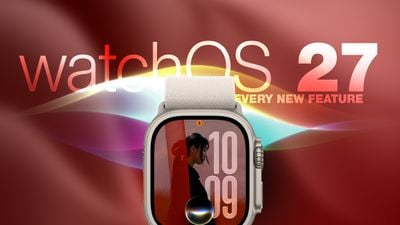

## Qué pasó: Siri se convierte en el centro del reloj

El gran protagonista de watchOS 27 es Siri con IA. El asistente gana conciencia de contexto y estrena una aplicación propia que reúne todas las conversaciones en una sola vista y las sincroniza de forma privada entre dispositivos mediante iCloud: puedes empezar a preguntar algo en el iPhone y retomar el hilo en la muñeca, fijar las conversaciones que quieras conservar o abrir un chat nuevo directamente desde el reloj.

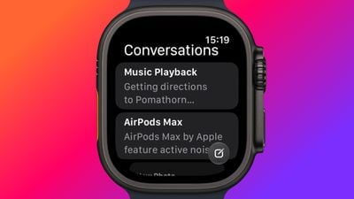

A su lado llega una esfera modular de Siri con una complicación rectangular que muestra lo más relevante de la Pila Inteligente y se actualiza a lo largo del día según la hora, la ubicación y otros factores.

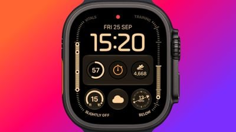

La navegación también cambia. Pulsar la corona digital ya no abre la clásica colmena de aplicaciones: ahora aparece una cuadrícula dinámica con apps sugeridas, las más usadas y las usadas recientemente, con Siri en el centro. La lista alfabética completa sigue disponible girando la corona.

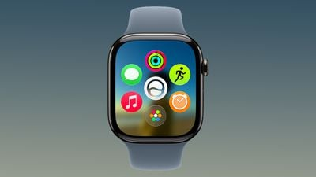

Y hay un tercer gesto que se suma al doble toque y al giro de muñeca: se llama Toque, y consiste en juntar una vez el índice y el pulgar para abrir el widget destacado de la Pila Inteligente. El doble toque sigue sirviendo para navegar por la pila y el giro de muñeca para descartar notificaciones.

No todo son sumas. Walkie-Talkie desaparece con esta versión: la app deja de estar disponible tras actualizar y no se puede volver a instalar desde la App Store. Quien se quede en watchOS 26 la conserva, pero no podrá iniciar conversaciones con contactos que ya hayan actualizado.

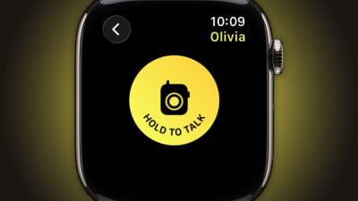

Otro cambio que puede despistar: la doble pulsación de la corona, que antes abría el conmutador de apps, muestra ahora la cuadrícula dinámica. Ese gesto queda reservado para Live Rewind, una función pendiente de lanzamiento y exclusiva de los Series 12 y Ultra 4 que transcribirá los últimos quince segundos de sonido del entorno. El conmutador de apps regresará con watchOS 27.2 asociado a un gesto distinto —puedes leer los detalles en [la vuelta del conmutador de apps en watchOS 27.2](/noticias/watchos-27-2-app-switcher-returns/)— y en la beta actual se abre con una pulsación larga en la parte inferior de la app en uso.

## Por qué importa: salud y deporte ganan autonomía

En el apartado de localización, las tres apps de Buscar (dispositivos, objetos y personas) se fusionan en una única app Encontrar con un diseño centrado en el mapa, que incluye accesos directos para obtener direcciones y localizar objetos cercanos.

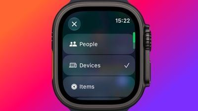

Workout Buddy, el entrenador introducido en watchOS 26, deja de exigir el iPhone cerca: funciona en el reloj siempre que haya wifi o conexión de datos. Además incorpora lecturas nuevas del historial de entrenamiento, con seguimiento de la progresión en ritmo, distancia y duración, y ahora habla español además de inglés.

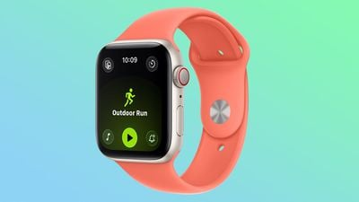

El control del ciclo en la app Salud puede avisar cuando los patrones registrados sugieren perimenopausia, con seguimiento de síntomas y material educativo. Apple precisa que estos avisos solo se basan en el historial registrado, se aplican a partir de los 40 años y no constituyen ni un método anticonceptivo ni un diagnóstico.

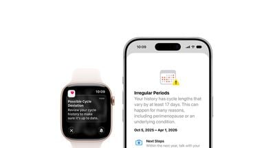

Para quienes entrenan en interior, los nuevos algoritmos de movimiento por aprendizaje automático miden la distancia en carrera y caminata con más precisión desde el primer paso, sin el periodo de ajuste de antes. Los mapas de ruta de exterior también son más exactos y el recuento de pasos por fin coincide entre las apps Fitness y Salud.

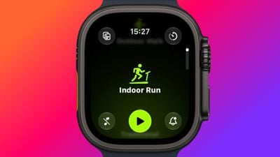

## Qué cambia para el lector: watchOS 27 desata el reloj del iPhone

La Pila Inteligente se vuelve más perspicaz con sugerencias contextuales nuevas: la ubicación del coche aparcado, el cumpleaños de un contacto cercano, cambios en el saldo de la tarjeta de transporte, la app Ruido justo después de una alerta acústica, un recordatorio de que el modo Teatro sigue activo, mensajes fijados, celebraciones y carnés de identidad.

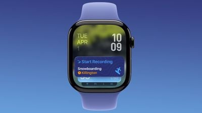

Los estrenos de hardware también reciben un extra: en el Series 12 y el Ultra 4, un modelo de podómetro rediseñado junto al chip S11 permite un recuento de pasos más preciso y una complicación de Pasos que lo muestra en tiempo real desde la esfera. Queda por ver si llegará a modelos anteriores.

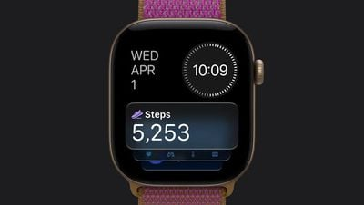

En conjunto, watchOS 27 acerca el Apple Watch a la idea de asistente personal en la muñeca: Siri con IA y su app propia, una navegación reorganizada en torno a lo que más usas y funciones de salud y deporte que dependen menos del iPhone. La contrapartida es despedirse de Walkie-Talkie y reaprender un par de gestos, con el conmutador de apps a la espera de su regreso en la versión 27.2.
