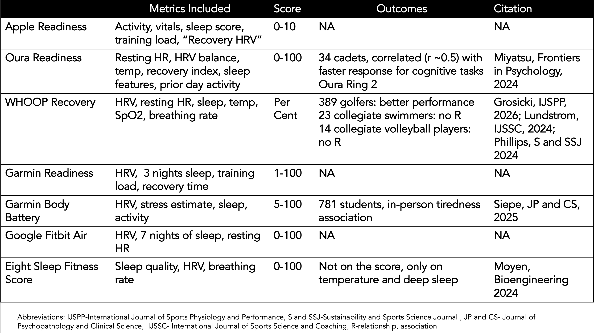
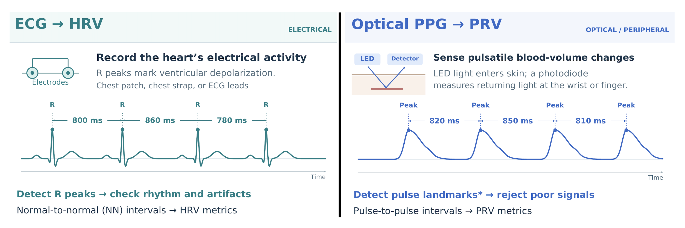
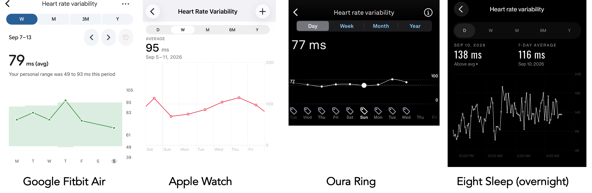

La escena se repite cada mañana: el reloj o el anillo muestra un número y sentencia cómo afrontar el día. Las llamadas readiness scores —puntuaciones de preparación o recuperación— se han convertido en una de las señales más consultadas de los wearables, y Apple acaba de sumarse al club. El 9 de septiembre presentó el rediseño de su sistema de sensores de salud con una Readiness de 0 a 10, en línea con [los nuevos Series 12 y Ultra 4, capaces de medir el pulso cada cinco segundos](/noticias/apple-watch-series-12-ultra-4-theater-mode/). Pero una revisión de la evidencia publicada por el cardiólogo Eric Topol en su boletín Ground Truths, difundida por Gadgets & Wearables, llega a una conclusión incómoda: la señal que miden estos dispositivos puede ser buena, pero nadie ha demostrado que seguir el consejo de la puntuación mejore la salud.

## Qué promete (y qué mide) una readiness score

En esencia, una readiness score combina varias métricas —variabilidad de la frecuencia cardiaca (HRV), frecuencia cardiaca en reposo, sueño y actividad reciente— y las condensa en un único valor. Cada fabricante le pone su nombre: Readiness en Garmin y Oura, Recovery en Whoop, Fitness Score en Eight Sleep. Apple se incorporó en septiembre con su propia puntuación, disponible solo en el Watch Series 12 y el Ultra 4, y con un dato revelador: la firma no ha publicado ninguna investigación sobre ella, ni siquiera en su web.

El contexto explica el interés. Más de 100 millones de adultos en Estados Unidos usan sensores ponibles, y estos valores se promocionan como una medida de la salud del sistema nervioso autónomo, un marcador de envejecimiento biológico o una vía hacia la longevidad. Topol es tajante: nada de eso está probado.

La oferta, además, no deja de crecer. Relojes como [el Moto Watch Ultra de Motorola, que incorpora las métricas de Polar](/noticias/moto-watch-ultra-lte/), ensanchan un catálogo en el que la puntuación final se presenta como la pieza estrella.

## La brecha: medir una señal no es saber qué hacer con ella

Topol no cuestiona que los wearables midan la frecuencia cardiaca, el sueño o el HRV. Su pregunta es otra: si Apple indica «Recuperar» o Garmin marca una Training Readiness baja, ¿ignorar ese consejo empeora el entrenamiento, retrasa la recuperación o aumenta el riesgo de lesión? El investigador esperaba encontrar al menos algún estudio de alta calidad que demostrara la utilidad de estas puntuaciones vinculándolas a resultados de salud; no encontró ninguno.

Una revisión de 2025 sobre 14 puntuaciones compuestas de readiness y recuperación —citada por Topol— llegó a una conclusión parecida: el HRV pesaba un 86 % en esas notas, la frecuencia cardiaca en reposo un 79 %, y la actividad física y la duración del sueño un 71 % cada una. Los protocolos de medición variaban y no había estandarización. El mejor ejemplo que halló Topol fue un estudio de Whoop con 389 golfistas profesionales: una Recovery 10 puntos más alta se asoció a unos 0,5 golpes menos por vuelta. El problema es que el trabajo no tenía grupo de control y solo mostraba una asociación, no una relación causal.

Hay un agravante estructural: las fórmulas son propiedad de cada empresa, no se publican y pueden cambiar sin avisar. Como no existe un estándar común, un 90 de Oura no significa lo mismo que un 90 de un Google Fitbit Air. De todas las métricas implicadas, la única que ha demostrado ser muy precisa de forma consistente entre dispositivos es la frecuencia cardiaca en reposo.

La competencia por la mejor puntuación es también una batalla comercial: [Garmin lanzó su pulsera CIRQA sin cuota mensual para atacar el modelo de suscripción de Whoop](/noticias/garmin-cirqa-screenless-band/).

## El HRV del reloj no es el HRV de un electrocardiograma

Aquí está el matiz técnico que sostiene buena parte del debate. La evidencia que vincula un HRV bajo con peores resultados de salud —más mortalidad por cualquier causa y cardiovascular, y vínculos menos sólidos con deterioro cognitivo, demencia, enfermedad mental, diabetes tipo 2 o abuso de sustancias— procede de mediciones con electrocardiograma (ECG). Los relojes y anillos, en cambio, usan un sensor óptico que sigue el pulso en la piel y produce una magnitud relacionada, pero distinta: la variabilidad de la frecuencia de pulso (PRV).

Ambas coinciden razonablemente en reposo o durante el sueño, pero la concordancia se deteriora con el movimiento, un ajuste flojo del sensor, problemas de circulación o ciertas enfermedades. Y la investigación es escasa. El estudio que suele citarse se hizo con solo 13 adultos sanos —Oura Ring 3 y 4, Whoop 4.0 y Garmin Fenix 6— y encontró correlaciones de 0,88 a 0,97, con un error porcentual absoluto medio del 6 % al 10 %. En el otro extremo, un trabajo con más de 900 adultos halló una correlación pobre entre HRV y PRV y concluyó que la PRV es «un sustituto inválido del HRV»; una revisión sistemática de 43 estudios fue igual de cauta y advirtió de que la PRV no es intercambiable de forma universal. El mayor estudio disponible, con más de 8 millones de usuarios de Fitbit, es también el más antiguo: los datos son de 2018.

Faltan, además, grupos poco representados: personas mayores, personas con sobrepeso u obesidad y personas de color, en quienes el sensor óptico puede ser menos preciso. Y el HRV no es una señal específica: lo bajan el ejercicio intenso, el alcohol, la enfermedad, el estrés o dormir mal. La propia comunidad de Oura estima caídas del HRV nocturno del 8 % sin alcohol, del 4 % con vino y del 14 % tras una fiesta.

¿Significa eso que el HRV cause algo? La evidencia apunta a lo contrario. En un estudio del UK Biobank con más de 46.000 participantes, un HRV predicho genéticamente no mostró la relación esperada con la mortalidad, lo que sugiere que el HRV refleja un estado fisiológico, pero no lo provoca.

## Cómo usarlas sin engañarse

Nada de esto significa tirar el reloj. Como indicador de tendencia personal, una readiness score puede ser útil: varias lecturas inusuales seguidas del mismo dispositivo merecen más atención que una cifra baja aislada. La recomendación que se desprende del repaso es mirar tendencias de al menos dos o tres semanas, siempre con el mismo dispositivo y en condiciones comparables, y usar las mediciones nocturnas con poco movimiento y la métrica RMSSD como el mejor acercamiento al HRV real.

El riesgo es la precisión que sugiere el número final. Quien se obsesiona con la puntuación puede caer en la «ortosomnia» o en ansiedad, que a su vez empeora las cifras. Topol recuerda que tampoco hay pruebas de que subir el HRV mejore la salud: es un marcador indirecto sin causalidad demostrada, y las empresas no han publicado estudios prospectivos o aleatorizados que lo conecten con resultados de salud. «No estamos listos para las readiness scores», resume.

El propio autor reconoce el potencial: la neurocientífica Maiken Nedergaard ha propuesto que el HRV podría servir como marcador no invasivo de circuitos entre el cerebro y el cuerpo, incluida la limpieza cerebral durante el sueño. Sería muy útil, pero exige investigación sólida. Mientras llega, la puntuación de cada mañana sigue siendo una señal real a la que le falta la prueba de que acertar con ella cambie algo.
