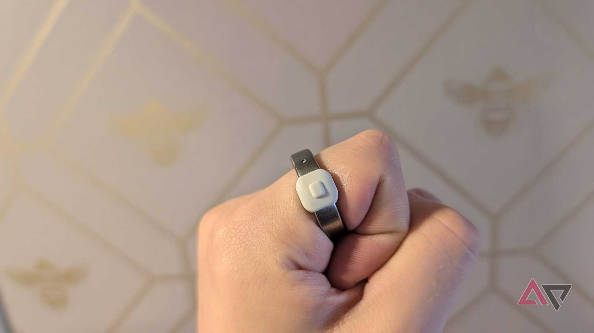
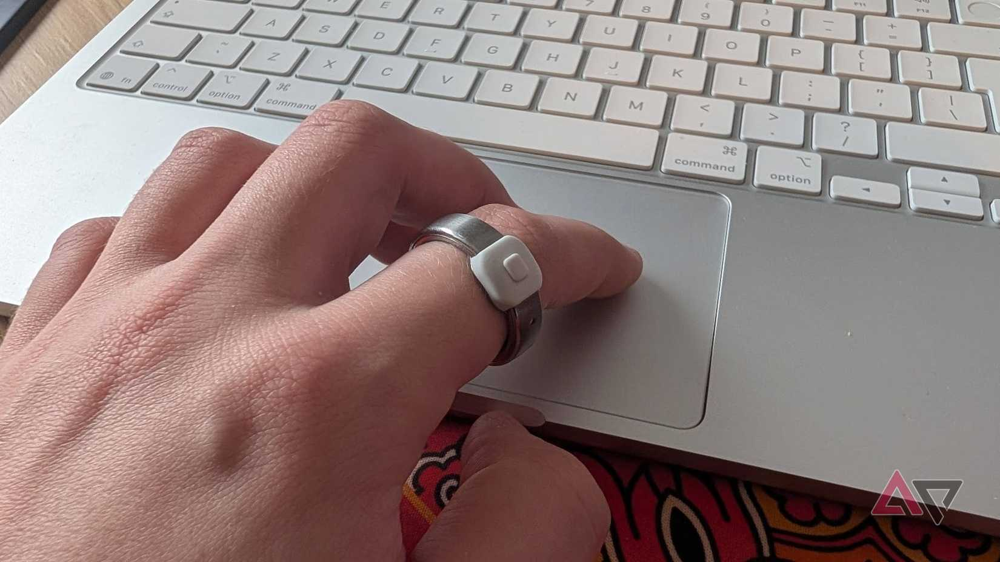
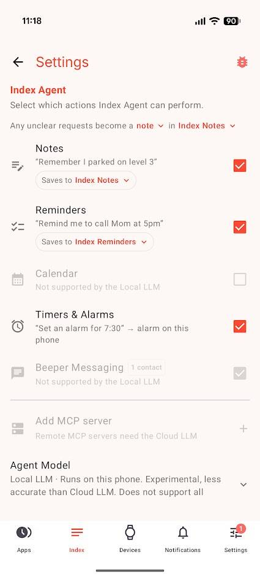

El **Pebble Index 01** no es un anillo de salud ni un reloj inteligente. Es un anillo con un botón que graba la voz y la convierte en tareas. El redactor de Android Police Jon Gilbert lo probó y asegura que ha sustituido con él su Pixel Watch y buena parte de sus aplicaciones de productividad. Conviene separar dos planos desde el principio: lo que el producto hace y lo que su autor opina sobre él.

## Un botón en el dedo que convierte la voz en tareas

El funcionamiento es tan simple como suena: se pulsa el botón con el pulgar, se habla y se suelta. La grabación viaja al teléfono, donde la aplicación de Pebble y su modelo de lenguaje (LLM) integrado deciden qué hacer con ella. Según el autor, ese modelo puede crear una nota, añadir un recordatorio, crear un evento de calendario, poner una alarma o enviar un mensaje de texto.

El botón no sirve solo para dictar. Con varias pulsaciones controla la reproducción de música —el ajuste de fábrica asigna una pulsación a reproducir o pausar y dos o tres a cambiar de pista— y, manteniendo una doble pulsación, lanza una búsqueda web. La app permite además elegir qué acciones puede ejecutar el asistente.

La clave, cuenta el autor, es dónde queda el botón: al lado del pulgar cuando la mano está relajada, no debajo de él. Eso permite activarlo con un movimiento mínimo, incluso con las manos ocupadas. Pone un ejemplo cotidiano: mientras hacía la maleta, preguntó a un amigo por la silla de oficina que acababa de comprar y aprovechó para apuntar que debía investigarla más tarde.

## Su autor lo ve más rápido y discreto que un asistente de voz

Este apartado es, explícitamente, la experiencia personal del redactor y no una medición independiente. Su conclusión es que el Index 01 le resulta más rápido que invocar al asistente del teléfono: asegura que tarda unos tres segundos en ejecutar la acción, frente a la espera que, dice, se ha vuelto habitual desde que Gemini sustituyó a Google Assistant. También lo encuentra más discreto, porque puede pulsar el botón mientras mantiene una conversación en lugar de hablarle a un altavoz.

Sobre el reconocimiento, el autor señala que el modelo descarta el lenguaje sobrante y que funciona mejor cuando la instrucción empieza por la acción («pon un recordatorio…», «añade a mi lista…»), aunque en general se maneja con órdenes vagas. En cuanto al diseño, reconoce que es más grueso que la mayoría de anillos y que temía que resultara incómodo, pero afirma que a la semana de uso se olvida de que lo lleva puesto.

## El Index 01 nunca se carga: la promesa y su letra pequeña

Aquí llegan los datos del producto, que su autor mezcla con su valoración. La batería del Index 01 no se puede cambiar ni recargar. Pebble afirma que puede durar hasta dos años con un uso normal —entre 10 y 20 notas de voz al día—, lo que elimina por completo la rutina de cargarlo, pero también convierte la vida del anillo en la vida de su batería. Es la pregunta incómoda de siempre: si la celda se agota antes de lo prometido, no hay reemplazo posible.

El anillo es resistente al agua hasta un metro, y el autor lo ha llevado mientras se lavaba las manos y se duchaba sin que dejara de funcionar. En privacidad, la conexión entre el anillo y el teléfono va cifrada y las grabaciones pueden procesarse en el propio dispositivo: tanto el anillo como la app funcionan sin conexión y no dependen de un servicio en la nube. En el apartado de integraciones, guarda las notas en la aplicación de Pebble y puede enlazar con Google Tasks, Notion, Tasker u Obsidian.

La app deja claro que el modelo local es una opción experimental, menos precisa que el modelo en la nube, y que algunas acciones dependen de este último. Es un matiz importante para quien quiera entender hasta dónde llega el procesamiento local que promete el producto.

## Qué cambia para quien ya lleva un reloj en la muñeca

El Index 01 no mide nada. No tiene seguimiento de salud y su autor admite que no es lo bastante proactivo como para llamarlo anillo inteligente en el sentido habitual. Tampoco muestra notificaciones ni tiene pantalla. Su valor no está en la ficha técnica, sino en sustituir un gesto que hacemos decenas de veces al día: sacar el móvil para apuntar algo. El autor asegura que mantiene Google Keep para colaborar y Bundled Notes para guardar recetas, pero que el anillo ha reemplazado sus listas de tareas y sus aplicaciones de notas.

Para quien busque métricas de salud o notificaciones, hay alternativas pensadas para eso, como [el anillo con seguimiento de Qalo](/noticias/wearables/qalo-pulsera-anillo/). Si lo que quieres es dejar de interrumpir lo que haces para no olvidar una idea, este tipo de anillo tiene sentido; si esperas datos de salud, una pantalla o la posibilidad de reemplazar la batería, todavía no es tu producto.
