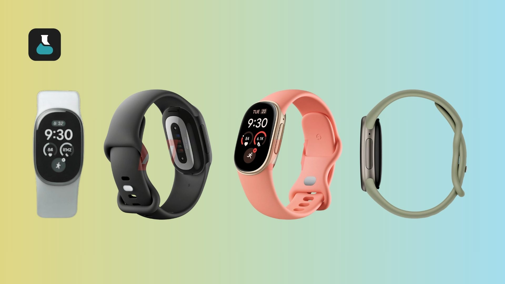
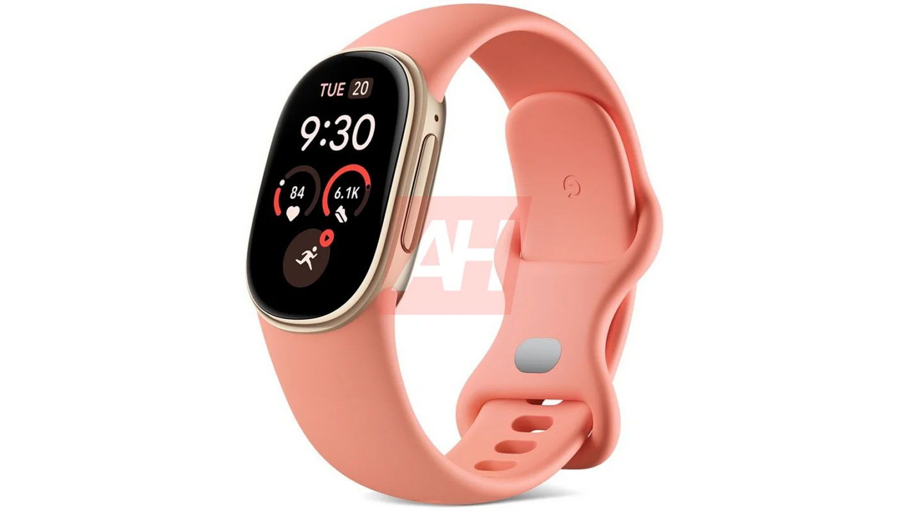

Google prepara un ponible que todavía no ha anunciado, pero que ya ha aparecido varias veces en filtración: el **Fitbit Edge**. La última, recogida por GSMArena y atribuida al medio francés Dealabs, apunta a un precio de **179 € en la eurozona y 159 £ en el Reino Unido**, además de cuatro colores y buena parte de su ficha técnica. Conviene recordarlo desde ya: **nada de esto está confirmado por Google**.

## Un precio que lo coloca en el hueco del Fitbit Charge 6

Si la cifra se cumple, el Fitbit Edge se sentaría justo por encima del Fitbit Charge 6 y muy por debajo de la familia Pixel Watch. Esa franja es la de quien quiere seguimiento de salud serio sin el precio ni la autonomía de un reloj inteligente completo. Según la filtración, el dispositivo llegará en cuatro acabados heredados del Pixel Watch 5:

- **Obsidian & Matte Black**: caja de aluminio en negro mate con correa deportiva negra.
- **Olive & Satin Pyrite**: caja de aluminio Satin Pyrite con correa verde oliva.
- **Canyon & Champagne Gold**: caja de aluminio en oro champán con correa rosa melocotón.
- **Fog & Polished Silver**: caja de aluminio en plata pulida con correa gris niebla.

## Qué promete la ficha técnica filtrada del Fitbit Edge

La lista de especificaciones que circula es larga y mezcla lo que ya se veía en renders anteriores con datos nuevos. Sobre el papel, el Fitbit Edge tendría una **pantalla AMOLED rectangular de 1,34 pulgadas** con modo always-on, un cuerpo de aluminio de 17,7 gramos y resistencia al agua y al polvo **5 ATM e IP68**. La autonomía anunciada sería de **siete días**, que caerían a unos **dos días con la pantalla siempre activa**; la carga completa rondaría las dos horas, aunque otras fuentes hablan de cargas rápidas parciales de minutos.

En sensores y métricas, la filtración menciona GPS, Bluetooth 5.4, acelerómetro, barómetro, giroscopio, sensor de frecuencia cardíaca, SpO2, ECG, sensor de luz ambiental y podómetro. A eso se sumarían más de **40 modos de ejercicio**, detección automática de actividad, seguimiento del sueño y del ciclo menstrual, temperatura de la piel y métricas derivadas como carga cardíaca, nivel de forma física y VO2 máximo.

## La letra pequeña: Gemini, batería reemplazable y dudas razonables

El gancho de esta generación no sería el hardware, sino el software. Las filtraciones hablan de un **entrenador personal con Gemini**, capaz de dar indicaciones durante el entrenamiento y planes adaptados, además de compatibilidad con **Android e iOS**. Es un detalle importante: los Pixel Watch son solo para Android, así que el Fitbit Edge recuperaría al público de iPhone, igual que el Fitbit Air.

Hay también dos promesas que conviene mirar con lupa hasta que Google las confirme. La primera es la de una **batería reemplazable por el usuario**, poco habitual en este segmento y muy útil a largo plazo. La segunda son las métricas de tendencia de presión arterial y de resistencia a la insulina, un tipo de dato que en el pasado ha llegado ligado a suscripciones o a funciones aún en rodaje. Ninguna filtración aclara cuánto de esto dependerá de una suscripción de pago.

Desde el punto de vista del uso diario, la propuesta tiene sentido: pantalla para ver notificaciones y progreso, pero sin la complejidad ni el mantenimiento de un Wear OS. El propio contexto del portal lo anticipaba: el [Fitbit Charge 7 ya asomó en la FCC](/noticias/fitbit-charge-7-launch/), y el Edge parece la pieza que Google quiere colocar entre el Air sin pantalla y el Pixel Watch 5.

## Qué cambia para el lector

Todavía no hay fecha oficial. La filtración de esta semana es más detallada que las anteriores y apunta a un debut cercano, pero hasta que Google anuncie el Fitbit Edge, el precio, los colores y las métricas de salud siguen siendo un rumor. **Si buscas un ponible con pantalla, buena autonomía y entrenador con IA, este es un candidato a seguir; si necesitas certezas sobre salud o compra inmediata, espera a la presentación oficial.**
