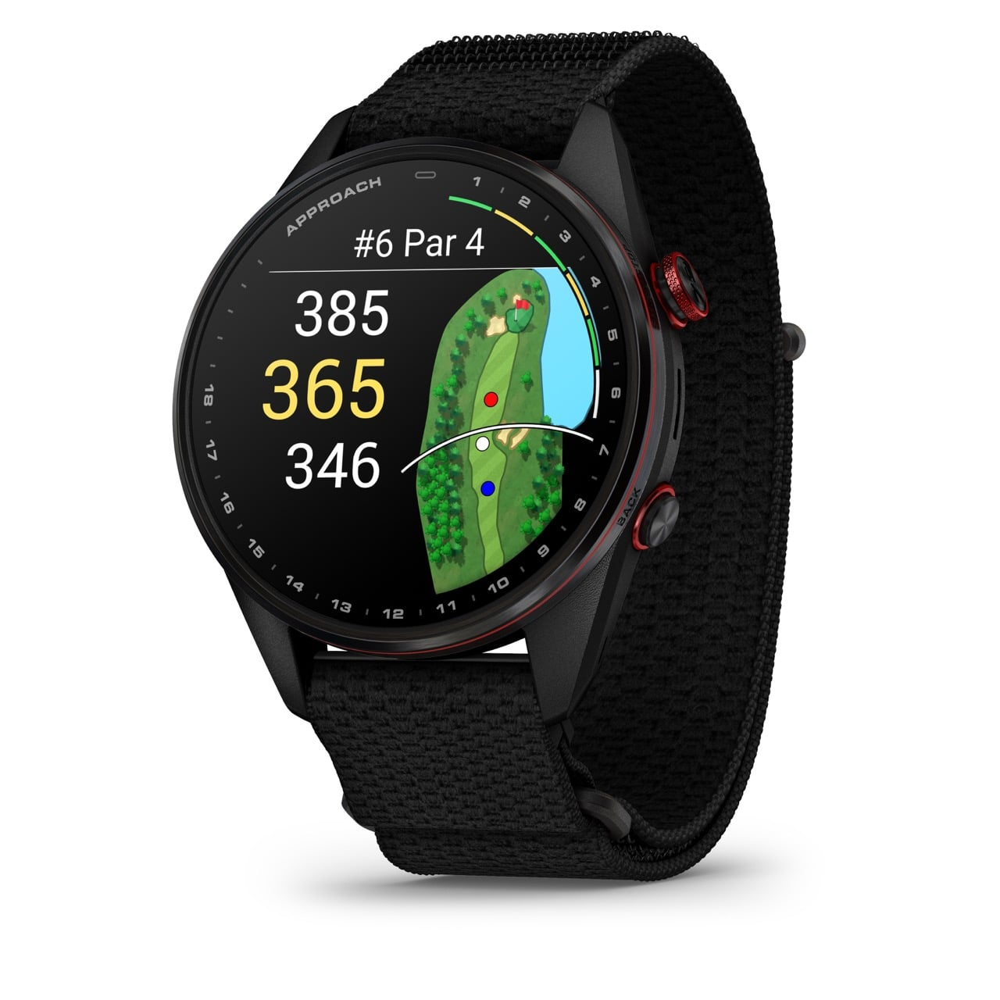

Garmin ha presentado el Approach S72, su nuevo buque insignia para el golf, y la novedad no está ni en la pantalla ni en el bisel: está en lo que el reloj mide mientras juegas. El dispositivo llega en dos tamaños, 43 y 47 mm, con pantalla AMOLED, bisel de titanio, cristal de zafiro y correa de tela ComfortFit, y Garmin lo pone a la venta desde 799,99 dólares. La promesa es que el reloj no se limite a indicar a qué distancia está la bandera, sino que ayude a entender por qué se juega como se juega.

## Qué mide el Approach S72 en tu swing

La función que más cambia el uso es la medición del swing directamente desde la muñeca, sin sensores en el palo. Garmin detalla que el reloj registra velocidad de mano, longitud del backswing y rotación de la muñeca, entre otros datos, para que el jugador se apoye en cifras y no solo en la sensación. A esto se suma un perfil de actividad específico para el campo de prácticas: además de analizar las tendencias del jugador, las sesiones se registran en la aplicación Garmin Connect y cuentan para sus objetivos de fitness.

En el apartado de datos biométricos, el Approach S72 incorpora frecuencia cardiaca en tiempo real y permite revisar cómo varió durante una vuelta ya completada. Garmin insiste en que no es un dispositivo médico y que sus métricas no sirven para diagnosticar ni vigilar ninguna condición de salud.

## Lectura de green y ayuda en cada golpe

Para afinar la puntería, Garmin añade una función de lectura de green que muestra hacia dónde romperá el putt y el porcentaje medio de pendiente en campos seleccionados, siempre que se tenga activa una suscripción a Garmin Golf. También hay analíticas de putting —sesgo de velocidad y de dirección, tasa de acierto y otros— y vistas aéreas del hoyo con imágenes reales para decidir dónde poner la bola. La lectura de green, las analíticas y las vistas aéreas requieren esa membresía, así que conviene tenerlo en cuenta antes de contar con ellas.

## Un reloj que también sirve fuera del campo

Lo que más acerca este modelo al día a día es el salto en conectividad. Es el primer reloj de golf de Garmin con altavoz y micrófono, lo que permite hacer y recibir llamadas y ejecutar tareas básicas por voz. Añade también una linterna integrada con intensidades de luz blanca y roja, útil para encontrar el material en la bolsa o iluminar una zona oscura. En autonomía, la versión de mayor tamaño promete hasta 20 horas en el campo y hasta 16 días con el GPS apagado.

Fuera del green mantiene las funciones de salud de gama alta de la marca: frecuencia cardiaca en la muñeca, seguimiento del estrés, Body Battery, monitorización avanzada del sueño y perfiles de actividad precargados. Es la misma línea de sensores corporales que Garmin ha ido reforzando con movimientos como la [compra de Moxy Monitor y su apuesta por la fatiga muscular](/noticias/wearables/garmin-compra-moxy-monitor-muscle-battery/).

## Para quién es

El Approach S72 no es un reloj barato: arranca en 799,99 dólares y buena parte de las funciones de golf más útiles quedan detrás de la suscripción Garmin Golf. Si juegas con frecuencia y quieres datos sobre tu swing y tu ronda, tiene sentido. Si lo que buscas es un ponible de diario con GPS ocasional, el precio y la dependencia de la membresía pesan más de lo que aporta. Quien esperaba un relevo de la gama MARQ Golfer —como ha dejado caer TechRadar— sigue sin tenerlo aquí.
