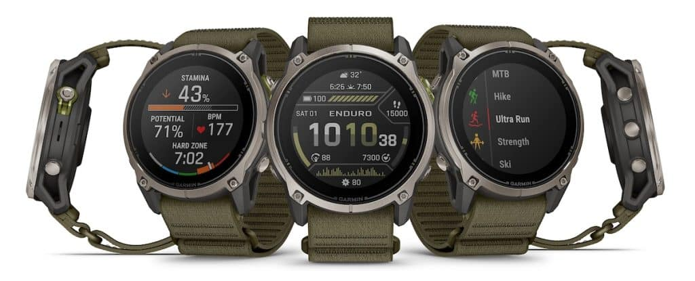
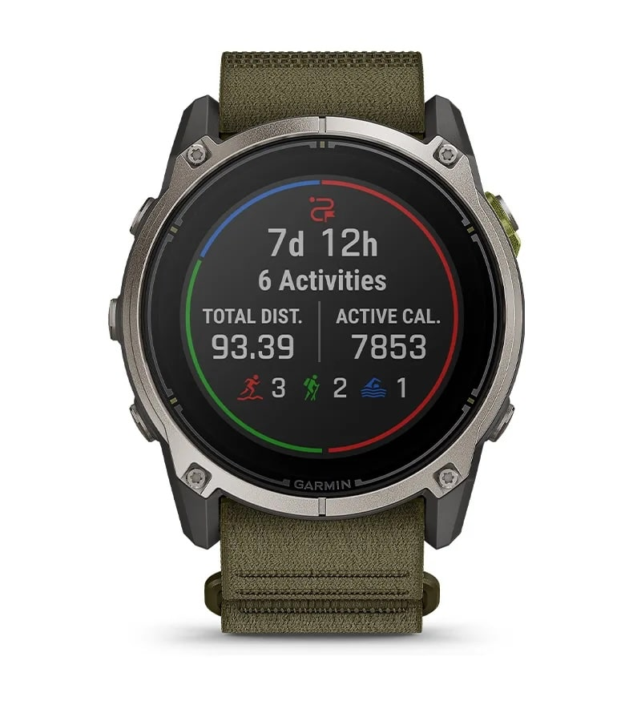

Garmin ha presentado el Enduro 4, un reloj GPS con carga solar que mantiene la receta del Enduro 3 y traslada casi toda su actualización al terreno del software. La compañía lo sitúa como su smartwatch GPS de mayor autonomía —hasta 90 días en modo reloj y hasta 320 horas en actividad con exposición solar suficiente— y ya está a la venta por 899,99 dólares.

## El Enduro 4 mantiene la autonomía y dobla el almacenamiento

En la muñeca, las cifras de batería apenas se mueven. Garmin repite las referencias del Enduro 3: hasta 36 días en modo reloj (90 días con carga solar), hasta 120 horas de GPS continuo (320 horas con solar) y hasta 60 horas en máxima precisión (90 horas con solar). El modo de ahorro llega a 92 días y, con luz suficiente, Garmin no le pone tope.

No es un problema: el Enduro 3 ya se construyó alrededor de una autonomía difícil de discutir, y perseguir un número más grande no habría cambiado gran cosa en el uso diario. Los dos cambios físicos son la memoria, que pasa de 32 GB a 64 GB —más sitio para mapas y música en salidas largas—, y la correa ComfortFit, que sustituye al lazo elástico de nylon del modelo anterior y sube el peso total de 63 a 66 gramos (la caja sola se queda en 57 gramos).

El resto es reconocible: caja de 51 mm en polímero reforzado con fibra, bisel de titanio, lente Power Sapphire, pantalla MIP de 1,4 pulgadas (280 × 280) con carga solar, linterna LED con opción de luz blanca y roja, y resistencia al agua de 10 ATM.

## Nuevas métricas y un planificador de carrera

El grueso de la actualización está en el software. El Enduro 4 estrena objetivos de ritmo ajustados por desnivel, pensados para mantener el esfuerzo constante en subidas y bajadas, y un ritmo rodante también ajustado por pendiente en tiempo real. Se suman las zonas de stamina, que muestran cómo la energía disponible condiciona cada actividad, y la curva de stamina, que estima cómo evoluciona la resistencia según la forma física y el historial de entrenamiento.

Garmin añade además un planificador de carrera para pruebas largas, con puntos de avituallamiento, controles de corte, notas y descansos previstos, y un temporizador de descanso automático que evita tener que pulsar botones a mitad de carrera. La navegación gana fluidez gracias a un 50 % más de RAM que el Enduro 3 y a un motor de mapas renovado: la compañía promete un desplazamiento un 30 % más rápido y una vista en perspectiva con más detalle.

## Garmin Epic agrupa las travesías de varios días

La novedad con nombre propio es Garmin Epic, diseñada para actividades que se alargan varios días. En lugar de tratar cada jornada como un bloque aislado, reúne las actividades en un mismo relato dentro de Garmin Connect —durante días, semanas o meses— y permite añadir fotos, compartirlo y consultar los datos de salud y rendimiento acumulados en ese periodo.

A esto se suman herramientas para el remo indoor, con VO2 máx y curva de potencia, funciones ampliadas de rucking —peso de la mochila ajustable durante la actividad y objetivos como las calorías quemadas—, y más de 100 perfiles deportivos. El sensor es el habitual de Garmin: pulso en la muñeca, Pulse Ox, temperatura de la piel, GPS y GNSS multibanda con SatIQ, altímetro, barómetro y brújula. El apartado de salud y descanso hereda el informe nocturno, la alarma inteligente y el estado de salud.

## Qué cambia para quien ya tiene un Enduro 3

Conviene ser claro: quien venga de un Enduro 3 no encontrará un reloj que deje obsoleto el suyo. La caja, la pantalla, la carga solar y casi todas las cifras de batería son idénticas, y la caja pesa exactamente lo mismo. El doble de almacenamiento es útil y el software es más completo, pero el hardware por sí solo da pocas razones para correr a la tienda.

Si buscas un reloj para ultras y travesías de varios días y quieres las últimas métricas de desnivel, el planificador de carrera o Garmin Epic, sí: el Enduro 4 es el modelo actual y la referencia de la gama. Si lo que buscas es, sobre todo, mucha batería, tu Enduro 3 sigue cumpliendo, y Garmin ya priorizó la autonomía sobre la tecnología de pantalla cuando decidió [volver al AMOLED en el Fenix 9 Pro](/noticias/garmin-fenix-9-pro-microled-skip/). Esperar a ver cómo rinde la autonomía real del Enduro 4 con la pantalla siempre activa es, hoy, la decisión más prudente.
