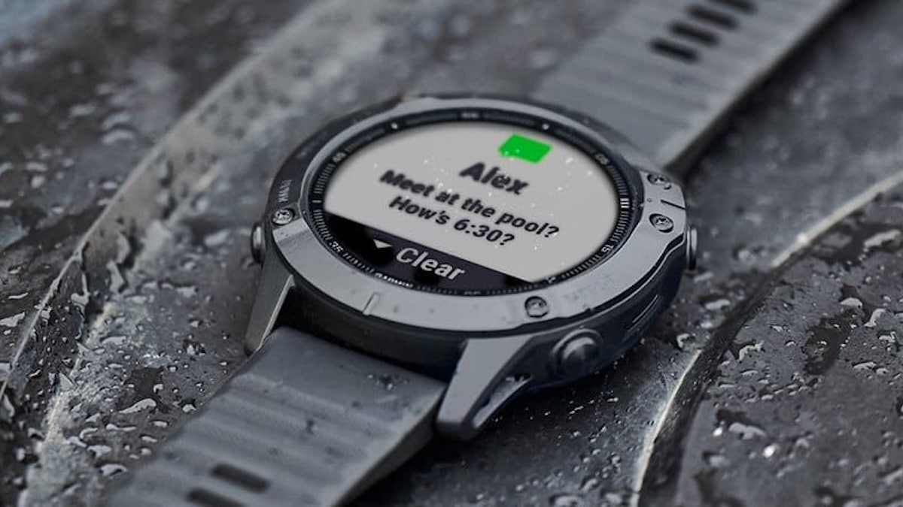

Si tienes un Garmin Fenix 6 en la muñeca y llevabas meses viendo predicciones de carrera que no cuadraban con tu forma física, la beta 29.02 llega justo para eso. Garmin ha reactivado el soporte de software del reloj presentado en 2019 con una actualización que corrige el Race Predictor, la herramienta que estima tiempos potenciales de 5K, 10K, media maratón y maratón a partir del entrenamiento y de métricas como el VO2 máx.

## Una sola corrección: el Race Predictor

El registro de cambios de la versión 29.02 recoge un único punto, y es precisamente el que afectaba a la experiencia diaria: Garmin corrige un fallo que provocaba que el Race Predictor generara valores incorrectos. La actualización se distribuye a través del programa público de betas y se instala desde el propio reloj, con la opción «Buscar actualizaciones» y descarga por Wi-Fi, sin pasar por un ordenador.

No hay funciones nuevas ni cambios de rendimiento en la nota. Es una actualización pequeña en lo técnico, pero relevante en lo práctico: devuelve la confianza en una de las métricas que muchos corredores consultan antes de una carrera.

## Por qué aparecían tiempos irreales

El problema se hizo visible durante el verano, cuando varios propietarios empezaron a reportar predicciones que mejoraban de golpe tras registrar una actividad. Un usuario vio cómo su previsión para el 5K pasaba de unos 27 minutos a cerca de 18, sin que su VO2 máx. hubiera variado de forma equivalente. Ese tipo de saltos no encaja con un cambio real de forma física, y menos en cuestión de una sesión.

Garmin reconoció el problema y aseguró en julio que sus ingenieros habían identificado la causa. La corrección se esperaba para agosto, pero no ha sido hasta la beta 29.02 cuando ha aparecido. La versión anterior del software, la 28.02, databa de marzo de 2025, de modo que esta beta rompe unos 18 meses de silencio en la plataforma.

## El Fenix 6, una generación de 2019 que sigue viva

Más de siete años después de su lanzamiento, el Fenix 6 sigue recibiendo mantenimiento, algo poco habitual en la relojería inteligente. La actualización también alcanza a modelos que comparten plataforma, como el Enduro original, el Tactix Delta, el Quatix 6 y los primeros MARQ.

Para muchos propietarios, seguir con este reloj no es nostalgia: la base de hardware todavía cubre lo que necesita un corredor o un usuario de montaña. Mapas, navegación, PacePro, métricas de entrenamiento y una autonomía que se mide en días siguen siendo argumentos vigentes. Como contexto, ya hemos repasado [el recuento de fallos del Fenix 9](/noticias/garmin-fenix-9-94-errores/), la generación más reciente, donde la cantidad de incidencias abiertas muestra el otro extremo del ciclo de vida de un reloj.

## Qué cambia para ti

Si tu Fenix 6 lleva meses dando predicciones que no te crees, la beta 29.02 está pensada exactamente para eso y merece la pena instalarla. Ten en cuenta que es software beta: si usas el reloj a diario para entrenar y prefieres no asumir el riesgo de un fallo puntual, quizá te convenga esperar a que la corrección llegue al canal estable.

Si lo que te ronda la cabeza es cambiar de reloj por otros motivos —pantalla, sensores nuevos o más funciones de entrenamiento—, esta actualización no altera esa decisión. Solo alarga la vida útil de un reloj que, siete años después, sigue cumpliendo para quien no necesita más.
