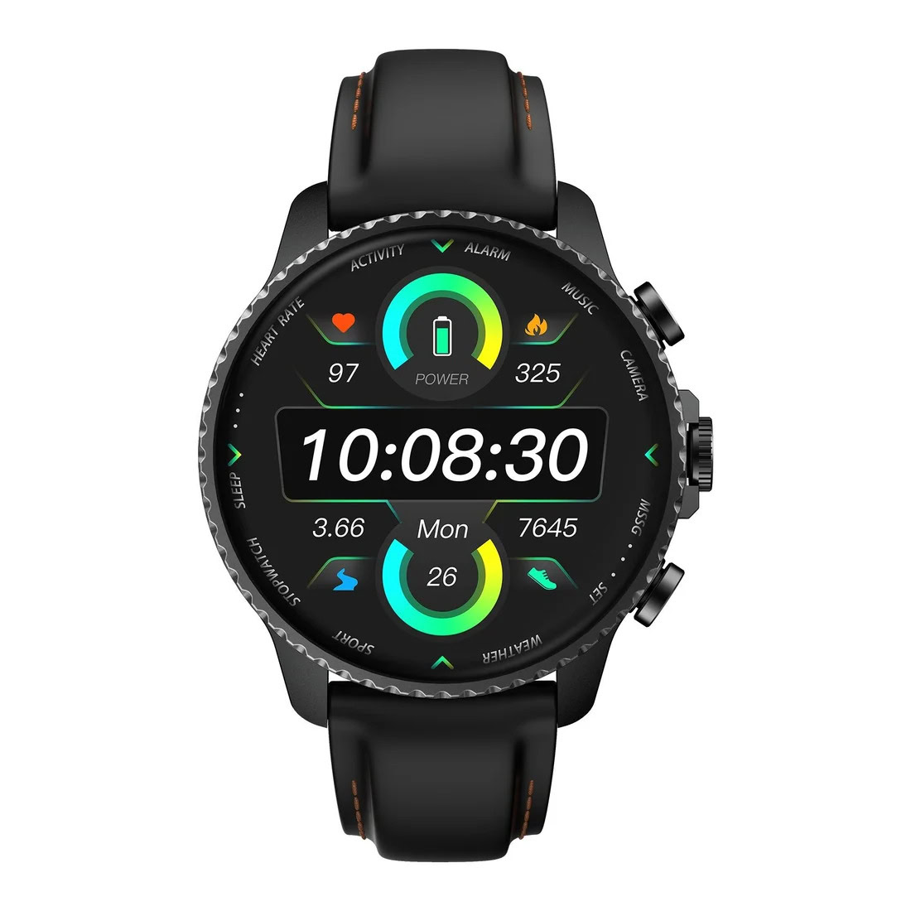
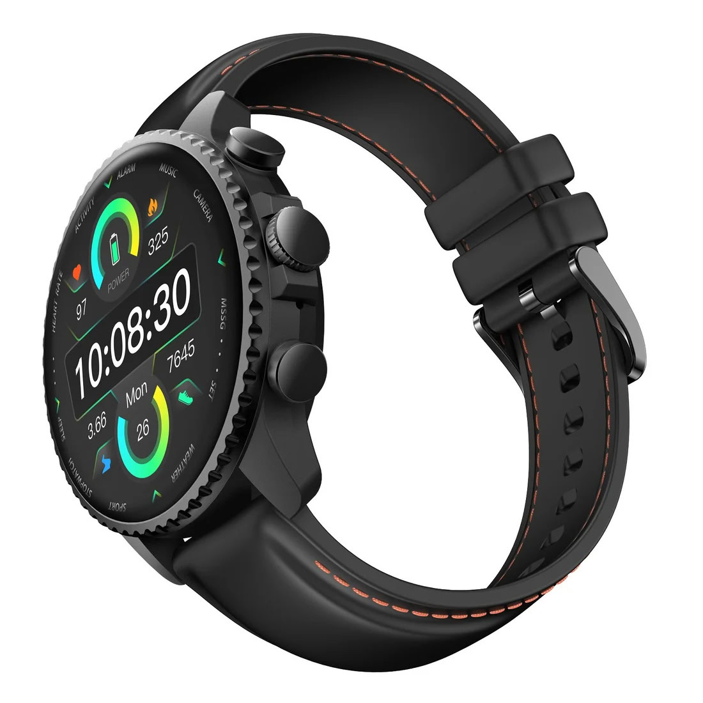
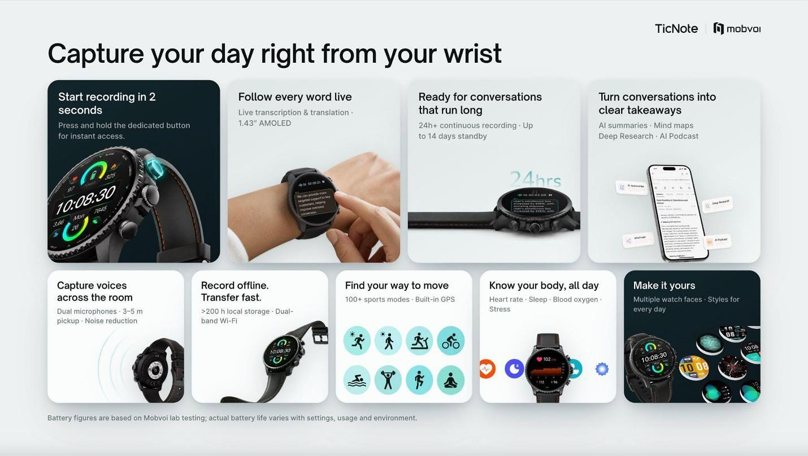
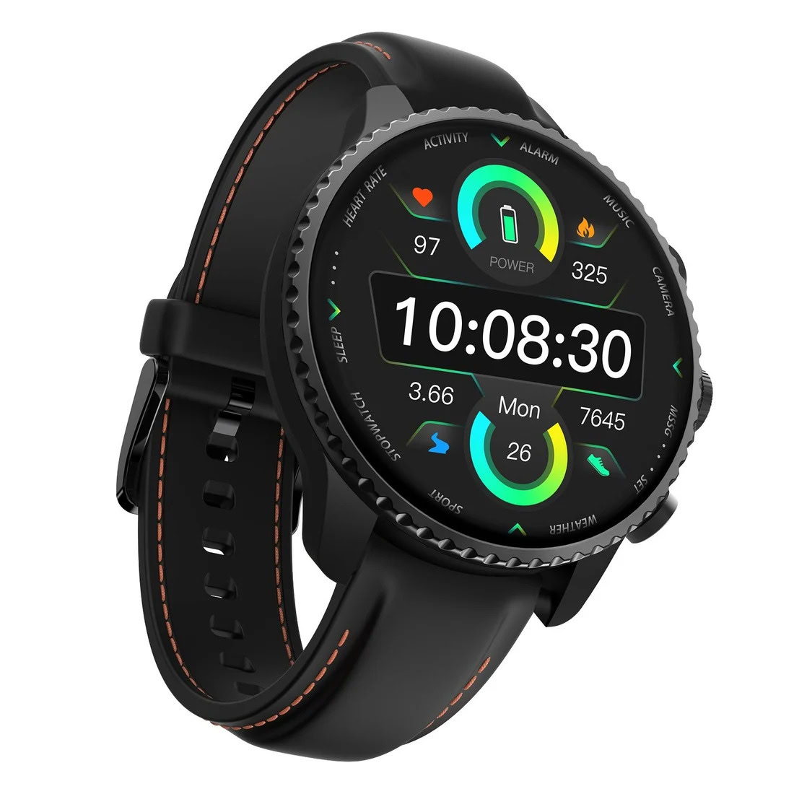

Mobvoi, la casa detrás de los TicWatch, ha anunciado el TicNote Watch, un reloj que cambia el enfoque habitual de la categoría: en lugar de competir por medir mejor el sueño o sumar modos deportivos, está construido para una tarea muy concreta. Su objetivo es grabar, transcribir y resumir conversaciones directamente desde la muñeca, sin depender del móvil, según recoge Android Authority.

El público al que apunta no es el de siempre. Mobvoi lo orienta al profesional que vive de lo que se dice en reuniones —comerciales, consultores, periodistas, abogados o personal sanitario—, no a quien busca sobre todo un entrenador de muñeca.

## El TicNote Watch graba sin sacar el móvil

El elemento diferencial es físico: un botón dedicado a la grabación. Mantenerlo pulsado arranca la captura de audio en unos dos segundos, funciona sin conexión y sirve tanto para conversaciones cara a cara como para llamadas de dos vías. Una doble pulsación inicia una grabación de hasta 60 segundos, pensada para apuntar una idea suelta antes de que se escape.

En la captura, el reloj recurre a dos micrófonos omnidireccionales que recogen voces a una distancia de entre 3 y 5 metros, con reducción de ruido para limpiar la señal.

En el papel, la autonomía es de las que llaman la atención: la marca habla de más de 24 horas de grabación continua, de hasta 200 horas de grabaciones guardadas en el propio reloj y de hasta 14 días en reposo. La letra pequeña de Mobvoi aclara que son cifras de laboratorio y que la batería real varía según el uso y el entorno. Aquí conviene ser prudente: grabar de forma continua no es lo mismo que llevar el reloj puesto todo el día con notificaciones y la pantalla siempre activa.

## Transcripción en vivo y resúmenes con IA

El otro pilar es el software. La transcripción en vivo aparece en la pantalla del reloj —un AMOLED de 1,43 pulgadas— en hasta 17 idiomas, con una precisión declarada de al menos el 98 % y una latencia inferior a 1,5 segundos. Son cifras de la propia compañía, así que habrá que comprobarlas en entornos con ruido, acentos marcados y varias voces a la vez.

Durante la transcripción se pueden marcar frases clave con un solo toque; esos subrayados se agrupan de forma automática para revisarlos al terminar la charla. Cuando la grabación acaba, el reloj muestra un resumen y un mapa mental generados por IA, listos para buscar, revisar o compartir.

## Deporte, salud y un ecosistema para las notas

El TicNote Watch no renuncia a lo que hoy se espera de un reloj. Suma más de 100 modos deportivos, GPS integrado, Wi-Fi de doble banda y registro de frecuencia cardiaca, sueño, oxígeno en sangre y estrés. Esos datos, junto con las reuniones y los entrenamientos, se integran en un "AI Journal" que reconstruye el día en una sola línea temporal; por la noche, un "AI Recap" resume los momentos clave. Son métricas de bienestar, no diagnósticos médicos.

La parte de las notas se apoya en la aplicación TicNote, el estudio web TicNote Cloud y funciones como Shadow AI 2.0 o una base de conocimiento. La marca permite además conectar asistentes y modelos propios —Anthropic, DeepSeek y Qwen, con OpenAI "próximamente"— y exportar transcripciones y resúmenes a Notion y Obsidian. Es la parte menos vistosa y, muy probablemente, la que decide si el reloj se queda en la muñeca o acaba en un cajón.

## Precio y disponibilidad

El TicNote Watch cuesta 249 dólares, aunque la compañía mantiene una oferta de lanzamiento por tiempo limitado que lo deja en 199 dólares. Se vende en TicNote.ai y en Amazon. Cada unidad incluye el plan Plus, con 600 minutos de transcripción al mes; hay planes Pro y Business opcionales para quien necesite más tiempo de transcripción y más peticiones de IA.

¿Merece la pena? Si tu trabajo consiste en no perderte lo que se dice en reuniones —visitas, entrevistas, ferias, consultas— y quieres hacerlo sin sacar el móvil, la propuesta es coherente y el plan Plus incluido ayuda a que el precio tenga sentido. Si lo que buscas es un reloj sencillo y barato para el día a día, como el [Casio F-B100W](/noticias/wearables/casio-f-b100w/), o un ponible centrado en el deporte, este no es tu producto: aquí las notas mandan y todo lo demás va detrás.
