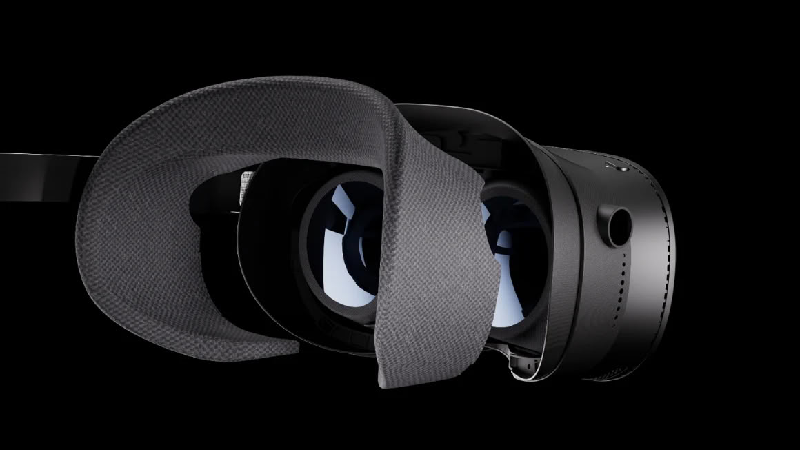

Pimax ha presentado el Crystal Pro, un casco de realidad virtual para PC que funciona sin cables y que gira en torno a una técnica propia de transmisión que la compañía llama streaming foveado nativo. El anuncio llegó durante su evento «Frontier: Change To Stay The Same», en el que también mostró unos controladores Ringless VR, un mini-PC llamado Spation y una identidad de marca renovada con un nuevo color de firma, Stratosphere Blue.

Sobre el papel, el objetivo es el que importa a quien se pone el casco: quitar el cable sin cargarse la imagen. Para lograrlo, el Crystal Pro combina el streaming por Wi-Fi integrado —con un adaptador Wi-Fi 6E dedicado que viene en la caja— con un kit opcional de 60 GHz, el 60G AirLink, que se puede comprar por separado o en un paquete conjunto.

## Qué cambia el streaming foveado nativo

La clave está en dónde mira el usuario. Gracias al seguimiento ocular, la conexión de 60 GHz envía la imagen nativa de la GPU directamente a los paneles de la zona que el usuario está enfocando, sin la codificación que exige el streaming por Wi-Fi. Es decir, la zona central de la mirada no pasa por el compresor de vídeo, que es justo donde se suelen notar los artefactos.

El kit incorpora dos Room Antennas que funcionan en configuración 2x2 MIMO, algo que Pimax presenta como un primero en un casco de realidad virtual, con una capacidad combinada de hasta 6 Gbps y menos de 2 ms de latencia añadida. El matiz, y no es menor, es que esa vía sin compresión depende de un accesorio que cuesta 599 dólares por sí solo: sin él, el casco sigue dependiendo del Wi-Fi, que es la ruta con codificación.

Pimax también estrena unos controladores Ringless VR, que sustituyen el anillo de seguimiento de sus mandos anteriores por seguimiento de manos por cámara junto con sensores infrarrojos y de movimiento. La compañía declara una latencia por debajo de los 15 ms y la posibilidad de encajarlos en un mando tipo gamepad para Windows y Steam. Su precio y su fecha de salida todavía no se han concretado.

## Pantallas QLED, seguimiento y modo autónomo

La ficha que acompaña al anuncio sitúa al casco en una doble condición: VR inalámbrica para PC y modo autónomo. Las pantallas son TFT QD-LCD (QLED) de 2.880 × 2.880 píxeles por ojo —unos 17 millones de píxeles en total y 35 PPD—, con óptica de cristal asférico, 110 grados de campo de visión horizontal y refresco de 72, 90 o 120 Hz. El atenuado local corre a cargo de mini-LED, con 576 zonas por ojo.

En seguimiento, el Crystal Pro combina seguimiento ocular con seguimiento interno SLAM 2.0 y una placa frontal intercambiable para soporte opcional de Lighthouse o para paso de realidad mixta con profundidad LiDAR. En su modo autónomo recurre a un Snapdragon XR2 Gen1, aunque no lleva batería integrada: la energía llega desde un paquete externo de 16.000 mAh incluido.

Para moverlo, la recomendación de Pimax arranca en una RTX 3080 o una RTX 4070, con una RTX 2070 como mínimo. Son cifras que conviene tener presentes: un casco con esta densidad de píxeles no perdona una GPU justa, y el streaming foveado alivia la transmisión, no la carga de render.

## Precio y disponibilidad del Pimax Crystal Pro

El Crystal Pro se queda en 1.399 dólares, o 1.899 dólares en el paquete que incluye el kit AirLink; el kit por separado cuesta 599 dólares. Pimax ya admite reservas por 1 dólar en su web, pero no ha dado fechas de envío para el casco ni precios para los controladores Ringless VR y el mini-PC Spation.

Ese Spation, de propina, es un mini-PC con componentes de escritorio en una caja más pequeña que una torre típica: combina un AMD Ryzen 7 9800X3D con una AMD RX 9070 XT o una NVIDIA RTX 5070 Ti, admite Windows y SteamOS y tendrá también una configuración para montar por piezas.

Merece la pena mirar este anuncio con la cautela que pide Pimax. Si buscas un casco inalámbrico de máxima resolución y no te importa pagar el AirLink aparte, el Crystal Pro va a esa liga; si lo que quieres es un inalámbrico sin sorpresas de primera generación, conviene esperar a las reviews y a que la compañía confirme fechas, porque el streaming foveado nativo suena muy bien en la presentación y hay que ver cómo se comporta en la cara, con la partida ya en marcha. Quien venga de las [VR Glasses de Meta](/noticias/meta-vr-glasses-anuncio/) notará que aquí la apuesta va en dirección contraria: más resolución y más hardware, a cambio de un desembolso bastante mayor.
