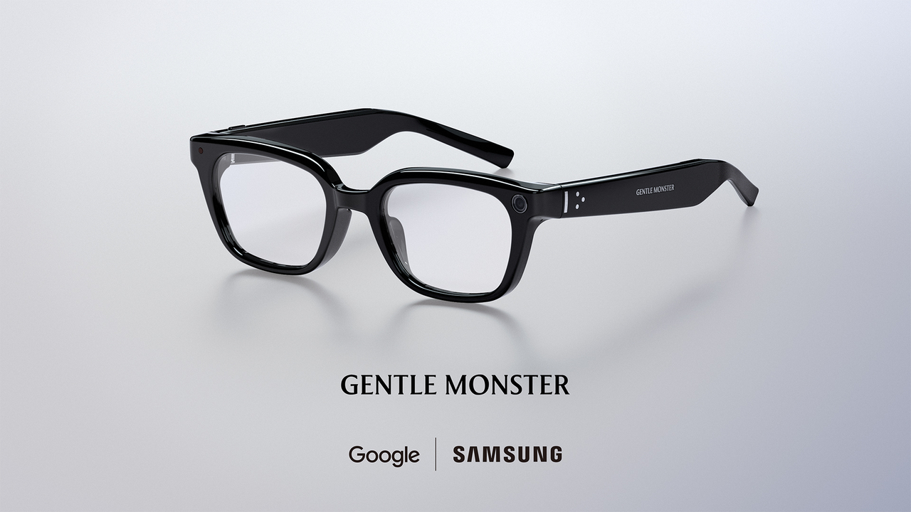

Samsung tiene fecha para su primer producto de gafas. La compañía planea lanzar sus Intelligent Eyewear en **noviembre**, según un informe del medio surcoreano The Korea Herald que GSMArena recoge, y que atribuye la confirmación a un ejecutivo de la propia Samsung. Ni el precio ni el día exacto se han anunciado: son los dos huecos que siguen abiertos a un mes de la supuesta llegada.

Las gafas se mostraron por primera vez con Google en el Google I/O de mayo sobre la plataforma Android XR, y en el Galaxy Unpacked de Londres de julio se enseñó algo más de su diseño. El reporte, por ahora, es lo único que pone una fecha sobre la mesa.

## Las Intelligent Eyewear: gafas sin pantalla con la cámara como protagonista

A diferencia de unas gafas de realidad aumentada, las Intelligent Eyewear no llevan display. Lo que sí integran es una cámara y micrófonos que capturan lo que ve y oye quien las lleva, además de altavoces para escuchar la respuesta.

El procesamiento no ocurre en las gafas: Gemini, la IA de Google, trabaja con esa información a través de un Galaxy conectado, y responde por los altavoces de la montura. Es decir, sin teléfono cerca el dispositivo pierde buena parte de su utilidad. Es un dato que conviene tener claro antes de emocionarse con el concepto.

Samsung ha puesto el peso en el centro de su discurso: asegura que son «más ligeras que la mayoría de las gafas de IA», y medios locales apuntan a un objetivo de hasta 5 gramos por debajo de las Ray-Ban Meta de 51 gramos. La compañía **no ha confirmado el peso final**, así que de momento es una promesa y no una cifra. El desarrollo se ha hecho con Google y con los fabricantes de monturas Gentle Monster y Warby Parker.

## La sombra de Meta: un mercado que ya tiene dueño

El movimiento de Samsung llega a un mercado que Meta ha ocupado antes y con mucha ventaja. Según Counterpoint Research, los envíos globales de gafas de IA crecieron un 263 % interanual en el primer semestre de 2026, y los modelos sin pantalla concentraron el 96 % del total. Dentro de ese segmento, Meta controlaba el 94 %.

Meta no se ha quedado quieta. El 23 de septiembre presentó las [Ray-Ban Meta Audio sin cámara](/noticias/ray-ban-meta-audio-sin-camara/), unas gafas de 43 gramos centradas en audio e IA que renuncian a grabar para quienes no quieren una cámara delante de la cara. Es exactamente el flanco por el que Samsung quiere entrar con un producto también sin display.

## Privacidad: el aviso a quien está al lado

El otro frente de las gafas con cámara es la privacidad, y en Corea del Sur ya ha llegado antes del lanzamiento. La Comisión de Protección de Información Personal se reunió con Samsung a finales de julio para hablar de cómo debe avisarse a las personas cercanas cuando una cámara o un micrófono están activos, y el Ministerio de Ciencia y TIC empezó a redactar guías de uso seguro en septiembre.

Samsung sostiene que sus gafas usarán LED dentro y fuera de la montura para indicar la grabación, y que si el indicador exterior queda tapado la grabación se desactiva. Es el mismo enfoque que Meta, pero la duda de fondo no cambia: [la cámara que vendió estas gafas es también su mayor problema](/noticias/smart-glasses-camera-privacy-opinion/).

## Qué cambia para el usuario

Si buscas unas gafas discretas para escuchar música, consultar cosas por voz y recibir avisos sin mirar el móvil, la propuesta de Samsung entra en la misma liga que las Ray-Ban Meta y merece seguimiento de cerca. Si lo que esperas es información superpuesta delante de los ojos, esto no es: las Intelligent Eyewear no tienen pantalla, como casi todo lo que hoy se vende en ese mercado. Y hasta que no haya precio y fecha oficiales, la recomendación es la de siempre: esperar a la confirmación de Samsung.
