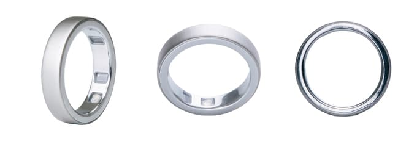
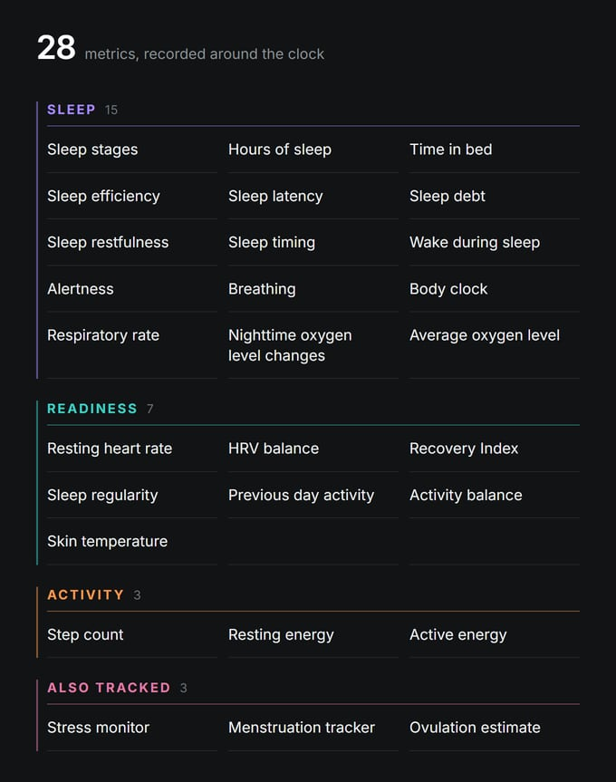

Hay una marca japonesa de anillos inteligentes que hasta ahora apenas se dejaba ver fuera de su país, y acaba de decidir que es el momento de intentarlo. SOXAI ha abierto en Kickstarter la campaña del Ring X, su modelo más delgado, y en pocos días ya ha superado los 750.000 dólares de recaudación. No es un proyecto nacido de la nada: la compañía fabrica anillos desde 2022, dice acumular unos 80.000 usuarios y su tecnología ha aparecido incluso en productos de terceros, como el Karada Mate Ring de Sharp.

La pregunta incómoda en un anillo que promete ser el más estrecho del mercado es si esa delgadez se paga con menos batería o con menos datos. Sobre el papel, SOXAI sostiene que no.

## Un anillo estrecho sin renunciar a la batería

El dato que vende el producto es el grosor de la banda: 5,19 mm de ancho, una cifra que la empresa presenta como la más estrecha del mercado entre los anillos con seguimiento de constantes vitales. El acabado mide 2,6 mm de espesor, usa una aleación de titanio, resiste el agua hasta 100 metros y llega en tres acabados: plateado cepillado, negro mate y dorado.

Lo llamativo no es tanto el récord como la autonomía que acompaña a ese tamaño. SOXAI anuncia hasta 10 días entre cargas, una cifra que juega en la misma liga que anillos bastante más voluminosos. Conviene leerla con matices, porque ese máximo corresponde a las tallas grandes estadounidenses, de la 10 a la 13; las versiones pequeñas ofrecerán menos aguante. La propia comparativa de la marca incluye otro anillo de 5,2 mm, apenas 0,01 mm más ancho, así que la combinación de tamaño y batería es más interesante que la etiqueta de récord.

## Sensores conocidos y app sin suscripción

En el apartado de medición no hay sorpresas: sensores ópticos para frecuencia cardiaca, variabilidad de la frecuencia cardiaca (HRV) y oxígeno en sangre, junto a temperatura de la piel y detección de movimiento. La aplicación traduce esos datos en fases y puntuaciones de sueño, actividad, información de estrés, tipo cronobiológico y seguimiento de tendencias de apnea del sueño.

El detalle que más puede pesar en la decisión de compra está en el modelo de negocio. SOXAI asegura que no hay suscripción obligatoria y que todas las funciones de la app, incluidas las que lleguen en futuras actualizaciones, seguirán siendo gratuitas. Es una postura más cercana a la de RingConn que a la de [Oura](/noticias/wearables/oura-xella-health-biomarcadores/), que ha construido buena parte de su propuesta alrededor de una cuota mensual. Para quien ya paga por un servicio así, un anillo que no lo exija cambia la cuenta anual.

## Por qué importa el salto internacional del SOXAI Ring X

Más allá del producto, el movimiento relevante es que SOXAI quiere vender fuera de Japón. La campaña se abrió el 2 de octubre y termina el 10 de octubre, con aportaciones early bird desde unos 279 dólares, reservas estándar en torno a 319 y un precio de venta futuro que la empresa sitúa en 399 dólares, aunque todavía no se ha vendido a ese precio.

Hay que armarse de paciencia: los envíos están previstos entre mayo y julio de 2027, y los kits para medir la talla deberían llegar a los patrocinadores en diciembre de 2026. La compañía afirma tener ya un prototipo funcional, pero aún deben completarse la validación final del diseño y las pruebas de producción.

La disponibilidad internacional tampoco está cerrada. Según las preguntas frecuentes de la campaña, SOXAI planea obtener las certificaciones necesarias para Estados Unidos, Reino Unido, la Unión Europea, Canadá y Australia, pero no todas están en regla todavía. A los clientes de regiones no admitidas se les devolverá el dinero en lugar de enviarles el dispositivo.

## Qué mirar antes de decidir

Si buscas un anillo para el día a día y valoras llevarlo sin notarlo en el dedo, el Ring X apunta a una propuesta sensata: fino, resistente al agua y sin cuota mensual. Si lo que necesitas es comprar ya y tener garantías de soporte en España, conviene esperar: las entregas se van a 2027, las certificaciones europeas no están cerradas y no todas las tallas igualarán los 10 días de batería anunciados. Y como siempre con las métricas de sueño y salud, tómalas como orientación y no como diagnóstico: ninguna app convierte un anillo en un consejo médico.
