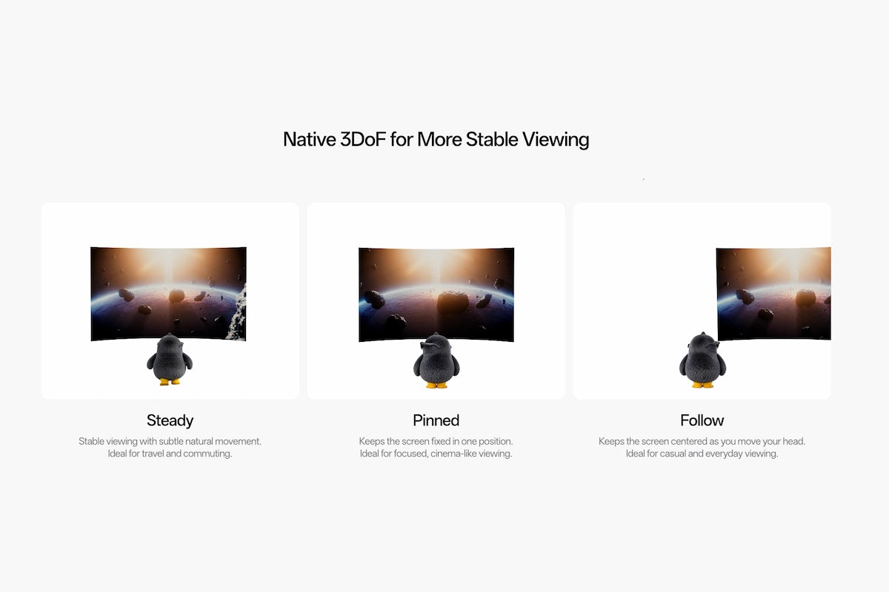
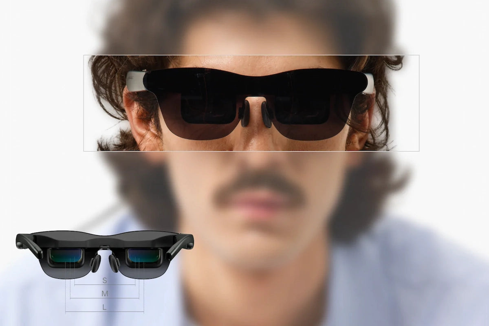
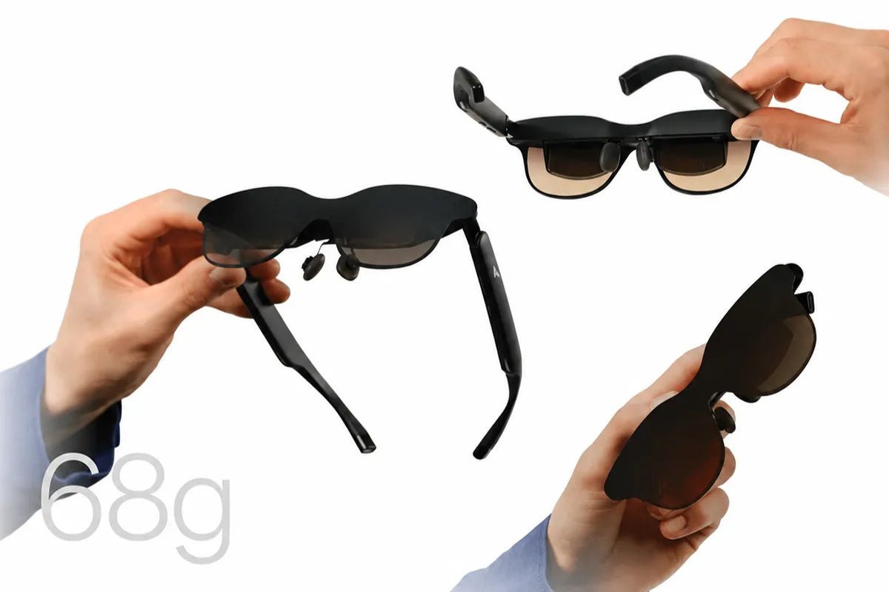

Las gafas AR de pantalla virtual prometen una imagen grande en casi cualquier sitio, pero el tamaño no lo es todo. La forma en que esa pantalla reacciona cuando el usuario gira o inclina la cabeza decide si la experiencia se siente estable o incómoda. Ahí entra el seguimiento de cabeza **3DoF**: detecta los movimientos de rotación de la cabeza para que las gafas ajusten el comportamiento de la pantalla virtual según hacia dónde se mira.

Esta guía explica qué mide exactamente el 3DoF, en qué se diferencia del 6DoF y qué implica en la práctica al elegir o usar unas gafas AR. Entender estas siglas importa cada vez más: las gafas inteligentes han dejado de ser una curiosidad, como repasamos en el análisis del [crecimiento de las gafas inteligentes sin pantalla](/noticias/smart-glasses-market-doubles-meta/).

La explicación parte del blog de RayNeo, un fabricante de gafas AR. Conviene leerla como la visión de una marca sobre una función aplicada a sus propios productos, no como un estándar neutral de la industria.

## Qué es 3DoF y qué mide exactamente

3DoF son tres grados de libertad (*three degrees of freedom*). El sistema sigue el movimiento de rotación alrededor de tres ejes: **pitch, yaw y roll**. En términos prácticos, sabe hacia dónde apunta la cabeza, pero no rastrea la posición exacta en el espacio físico.

Eso significa que un sistema 3DoF detecta cuándo se mira hacia arriba o hacia abajo, cuándo se gira a izquierda o derecha y cuándo se inclina la cabeza. Lo que no puede saber por sí solo es si se ha dado un paso lateral, si el cuerpo se ha inclinado hacia delante o si se ha subido o bajado. El 3DoF habla de orientación de la cabeza, no de la mirada ni de la posición del cuerpo.

## Pitch, yaw y roll: los tres giros que detecta

- **Pitch**: mirar hacia arriba o hacia abajo, como asentir con la cabeza.
- **Yaw**: girar a izquierda o derecha, como pasar la vista de un lado a otro de la habitación.
- **Roll**: inclinar la cabeza de lado, acercando una oreja al hombro.

Juntos, estos tres ejes describen la dirección de rotación de la cabeza. Seguirlos ayuda a que la pantalla virtual responda de forma coherente cuando se gira, se mira hacia arriba o se inclina ligeramente durante el uso.

## Cómo funciona el seguimiento de cabeza 3DoF

Los sistemas 3DoF suelen apoyarse en sensores de movimiento agrupados en una **unidad de medición inercial (IMU)**. Un **giroscopio** mide el movimiento de rotación sobre los ejes del dispositivo, mientras que los datos del **acelerómetro** ayudan a entender el movimiento y la orientación. El **software** combina ambas lecturas para estimar cómo giran las gafas en cada momento.

Lo importante para quien las lleva es lo que ocurre después: a medida que la cabeza gira o se inclina, las gafas reciben datos de orientación actualizados. Un modo espacial compatible puede usar esos datos para decidir si la pantalla debe quedarse en una dirección elegida, mantenerse estable ante movimientos pequeños o seguir la vista.

## 3DoF frente a 6DoF: la diferencia está en la posición

| Seguimiento | 3DoF | 6DoF |
| --- | --- | --- |
| Pitch, yaw y roll | Sí | Sí |
| Avance y retroceso | No | Sí |
| Desplazamiento lateral | No | Sí |
| Movimiento vertical | No | Sí |
| Punto fuerte habitual | Visión sentado y pantallas virtuales | Movimiento por la habitación e interacción espacial |

Ambos términos describen cuánto movimiento entiende un sistema de seguimiento. El 3DoF solo sigue la rotación; el 6DoF añade tres tipos de **movimiento posicional**: adelante y atrás, izquierda y derecha, y arriba y abajo.

Por ejemplo, si se gira la cabeza a la izquierda, tanto el 3DoF como el 6DoF detectan la rotación. Si se mantiene la mirada al frente pero el cuerpo se acerca a un objeto virtual, el 6DoF sí detecta ese cambio de posición.

Que el 3DoF no cubra la posición no lo convierte en una mala opción para unas gafas AR. Cuando el objetivo principal es mostrar una pantalla virtual grande, el usuario suele estar sentado y lo importante es cómo responde la pantalla a la rotación de la cabeza. El seguimiento posicional completo gana peso cuando la experiencia espera que el usuario se mueva por un espacio o interactúe con objetos virtuales desde distintas posiciones.

## Qué aporta el 3DoF con una pantalla virtual

El beneficio se entiende mejor en situaciones cotidianas. Al seguir cómo gira e inclina la cabeza, unas gafas AR compatibles pueden decidir si la pantalla se mantiene más estable, se queda fija en un punto o permanece centrada en la vista.

### Mantener la pantalla más estable en vuelos y trayectos

Ver una pantalla virtual en un tren o un avión puede resultar incómodo si cada pequeño movimiento afecta a la imagen. Cuando el 3DoF se combina con un modo de estabilización, las gafas usan los datos de rotación para reducir el movimiento indeseado sin bloquear el movimiento natural de la cabeza. Así es más fácil seguir una película o un juego cuando el tren vibra, el avión atraviesa una turbulencia ligera o simplemente se gira un poco la cabeza durante un viaje largo.

### Fijar la pantalla para cine o trabajo concentrado

A veces no se quiere que la pantalla siga cada giro. Cuando el 3DoF se usa para anclar la pantalla en una posición virtual fija, la experiencia se parece más a mirar un televisor, una pantalla de cine o un monitor colocado delante. Por ejemplo, al ver una película en el sofá se puede apartar la vista un momento y volver a la misma posición de pantalla; en un escritorio, se puede mirar el teclado o hacia otro monitor sin que la pantalla virtual persiga la mirada.

### Mantener la pantalla a la vista al cambiar de postura

También hay ocasiones en las que fijar la pantalla resulta menos cómodo. Se puede estar recostado en el sofá, ajustando la cabeza sobre un cojín o girando de lado mientras se ve algo de forma casual. En esos casos, el 3DoF puede usarse para mantener la pantalla centrada a medida que cambia la orientación de la cabeza, de modo que no haya que volver a buscar un punto fijo y la imagen permanezca delante.

## Cómo lo lleva RayNeo a su serie GT

Aquí entra la parte que describe el propio fabricante. Según RayNeo, la serie GT incorpora por primera vez 3DoF nativo en sus gafas AR: en lugar de tratar la pantalla virtual como algo que sigue siempre el mismo patrón de movimiento, los modelos RayNeo GT y GT Max permiten elegir cómo responde la pantalla al girar o inclinar la cabeza.

Ambos modelos usan un chip dedicado **Zone 360 3DoF** para el seguimiento espacial junto a un chip de pantalla **Vision 4000** para el procesado de imagen. Este diseño de doble chip da al seguimiento espacial su propio procesado, mientras que el chip de pantalla se ocupa de la imagen. El resultado son tres modos de visualización 3DoF nativos: **Steady, Pinned y Follow**.

### Steady: una vista más estable en movimiento

Mantiene la pantalla estable y permite un movimiento natural sutil. Resulta útil en vuelos, trenes y desplazamientos diarios, donde los pequeños movimientos pueden dificultar el seguimiento de una pantalla virtual.

### Pinned: la pantalla en un solo sitio

Fija la pantalla virtual en una posición en lugar de hacerla seguir cada giro. Encaja en películas, juegos o visionado concentrado cuando se quiere que la pantalla se sienta como un televisor o un monitor colocado delante.

### Follow: la pantalla siempre en la vista

Mantiene la pantalla centrada a medida que se gira la cabeza. Es una opción sencilla para un visionado casual en el que se cambia de postura o de dirección y se quiere que la pantalla acompañe.

En conjunto, los tres modos permiten elegir entre una vista en movimiento más estable, una pantalla virtual fija o una pantalla que sigue la dirección de la mirada.

## Qué mirar al elegir entre GT Max y GT

Los dos modelos comparten la misma experiencia 3DoF nativa, incluidos los modos Steady, Pinned y Follow. Las diferencias están en el tamaño y la amplitud de la pantalla virtual, en cómo encaja la óptica con la distancia interpupilar (IPD) y en el peso de la montura.

| Característica | RayNeo GT Max | RayNeo GT |
| --- | --- | --- |
| Campo de visión | 59° | 46° |
| Tamaños de pantalla virtual | 227 / 267 / 307 pulgadas | 136 / 201 / 231 pulgadas |
| Densidad de píxeles | 38 PPD | 49 PPD |
| Peso | 78 g | 68 g |
| Ajuste de IPD | S (&lt;64 mm), M (64-67 mm), L (&gt;67 mm) | Fijo 64 mm |
| Frecuencia de refresco 2D | Hasta 120 Hz | Hasta 120 Hz |
| Modos espaciales | Steady / Pinned / Follow | Steady / Pinned / Follow |

El GT Max se orienta a quien busca una pantalla virtual más amplia. Su campo de visión de 59° genera una pantalla por defecto de 267 pulgadas, con opciones de 227 y 307 pulgadas, lo que da a películas y juegos un aire más de cine. También ofrece más flexibilidad de ajuste óptico con tres tallas de IPD: S por debajo de 64 mm, M entre 64 y 67 mm y L por encima de 67 mm. Con 78 g y 38 PPD, prioriza el tamaño de pantalla y la inmersión antes que una montura ultraligera o una densidad de píxeles mayor.

El GT adopta un enfoque más ligero con 68 g, pensado para desplazamientos, viajes y sesiones de visionado más largas. Su campo de visión de 46° crea una pantalla virtual por defecto de 201 pulgadas, y sus 49 PPD ayudan a mantener nítidos el texto, los subtítulos y los detalles finos. Mantiene hasta 120 Hz en 2D y los mismos modos espaciales. Su principal consideración de ajuste es la IPD fija de 64 mm.

## Limitaciones que conviene tener presentes

- **El 3DoF solo sigue rotación.** No detecta si el usuario se desplaza, se inclina hacia delante o cambia de altura. Para experiencias que esperan movimiento por un espacio o interacción con objetos virtuales hacen falta sistemas posicionales como el 6DoF.
- **La explicación viene de un fabricante.** La descripción de los chips Zone 360 3DoF y Vision 4000, y de los modos Steady, Pinned y Follow, es de RayNeo y se refiere a sus propios productos. No es un estándar neutral de la industria.
- **Los beneficios dependen del modo espacial.** Que la pantalla se estabilice, quede fija o siga la vista no es automático: depende de si las gafas ofrecen esa opción concreta.
- **El ajuste y el peso importan.** Una IPD que no encaje con la del usuario o una montura demasiado pesada pueden arruinar una experiencia que sobre el papel era mejor.
