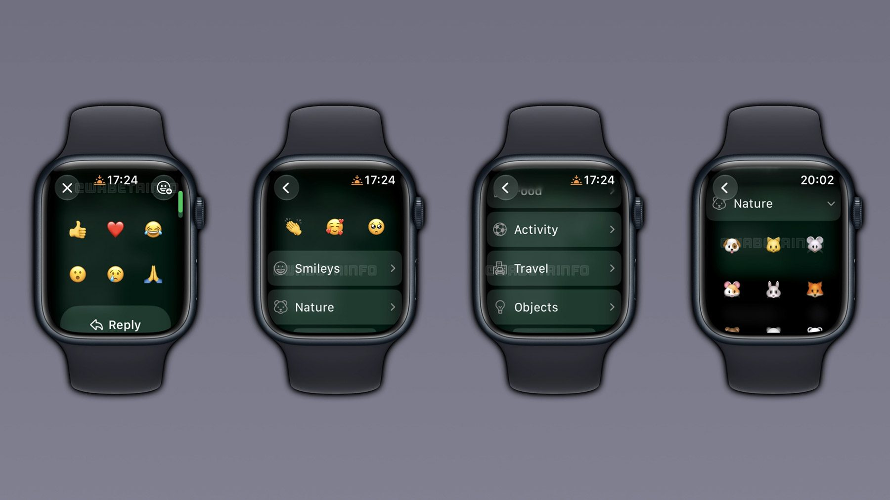

WhatsApp ha empezado a desplegar en el Apple Watch un selector completo de emojis para
reaccionar a los mensajes. Hasta ahora, la aplicación del reloj solo ofrecía seis
reacciones predefinidas y cualquier otra respuesta obligaba a recurrir al iPhone. La
novedad, adelantada por WABetaInfo, lleva a la muñeca todo el catálogo de emojis
disponible en watchOS y elimina una de las limitaciones más visibles que arrastraba la
app desde su llegada al reloj.

## WhatsApp pasa de seis reacciones fijas a todo el catálogo de watchOS

El gesto para reaccionar no cambia: mantener pulsado un mensaje sigue mostrando las seis
reacciones por defecto. La diferencia aparece al abrir el selector ampliado, desde el
que ya se puede acceder a los emojis usados recientemente y a la biblioteca completa del
sistema, organizada en las ocho categorías de watchOS: caritas, naturaleza, comida,
actividad, viajes, objetos, símbolos y banderas. Dentro de ese selector, WhatsApp permite
desplazarse entre categorías, tocar una de ellas para desplegar su contenido y elegir un
emoji reciente desde la parte superior de la lista.

Así lo recoge 9to5Mac a partir del informe de WABetaInfo, al que señala como origen de la
información.

## Una app que deja de depender del iPhone

La limitación a seis reacciones pesaba más de lo que parece. Reaccionar es la forma más
rápida de responder sin teclear en una pantalla tan pequeña, así que cualquier matiz que
se saliera de esos seis gestos rompía la experiencia: había que desbloquear el teléfono
para algo que debería resolverse desde la muñeca.

El contexto ayuda a entender el cambio. A finales de 2025, WhatsApp estrenó una app
completa para el Apple Watch con notificaciones de llamadas, mensajes de voz, historial
de chats y reacciones. Antes de eso, su presencia en watchOS era muy reducida y dependía
casi por completo de las notificaciones del sistema para leer y contestar. Ampliar ahora
las reacciones encaja en ese mismo camino: convertir el reloj en un cliente capaz de
resolver conversaciones cotidianas por sí solo, como ya ocurrió con el regreso del
[conmutador de apps en watchOS 27.2](/noticias/watchos-27-2-app-switcher-returns/).

## Qué cambia para el usuario y cuándo llegará

Para quien use WhatsApp en el Apple Watch, el efecto es directo: ya no hará falta sacar
el iPhone cada vez que la reacción adecuada no esté entre las seis de siempre. La función
se está desplegando de forma oficial, pero WhatsApp es conocida por sus lanzamientos
graduales, así que puede tardar unas semanas en llegar a todos los usuarios. Si todavía
no aparece en el reloj, lo más probable es que sea cuestión de tiempo y no un problema
del dispositivo.

El movimiento se suma a otros ajustes recientes con los que WhatsApp está afinando el
control que el usuario tiene sobre sus conversaciones, como
[la restricción de chats al teléfono principal](/noticias/whatsapp-limit-chats-primary-phone/).
En el reloj, la dirección es la misma: que cada vez más interacciones se resuelvan sin
depender del móvil.
