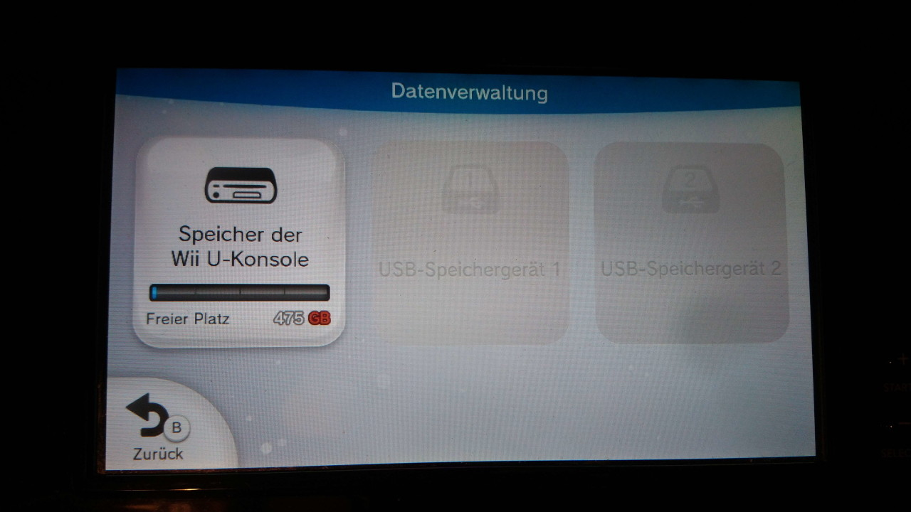
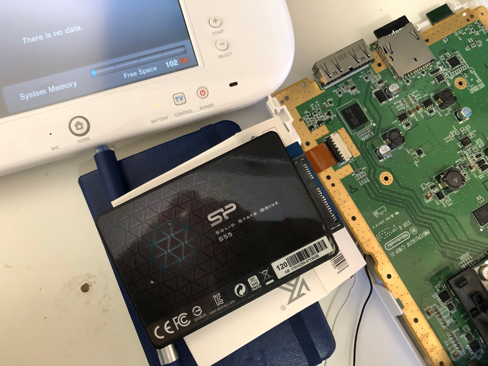

Esta guía explica cómo reconstruir desde cero la memoria interna (MLC) de Wii U en un medio limpio. Sirve para consolas con el chip eMMC dañado o con el sistema de archivos corrupto, con la caché SCFM inconsistente, para ampliar la capacidad del almacenamiento interno o para montar una redNAND sin SCFM. Si te interesa el ecosistema homebrew de la consola, también puedes ver [cómo el emulador de Wii U llegó a Nintendo Switch con el port homebrew Cemu-nx](/noticias/cemu-wii-u-switch-port/). Está dirigida a usuarios avanzados que ya trabajan con modificaciones de la consola.

## Requisitos previos

- Tener instalado **ISFShax** o **de_Fuse 0.7.1** (o posterior). de_Fuse exige soldadura, por lo que ISFShax es la opción recomendable si el instalador todavía se puede ejecutar.
- Contar con firmware **5.5.x**, la única configuración probada por el autor. En versiones anteriores podría funcionar o requerir adaptaciones con un cuidado especial.
- Disponer de una **copia de seguridad de la SLC**, que no se puede reconstruir con facilidad. Se puede crear en minute_minute, así que no hay excusa para omitirla: se han visto casos de corrupción de la SLC por causas desconocidas.
- Hacer copia de los datos que se quieran conservar, como partidas y Miis. El proceso **formatea la MLC y borra todo el contenido de la memoria interna de Wii U**.

Para las partidas, el original recomienda **SaveMii**, que requiere tener Tiramisu o Aroma en marcha. También se pueden mover partidas o juegos completos a un USB, que debería seguir siendo legible; al recrear los usuarios después hay que crearlos en el mismo orden para que los identificadores coincidan, aunque la copia con SaveMii sigue siendo recomendable. Si la guía se usa para reparar una eMMC defectuosa y esas vías no están disponibles, se puede usar la opción **Dump MLC** del menú de recuperación y extraer los datos con **wfs-extract**.

## Opciones de almacenamiento

La Wii U ofrece dos formas de conectar la memoria interna, cada una con sus contrapartidas:

- **SDIO.** En las consolas comerciales la memoria interna es un chip eMMC conectado por un bus SDIO interno al chip Latte. Ese bus también admite tarjetas SD. El acceso al medio conectado por SDIO se almacena en caché mediante un archivo en la SLC, presumiblemente para reducir las escrituras en la MLC. Esa caché se llama **SCFM** y es la razón por la que siempre hay que respaldar y restaurar SLC y MLC juntas, además de impedir el intercambio sencillo de varias tarjetas. IOSU solo admite tres tamaños en este bus: **8 GB o menos, 32 GB y 64 GB**; el tamaño se limita al mayor que encaje y el resto queda inutilizable. El bus está limitado a **26 MB/s (4 bits a 52 MHz)**. Para sustituir la eMMC por una microSD se puede usar **MLC2SD** o un interposer similar, o cableado con un adaptador de microSD. El autor recomienda una **SanDisk Max Endurance de 64 GB** (una tarjeta similar también debería servir), porque la Wii U es conocida por escribir mucho.
- **SATA.** La unidad de disco está conectada por SATA: los conectores son distintos, pero las señales eléctricas son las mismas. Algunas consolas de exposición usaban esta interfaz para conectar un disco duro. El tipo de dispositivo SATA se configura en la **SEEPROM**, de modo que una consola comercial también puede configurarse para usar un HDD o SSD SATA. La ventaja es que el tamaño no está limitado (el sistema de archivos WFS llega a **2 TB**) y no usa SCFM, lo que simplifica algunas operaciones y mejora el rendimiento en ciertos casos. La desventaja evidente es que se pierde la unidad de disco: sin ella, el menú de sistema de vWii no funciona, aunque los inyectables de vWii y la consola virtual de Wii de la eShop siguen utilizables solo si están instalados en USB. Además, puede ser necesario desactivar la MLC del bus SDIO, porque la consola podría seguir usando la SDIO si el dispositivo SATA tarda demasiado en iniciarse.
- **redNAND.** Redirige las lecturas y escrituras de uno o varios dispositivos de almacenamiento interno a particiones de la tarjeta SD. Se puede crear una partición MLC de tamaño arbitrario en la SD y configurarla con esta guía, y la SCFM se puede desactivar con facilidad. El límite de 64 GB **no** existe para redNAND si la SCFM está desactivada. Para redNAND existe un tutorial específico enlazado en el original.

¿Significa eso que no se puede superar los 64 GB en el bus SDIO? No, pero requiere ISFShax o de_Fuse para arrancar la consola cada vez: existe un parche que elimina los límites y usa siempre el tamaño máximo del medio SDIO, además de desactivar la SCFM (que no funciona con más de 64 GB). Desactivarla mejora el rendimiento y reduce el desgaste de la SLC, a costa de aumentar el desgaste del medio MLC. El autor lo empaqueta como **wafel_unlimit_mlc**.

## Pasos para reconstruir la MLC de Wii U

### 1. Descargar los títulos de sistema MLC de la región correspondiente

Descargar todos los títulos de sistema MLC de la región desde NUS, para lo que el original recomienda **MLCRestorerDownloader**. Hay que copiar el archivo `otp.bin` desde la SD a la carpeta del descargador para que pueda obtener la clave común. El resultado es el directorio `output/MLC/{region}`, con un subdirectorio por título: en total deberían ser **52 títulos** que ocupan alrededor de **1,1 GB**. Si la consola tiene un firmware antiguo, también puede ser necesario obtener los últimos títulos de la SLC.

### 2. Preparar la carpeta de instalación en la SD

En la raíz de la tarjeta SD (la que va en la ranura frontal, no el medio de reemplazo de la MLC) crear una carpeta llamada **wafel_install** y copiar allí los 52 títulos, de modo que contenga las 52 subcarpetas, una por título. Si se quieren reinstalar o actualizar títulos de la SLC, también se colocarían ahí.

### 3. Conectar el medio MLC elegido

Conectar el medio que se vaya a usar como MLC. Si se usa SATA, hay que ir a `Backup and Restore` y, en `Set SATA Device in SEEPROM`, seleccionar `GEN2-HDD (Kiosk CAT-I with HDD)`. Para instalar MLC2SD, el original remite a la sección de soldadura de su guía sobre reparación de eMMC (error 160-0103).

### 4. Borrar la MLC y la caché SCFM

Si la instalación se hace en una eMMC o en MLC2SD, ir a `Backup and Restore` y seleccionar **`Erase MLC`** y **`Delete scfm.img`**. Si el borrado de la MLC falla, se puede ignorar cuando el medio no estaba formateado como MLC antes (por ejemplo, por una instalación previa fallida).

### 5. Copiar los complementos de instalación

Colocar **wafel_setup_mlc.ipx** en la tarjeta SD, dentro de `/wiiu/ios_plugins`. Si se quieren más de 64 GB en SDIO, también hay que poner allí **wafel_unlimit_mlc.ipx**. Instalar con `wafel_unlimit_mlc.ipx` lo hace permanentemente necesario y, por tanto, exige ISFShax o de_Fuse de forma permanente.

### 6. Abrir el monitor serie (solo con de_Fuse, opcional)

Al usar de_Fuse, abrir el monitor serie en el PC (PuTTY o minicom) para seguir el progreso de la instalación, ya que la propia Wii U no mostrará salida en pantalla. El original adjunta el registro serie completo de una instalación correcta como referencia.

### 7. Iniciar la instalación y leer el LED de encendido

Seleccionar **`Patch (sd) and boot IOS (slc)`** en minute para iniciar la configuración de la MLC. Durante el proceso no se verá nada en pantalla: hay que guiarse por el LED de encendido. El LED **parpadea en azul** mientras instala los títulos; si algo sale mal, se vuelve **naranja**, pero continúa mientras parpadee; cuando termina, queda **fijo** y ya se puede apagar la consola. Si parpadea en **rojo**, se ha producido un fallo grave y conviene pedir ayuda. Durante la instalación se escribe un registro breve en la SD (`wafel_setup_mlc.log`) y al final se activa la configuración inicial para el siguiente arranque.

### 8. Comprobar que el instalador se eliminó solo

Verificar que `wafel_setup_mlc.ipx` se haya borrado por sí solo de la carpeta `/wiiu/ios_plugins` de la SD.

### 9. Arrancar la consola

Encender la consola con la opción `Patch (sd) and boot IOS (slc)`.

### 10. Completar la configuración inicial

Si todo funcionó, debería lanzarse la configuración inicial del sistema.

### 11. Liberar espacio en la SD (opcional)

Borrar la carpeta **wafel_install** para recuperar espacio.

## Cómo verificar que funcionó

La instalación ha salido bien si el complemento `wafel_setup_mlc.ipx` desapareció de `/wiiu/ios_plugins`, la consola arranca con `Patch (sd) and boot IOS (slc)` y aparece la **configuración inicial del sistema**. El archivo `wafel_setup_mlc.log` de la SD permite revisar el registro breve del proceso.

## Finalización solo con ISFShax

Si se usa `wafel_unlimit_mlc.ipx`, hay que mantener ISFShax instalado. Si aún no se hizo, completar el paso **«Booting without SD»** del tutorial de ISFShax, añadiendo además `wafel_unlimit_mlc.ipx` renombrado como **`9unlimit.ipx`** al directorio **`/storage_slc/sys/hax/ios_plugins`**. Sin `wafel_unlimit_mlc.ipx`, se puede desinstalar ISFShax o conservarlo como protección contra bricks; si se conserva, también hay que completar el paso «Booting without SD». La Wii U debería arrancar sola sin tarjeta SD insertada, y conviene activar el arranque automático.

## Advertencias

Guía solo para **usuarios avanzados**, con riesgo serio de dejar la consola inservible. Hay que leerla por completo antes de ejecutar ningún paso y entender cada paso y sus consecuencias. Si el LED **parpadea en azul**, se trata de un problema de la SLC y no de la MLC, por lo que esta guía no sirve para ese caso. El proceso borra todos los datos de la memoria interna.
