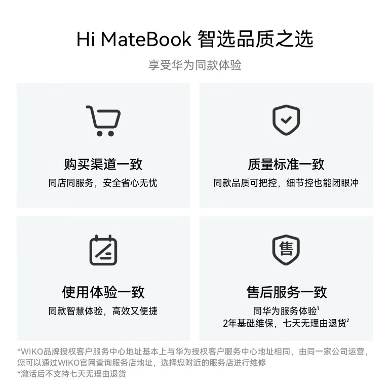
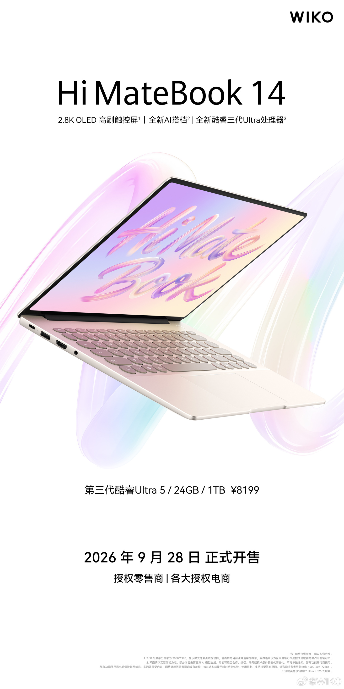
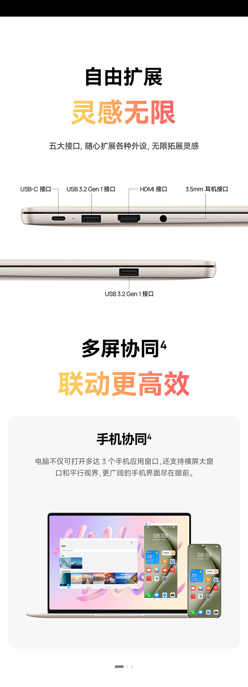

WIKO puso en venta el 28 de septiembre su portátil **Hi MateBook 14 edición Core** (酷睿版), una variante de su modelo de 14 pulgadas montada sobre un Intel Core Ultra 5 325, con 24 GB de memoria y un SSD de 1 TB. El equipo arrancó su comercialización a las 10:08 (hora local) a un precio de **8.199 yuanes**, según recoge ITHome.

Se trata de un portátil fino de uso profesional que WIKO vende dentro del programa de «selección inteligente» (智选) de Huawei: la marca indica que mantiene equiparables con los equipos de Huawei cuatro planos —canal de compra, estándar de calidad, experiencia de uso y servicio posventa— y ofrece dos años de garantía básica. También advierte de que, una vez activado el equipo, no se admite la devolución sin motivo en siete días.

## WIKO Hi MateBook 14 edición Core: pantalla OLED y procesador

El corazón del equipo es un **Intel Core Ultra 5 325** con turbo de hasta 4,5 GHz, gráficos integrados de arquitectura Xe3 y una capacidad declarada de 47 TOPS para tareas de inteligencia artificial.

La pantalla es un **OLED de 14,2 pulgadas** con resolución 2.880 × 1.920 (2,8K) y tasa de refresco de 120 Hz. Según la ficha publicada, ocupa el 91 % del frontal, admite diez puntos de tacto, alcanza un contraste de 1.000.000:1 y 1.070 millones de colores con una desviación de color ΔE menor que 1. En confort visual acumula filtrado de luz azul a nivel de hardware, certificación TÜV Rheinland Eye Comfort y atenuación PWM a 1.920 Hz.

Con ese panel entra en la senda de los portátiles de 14 pulgadas con OLED que ya se pueden encontrar en Occidente, como el [Lenovo Yoga 9i 2026](/noticias/lenovo-yoga-9i-2026-review/) que probamos con Panther Lake.

## Diseño, batería y conexiones

El chasis es de metal con perforaciones circulares en la tapa posterior y llega a **1,33 kg** y **14,5 mm** de grosor. El teclado repite el diseño de «puntos de arte» de la gama, con teclas de gran curvatura, un recorrido de 1,5 mm, flechas de tamaño completo y un recubrimiento que reduce las huellas. La refrigeración se apoya en dos ventiladores de aleta de tiburón.

La batería es de **70 Wh** y, según WIKO, permite hasta **17 horas** de reproducción local de vídeo a 1080p. Para la conectividad inalámbrica emplea una antena de metamateriales que promete hasta 270 metros de alcance, y el equipo integra su propio agente de inteligencia artificial, el asistente «小唯同学».

En puertos hay un USB-C, dos USB 3.2 Gen 1, un HDMI y una salida de auriculares de 3,5 mm, además de colaboración multipantalla entre portátil, teléfono, tableta y auriculares.

## Qué cambia para el lector

Vistas las cifras, la propuesta es clara: 8.199 yuanes compran un OLED táctil de 2,8K a 120 Hz, 24 GB de memoria, 1 TB de almacenamiento, 70 Wh de batería y un cuerpo de 1,33 kg. Sobre el papel es una combinación orientada a quien quiere un portátil ligero para trabajo y consumo multimedia sin renunciar a pantalla de calidad.

La salvedad es la disponibilidad. ITHome describe exclusivamente la venta en el mercado chino y no facilita precio ni fecha para otros países, así que este lanzamiento conviene leerlo como novedad de catálogo, no como confirmación de llegada a España o al resto de Europa.
