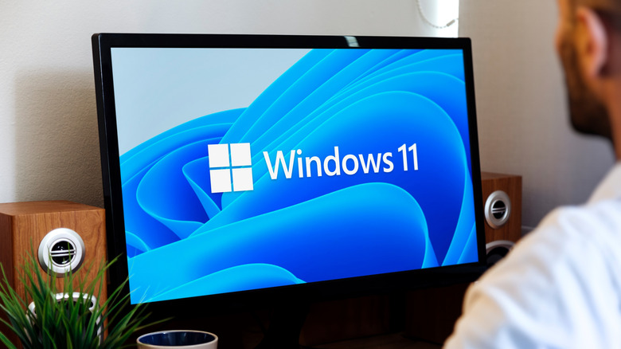
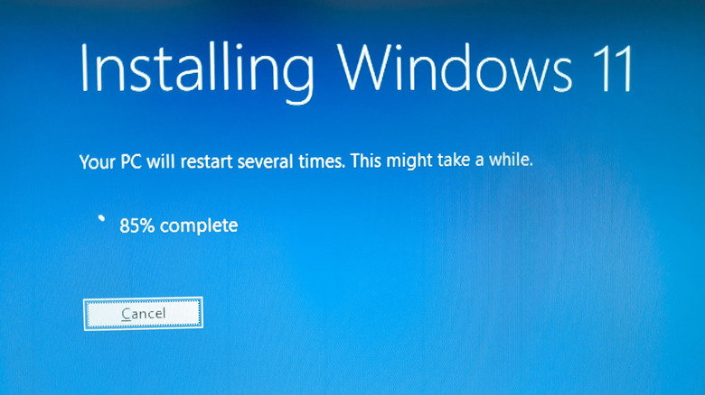

Instalar Windows 11 en un equipo nuevo o reinstalarlo en uno antiguo exige casi siempre lo mismo: un medio de arranque. La **Media Creation Tool** de Microsoft es la vía oficial para prepararlo, porque descarga el sistema y lo escribe en un USB sin que el usuario tenga que buscar archivos sueltos ni herramientas de terceros.

Esta guía explica el proceso completo con la herramienta oficial, cubre qué hacer cuando algo falla y repasa las alternativas más útiles para quien necesite algo más flexible que un único USB de instalación.

## Qué necesitas antes de empezar

Conviene reunir todo lo necesario de antemano para no interrumpir el proceso a mitad de camino:

1. **Un USB de al menos 8 GB.** Todo su contenido se borrará al convertirlo en disco de arranque, así que respalda antes cualquier archivo importante.
2. **Una conexión a internet estable.** La descarga de Windows ocupa varios gigabytes.
3. **Un equipo con procesador de 64 bits (x64).** Para preparar Windows 11 en un dispositivo con arquitectura ARM hay que descargar en su lugar la ISO oficial ARM64 de Microsoft.
4. **Opcionalmente, una licencia válida de Windows 11.** No hace falta licencia para descargar la herramienta: se pedirá durante la configuración del sistema y se puede omitir, aunque eso conlleva limitaciones menores de personalización.

Además, el PC donde se vaya a instalar Windows 11 debe cumplir los requisitos mínimos del sistema. El obstáculo más habitual en equipos antiguos es el **TPM 2.0**. El resto de la lista incluye al menos 4 GB de RAM, 64 GB de almacenamiento y una tarjeta gráfica compatible con DirectX 12 o posterior.

## Cómo usar la Media Creation Tool paso a paso

### 1. Descarga la Media Creation Tool

Entra en la página de descarga de Windows 11 de Microsoft, donde aparecen tres opciones. La primera sirve para instalar Windows 11 en el equipo actual y la última descarga una ISO para usos avanzados. De momento, pulsa **Download Now** bajo el apartado **Create Windows 11 Installation Media**. Se descargará un archivo pequeño llamado **MediaCreationTool.exe**.

### 2. Ejecuta la herramienta como administrador

Haz clic derecho sobre el archivo descargado y elige **Run as administrator**. No conviene saltarse este paso, porque la herramienta no funciona correctamente sin privilegios de administrador. Si se abre con un doble clic normal, debería solicitar esos permisos igualmente, pero es más seguro forzarlo desde el principio. Cuando cargue, lee los términos de licencia y pulsa **Accept** para continuar.

### 3. Selecciona el USB

En la pantalla **Select language and edition**, la casilla **Use the recommended options** ya debería estar marcada con el idioma correcto. Si no es así, desmárcala y cambia lo que haga falta. En la pantalla siguiente, elige **USB flash drive**; si aún no has conectado el dispositivo, este es el momento. Después pulsa **Next** y selecciónalo en la lista.

Comprueba dos veces que has elegido la unidad correcta, porque la herramienta **borrará todo su contenido**.

### 4. Espera a que termine la descarga y la grabación

A partir de aquí, la herramienta descarga Windows 11 y escribe una versión arrancable en el USB. El tiempo que tarde depende de la velocidad de internet, del rendimiento del PC y de la velocidad de escritura del propio USB. Deja que trabaje sin interrupciones.

### 5. Comprueba que el USB está listo

Al terminar, la herramienta confirmará que la unidad está preparada. Pulsa **Finish**.

## Cómo verificar que el USB arranca

Ya puedes usar el USB de arranque en cualquier PC donde quieras instalar el sistema. Conéctalo al equipo de destino y, durante el arranque, pulsa la tecla que permite iniciar desde un dispositivo externo. Según la máquina, puede ser **Esc**, **F12**, **Del** u otra distinta. Elige arrancar desde el USB y sigue el proceso de instalación una vez dentro del entorno de Windows.

## Solución a los problemas más comunes

Aunque la herramienta es sencilla, a veces surgen contratiempos. Estos son los dos más frecuentes y sus posibles arreglos.

### La herramienta no reconoce el USB

- Prueba a conectar la unidad en otro puerto USB y asegúrate de que esté bien insertada.
- Abre el Explorador de archivos, ve a **This PC** y haz clic derecho sobre el USB. Selecciona **Format** y formatea la unidad con la opción **FAT32** en **File system**.
- Haz clic derecho sobre el **botón Start** y elige **Disk Management**. Comprueba que la unidad aparece ahí con una letra asignada. Si figura como no asignada, haz clic derecho sobre el espacio vacío, crea un **New Simple Volume** y asígnale una letra.

Después de uno o varios de estos arreglos, vuelve a ejecutar la Media Creation Tool. Si sigue sin funcionar, prueba con otro USB.

### La herramienta no se abre

Hay que ejecutarla como administrador: haz clic derecho sobre el archivo **.exe** descargado y elige **Run as administrator**. Si aun así no se abre, comprueba que el antivirus u otros procesos en segundo plano, como Windows Update, no estén interfiriendo. Reinicia el PC e inténtalo de nuevo.

También puede ocurrir que el propio ejecutable esté incompleto o dañado. En ese caso, bórralo y descárgalo de nuevo.

## Alternativas: crear el USB sin la Media Creation Tool

Si prefieres no usar la herramienta de Microsoft o no puedes, la tercera opción de la página de descarga permite bajar directamente la **ISO de Windows 11** y crear el disco de arranque con utilidades de terceros. Ese mismo archivo ISO también sirve, de paso, para montar una máquina virtual.

**Rufus** es una buena opción para esta tarea: es gratuito, ligero y facilita la creación de USB de arranque a partir de archivos ISO. Funciona en Windows 8 y versiones posteriores, y es una aplicación portátil, así que no requiere instalación. Incluso incorpora una opción para descargar la última ISO desde Microsoft sin tener que buscarla a mano. Se comporta de forma parecida a la Media Creation Tool, pero ofrece más control sobre los esquemas de partición y las opciones de sistema de archivos; en la mayoría de los casos, los ajustes predeterminados son suficientes.

**Ventoy** es otra alternativa, todavía más versátil: en lugar de grabar una única ISO en el USB, convierte la unidad en un menú de arranque con varias opciones. Se instala una vez en el USB y luego basta con arrastrar y soltar archivos ISO —desde Windows 11 hasta Linux— sobre él. Resulta mucho más cómodo tener una sola unidad de gran capacidad con todas las imágenes necesarias que ir acumulando dispositivos para cada sistema operativo.

Como contrapartida, es una herramienta más compleja: la configuración inicial exige más pasos que Rufus y gestionar varios sistemas de arranque es más complicado que una instalación puntual. Para crear un único USB de Windows 11, Rufus es más sencillo; Ventoy tiene más sentido para usuarios avanzados que manejan varias imágenes de sistemas operativos.

## Advertencias y limitaciones

- La Media Creation Tool **borra por completo** la unidad elegida. Verifica dos veces que has seleccionado el USB correcto y no un disco con datos.
- El proceso puede alargarse bastante en conexiones lentas o con memorias USB antiguas; interrumpirlo obliga a empezar de nuevo.
- Sin licencia válida podrás instalar y usar Windows 11, pero con limitaciones de personalización.
- En equipos cuya placa no tenga TPM 2.0 o no cumpla el resto de requisitos mínimos, la instalación puede no ser posible sin soluciones alternativas.
