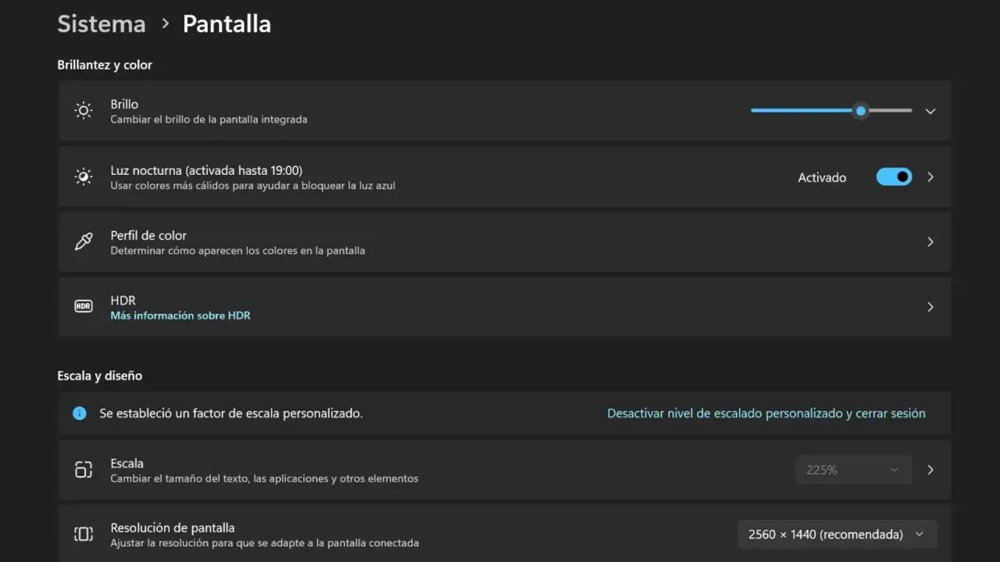
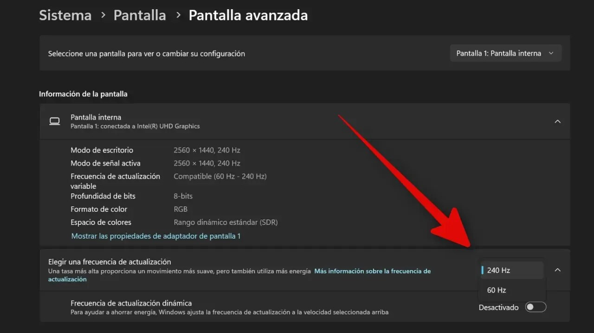

Las pantallas de alta frecuencia de actualización son uno de los atractivos de los
portátiles con Windows 11: a 120, 144 o 240 Hz el cursor, el desplazamiento por la web y
los juegos se perciben más suaves. La contrapartida es que esa fluidez no es gratuita y,
en un equipo que funciona con batería, se paga en autonomía. ComputerHoy señala un ajuste
poco visible de Windows 11 —la frecuencia de actualización del panel— que conviene revisar
si se busca alargar el tiempo de uso lejos del cargador.

## Por qué la frecuencia de actualización gasta batería

Pocos componentes de un portátil despilfarran tanta energía como el panel, y la
frecuencia de actualización decide cuántas veces por segundo hay que repintarlo. Cada
refresco adicional es trabajo extra para la pantalla, y ese trabajo se traduce en vatios:
irrelevante con el equipo enchufado, pero decisivo cuando la única fuente de energía es la
batería.

Para dimensionar el orden de magnitud, ComputerHoy reproduce una lista de potencias
recopilada por [*KTCplay*](https://us.ktcplay.com/blogs/support-tips/high-refresh-gaming-monitor-power-consumption)
para pantallas según su tasa de refresco:

- **60 Hz:** entre 25 y 30 W.
- **120 Hz:** entre 28 y 32 W.
- **144 Hz:** entre 30 y 34 W.
- **180 Hz:** entre 32 y 36 W.
- **240 Hz:** entre 35 y 40 W.

Son cifras de referencia para monitores, no una medición de un portátil concreto, pero la
horquilla sirve para dimensionar la diferencia: según el cálculo de la fuente, pasar de
240 Hz a 60 Hz deja unos 10 o 15 W menos en el panel, equivalente a entre 10 y 15 Wh menos
por cada hora de uso. La fuente relaciona este ajuste también con la gráfica, que deja de
dibujar más imágenes de las que la pantalla puede enseñar.

## Cómo cambiar la frecuencia de actualización en Windows 11

De fábrica, la mayoría de portátiles llegan con la tasa más alta activada y ahí se quedan
durante toda la vida del equipo, sin importar que la tarea sea redactar un documento,
contestar un correo o leer la prensa en la web. Cambiarla no exige instalar nada: basta con
abrir *Configuración > Sistema > Pantalla*, bajarse hasta *Pantalla avanzada* y localizar
la opción *Elegir una frecuencia de actualización*. En ese desplegable aparecen los valores
que admite el panel; para priorizar la batería conviene quedarse con el más bajo y subirlo
solo cuando la fluidez importe.

## La frecuencia dinámica, la opción que se adapta sola

Si el equipo es compatible, Windows 11 ofrece una salida más cómoda: la **frecuencia de
actualización dinámica** (*Dynamic Refresh Rate* o DRR), que sube y baja la tasa de forma
automática según la tarea en curso. En la captura anterior aparece como *Frecuencia de
actualización dinámica*, con el aviso de que Windows ajusta la tasa «para ayudar a ahorrar
energía»; en ese equipo figura desactivada, así que hay que activarla a mano.

La recomendación de la fuente es sencilla y aplicable a cualquier portátil de alta tasa:
reservar la tasa máxima para cuando la fluidez de verdad se nota y bajarla cuando manda la
autonomía, igual que se hace con el brillo. Es un cambio de un minuto que, en un
equipo de 120 Hz o más, puede notarse en la tarde de trabajo. De hecho, Windows 11 sigue
ensayando ajustes de pantalla, como su [modo oscuro automático](/noticias/windows-11-auto-dark-mode/).
