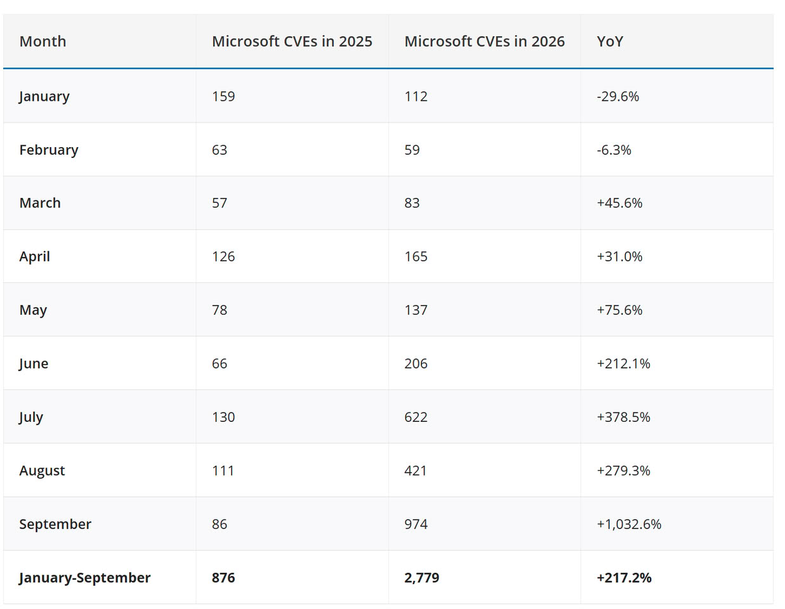

Microsoft ha publicado una actualización fuera de ciclo para Windows 11, la **KB5129195**, que se descarga de forma automática en todos los equipos. Es un parche acumulativo y obligatorio que llega para contener los daños causados por la actualización de septiembre (**KB5124008**), distribuida el 8 de septiembre, y que según el seguimiento de Windows Latest dejó varios frentes abiertos. El objetivo es cerrar cuanto antes los fallos más urgentes; lo que no hace, y conviene aclararlo desde el principio, es resolver los cuelgues asociados a las GPU AMD de la familia Radeon ni los fallos del Explorador de archivos.

## Qué arregla el parche KB5129195

La actualización avanza Windows 11 25H2 hasta la compilación 26200.9457 y Windows 11 24H2 hasta la 26100.9457, y tarda alrededor de diez minutos en descargarse e instalarse. Entre sus correcciones figuran:

- **CVE-2026-62721**: una vulnerabilidad de elevación de privilegios en el servicio User-Mode Power Service (UMPS). La actualización inicial no cerraba el problema por completo, y esta entrega completa el arreglo.
- **Escritorio remoto**: los fallos de Remote Desktop Services que impedían establecer conexión o superar la pantalla de configuración quedan resueltos.
- **Audio multicanal**: se restablecen los modos de 8 canales y de audio 3D que dejaron de funcionar tras el parche de septiembre.
- **Aplicaciones con máquinas virtuales Linux gestionadas por HCS**: vuelve a funcionar el uso compartido de carpetas del sistema anfitrión mediante Plan9, un fallo que durante días afectó a herramientas como Claude Cowork.

## Lo que sigue roto

El frente que más interesa a los usuarios de tarjetas gráficas es precisamente el que no se ha tocado: la actualización de emergencia **no incluye ningún arreglo para las GPU AMD**. Desde la llegada de la KB5124008, los usuarios de Radeon han reportado pantallas en negro, congelaciones del sistema —incluso sin estar jugando—, errores de tiempo de espera del controlador y pérdida total de la señal de vídeo. Los informes recogidos mencionan modelos como la RX 6600, RX 7700 XT, RX 7800 XT, RX 7900 GRE, RX 7900 XTX e incluso la RX 9070 XT, de modo que el problema no se limita a una sola generación. Volver a versiones anteriores de los controladores tampoco parece marcar la diferencia.

El Explorador de archivos continúa fallando al iniciarse o cerrándose a los pocos segundos de iniciar sesión, lo que en el peor de los casos deja el equipo en una pantalla negra sin escritorio ni barra de tareas. Los reportes se concentran en entornos empresariales que usan Citrix UPM, FSLogix, Horizon o ProfileUnity ProfileDisks, y afectan tanto a Windows 11 24H2 como a 25H2. Reiniciar `explorer.exe` desde el Administrador de tareas sirve como solución provisional.

A esto se suma el Historial de archivos, la herramienta de copias de seguridad heredada del sistema, que ha dejado de detectar las unidades externas conectadas y, por tanto, no puede restaurar versiones anteriores de los archivos.

La corrección del audio es solo parcial. El parche repara los modos multicanal, pero hay equipos que siguen sin reproducir sonido alguno, con el volumen al 100 % y sin que la página de sonido de Configuración responda: se cierra sola antes de poder ajustar nada. En el Administrador de dispositivos el hardware aparece con el mensaje "Este dispositivo no puede iniciarse (Código 10)". Los afectados son dispositivos USB, y también se han reportado micrófonos que no funcionan. Como medida temporal, cambiar a auriculares Bluetooth es la salida más sencilla mientras Microsoft publica un arreglo.

## Por qué importa: parchear más deprisa también rompe más

Windows Latest sostiene que el origen de esta avalancha de fallos está en el volumen de correcciones de seguridad. Su recuento sitúa en 611 las vulnerabilidades únicas corregidas por la actualización de septiembre para Windows 11 24H2 y 25H2; la cifra sube a 723 si se cuenta toda la familia Windows y a 974 si se incluyen el resto de productos de Microsoft. La comparación interanual es elocuente: en septiembre de 2025 se corrigieron 86 vulnerabilidades, frente a las 974 de 2026.

La explicación que maneja el medio es que Microsoft está empleando modelos de inteligencia artificial propios para localizar fallos de seguridad a un ritmo imposible de igualar a mano. El resultado es paradójico: el sistema es más seguro en teoría, pero cada tanda de parches introduce nuevas regresiones. Un empleado de Microsoft llegó a pedir públicamente volcados de memoria a los usuarios afectados por los cuelgues del Explorador de archivos para localizar la causa raíz.

## Qué puede comprobar el usuario

Para saber si la actualización de emergencia ya está aplicada, basta con abrir **Configuración > Sistema > Acerca de** y revisar la compilación del sistema: 26200.9457 en Windows 11 25H2 o 26100.9457 en 24H2. En el caso de las tarjetas Radeon, no queda otra que esperar a que Microsoft y AMD publiquen una solución conjunta, porque instalar controladores más antiguos no ha resuelto los bloqueos. Quien tenga el Explorador de archivos caído puede recuperar el escritorio reiniciando `explorer.exe` desde el Administrador de tareas, y quien siga sin audio puede tirar de Bluetooth de forma provisional. El Historial de archivos, en cambio, sigue sin alternativa oficial para los usuarios afectados.
