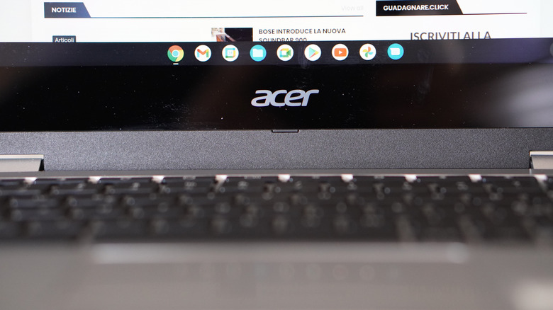

Tarde o temprano, un equipo deja de recibir parches de seguridad. Windows 10 alcanzó el final de su ciclo en octubre de 2025 —con actualizaciones de seguridad extendidas disponibles hasta octubre de 2027— y los Mac con procesador Intel también verán reducido su soporte cuando macOS 27 deje de admitirlos. Perder actualizaciones no significa que el hardware esté acabado: un sistema operativo ligero como ChromeOS Flex puede devolverle utilidad a una máquina que ya parece lenta, porque exige menos recursos que Windows y suele ofrecer una experiencia más fluida en equipos modestos.

ChromeOS Flex es la vía oficial de Google para instalar ese sistema en hardware propio, sin comprar un Chromebook. El proceso ronda la hora y, en muchos casos, no requiere más que un USB y un ordenador con Chrome. Esta guía reproduce los pasos publicados por Engadget para quien quiera alargar la vida de un PC antiguo.

## Requisitos previos

- Un equipo con CPU Intel o AMD, al menos **4 GB de RAM** y **16 GB de almacenamiento**. La antigüedad también importa: los procesadores de 2012 o anteriores no admiten las versiones más recientes de ChromeOS.
- Una **memoria USB de 8 GB o más**. Todo su contenido se borrará durante el proceso, así que conviene respaldarlo antes.
- Un ordenador en funcionamiento con **Chrome instalado** para crear el medio de instalación. Puede ser el mismo equipo que se va a convertir, siempre que todavía funcione.
- Una **copia de seguridad** completa del equipo de destino: la instalación borra todo su contenido.

## Paso 1: preparar el USB con ChromeOS Flex

1. Abre Chrome e instala la extensión **Chromebook Recovery Utility**.
2. Inserta la memoria USB en un puerto y abre la utilidad desde el botón **Extensiones** —el icono con forma de pieza de puzle— situado en la esquina superior derecha de Chrome.
3. Pulsa **Get started**, selecciona **Google ChromeOS Flex** en los menús desplegables de la página siguiente y continúa con **Continue**.
4. Elige tu unidad USB en la lista y pon en marcha el proceso. Espera a que la utilidad termine de preparar la memoria.

## Paso 2: arrancar el equipo desde el USB

1. Inserta la memoria ya preparada en el equipo donde quieres instalar ChromeOS Flex.
2. Enciende o reinicia la máquina y pulsa repetidamente una tecla como **F10**, **F12** o **Del** para entrar en el menú de arranque. Si no sabes cuál corresponde a tu modelo, búscalo en internet o revisa el manual.
3. Si aparece la pantalla de carga de Windows, reinicia e intenta pulsar la tecla antes. Puede hacer falta más de un intento.
4. En el menú de arranque, selecciona la memoria USB —puede figurar como **USB: ChromeOS Flex**— y espera a que cargue.

## Paso 3: probar o instalar el sistema

Al arrancar desde el USB se abre un asistente de configuración que permite **instalar** el sistema o **probarlo** sin más. La opción de prueba no conserva los datos entre reinicios, así que no está pensada para un uso prolongado, pero resulta útil para comprobar que todo funciona bien con tu hardware antes de dar el paso definitivo.

Cuando decidas instalar, ten presente que la operación **borrará todo el contenido del ordenador**. Tras elegir **Install ChromeOS Flex** y completarse la instalación, retira la memoria USB y reinicia el equipo para empezar a usar el sistema.

## Cómo verificar que funcionó

Reinicia sin la memoria USB conectada. Si el equipo arranca directamente en ChromeOS y muestra la pantalla de inicio de sesión de Google en lugar del escritorio de Windows, la instalación se completó correctamente. Si arrancaste en modo de prueba, en cambio, verás que los cambios no se conservan tras cada reinicio: esa es la señal de que aún no has instalado el sistema en el disco.

## Limitaciones y advertencias

Conviene conocer los límites antes de decidir. El más importante es que **no puedes arrancar Windows y ChromeOS Flex a la vez de forma oficial**: el doble arranque no está soportado. Existe el truco de dejar ChromeOS Flex en una memoria USB y arrancar desde ella, manteniendo Windows intacto en el disco principal, pero el rendimiento se resiente de forma notable.

El soporte tampoco es eterno. La fecha de fin de soporte depende de la configuración concreta de cada equipo, y Google mantiene una lista de modelos certificados para ChromeOS Flex con sus ventanas de soporte definidas. Que un equipo no figure en esa lista no lo descarta: según la experiencia del autor, el hardware no certificado puede funcionar igual de bien.

Hay además carencias de funcionalidad que se notan en el día a día:

- **Sin autenticación biométrica**, y ni siquiera es posible configurar un PIN para iniciar sesión al arrancar. Esas funciones dependen del hardware de seguridad dedicado de un Chromebook nativo, y ChromeOS Flex no las aprovecha aunque el PC las incorpore.
- **Sin Google Play Store**. La instalación tampoco incluye la máquina virtual de Android, así que no se pueden instalar aplicaciones Android ni cargarlas manualmente. En función del hardware puede activarse el soporte de Linux, pero las aplicaciones habría que instalarlas desde la línea de comandos.
- Google publica una [página de soporte](https://support.google.com/chromeosflex/answer/11542901) con todas las diferencias entre un Chromebook completo y una instalación de ChromeOS Flex.

Aun con esas limitaciones, ChromeOS Flex es un sistema ligero con un navegador eficaz y poco más, y precisamente por eso encaja en un PC antiguo que todavía funcione. Instalar Linux sigue siendo otra alternativa, y a menudo una con más recorrido, pero ChromeOS Flex requiere bastantes menos complicaciones. Para quien ya haya reciclado un portátil como [servidor doméstico](/noticias/old-laptop-home-server/), esta opción cubre el caso opuesto: devolver a un equipo retirado un escritorio sencillo y mantenido.
