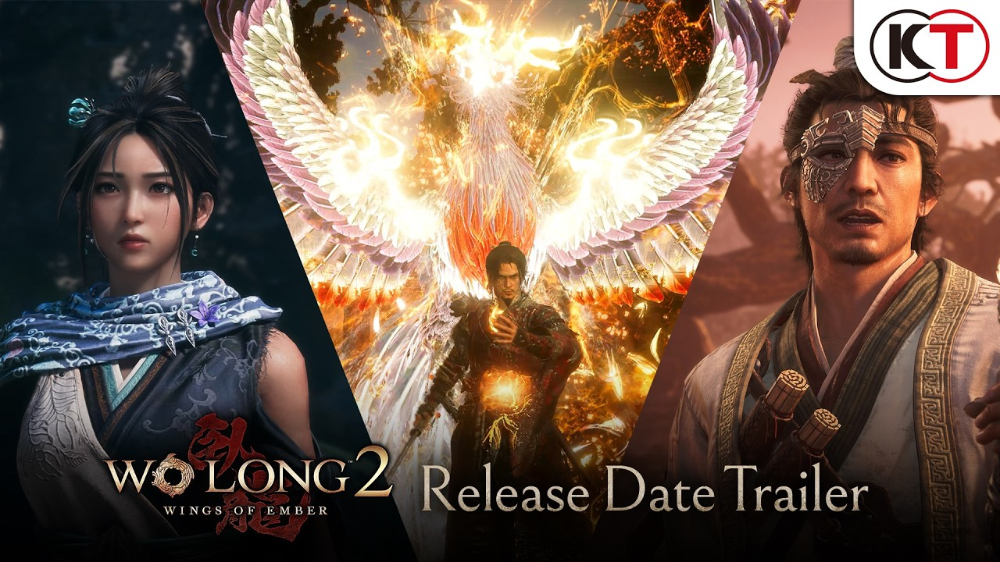
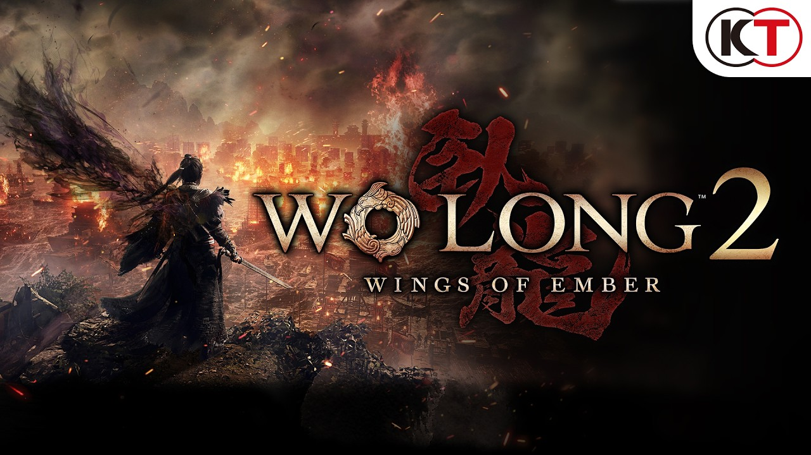
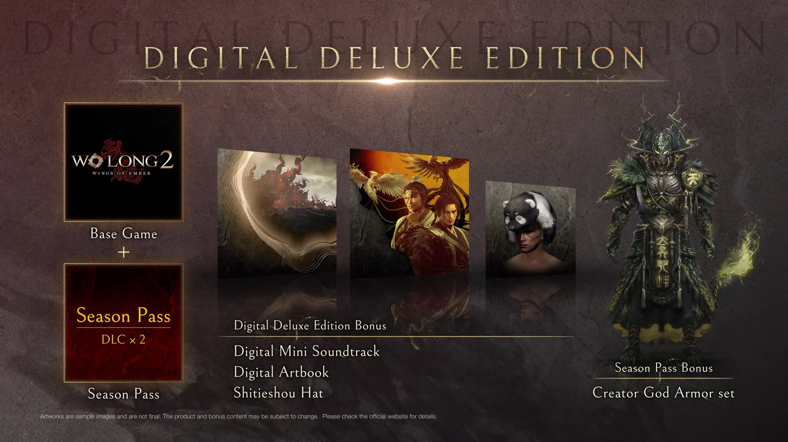

Koei Tecmo y el estudio Team Ninja pusieron fecha a *Wo Long 2: Wings of Ember*: el soulslike ambientado en la China de los Tres Reinos llegará **el 4 de marzo de 2027** en Xbox Series X|S, PlayStation 5, Nintendo Switch 2, Xbox en PC y Steam. La compañía acompañó el anuncio con un tráiler de fecha de lanzamiento y la apertura de las reservas.

La noticia más relevante para quien quiera probarlo antes de comprar es que ya está disponible una **demo Alfa gratuita**, publicada el mismo día del anuncio y jugable hasta el 30 de septiembre de 2026.

## Las plataformas confirmadas y lo que queda fuera

El lanzamiento está previsto, por ahora, en cinco sistemas: las consolas Xbox Series X|S, PlayStation 5 y Nintendo Switch 2, además de las versiones para PC en la tienda de Xbox y en Steam. El estudio también confirmó que el juego estará disponible **desde el primer día en Xbox Game Pass**, lo que permite jugarlo por suscripción sin comprarlo por separado en consolas Xbox y en PC.

La demo Alfa, en cambio, no llega a todas partes. Se puede descargar en Xbox Series X|S, PlayStation 5, Xbox en PC y Steam, pero **queda excluida de Nintendo Switch 2 y de Xbox Cloud**. Es decir, que quien piense jugarla en la futura consola híbrida de Nintendo o mediante streaming tendrá que esperar al lanzamiento completo o a otra prueba posterior.

## Una demo Alfa gratis, pero con reloj

La prueba no es una versión de lanzamiento, sino un adelanto alfa: incluye un sistema de creación de personaje que todavía está en desarrollo y **multijugador en línea para hasta tres jugadores**. El contenido se centra en el campo abierto de Changban, donde el jugador se une al ejército de Liu Bei para frenar el avance de las fuerzas de Cao Cao, con demonios inspirados en clásicos de la literatura china como telón de fondo.

Hay un incentivo concreto para completarla: quien la termine recibirá el **Casco del Fénix Novato (Fledgling Phoenix Helmet)**, un objeto cosmético que podrá utilizar en el juego completo cuando salga en marzo de 2027. Koei Tecmo también lanzará una encuesta al finalizar para recoger impresiones.

## Qué cambia para el lector hispanohablante

Más allá de la fecha y la demo, hay dos detalles que afectan directamente a quien juega en español. Por un lado, el juego incluirá **voces en japonés e inglés con textos en inglés, francés, italiano, alemán y español**, de modo que la interfaz y los diálogos escritos sí estarán localizados. Por otro, la presencia en Xbox Game Pass desde el primer día rebaja la barrera de entrada en consolas y PC, sobre todo si ya se paga la suscripción.

Las reservas ya están abiertas en dos formatos digitales. La edición estándar incluye solo el juego base, mientras que la **Digital Deluxe Edition** añade el pase de temporada —con dos expansiones de contenido aún sin fecha confirmada— y un conjunto de armadura de bonificación, además de un libro de arte digital, una minibanda sonora digital y un sombrero exclusivo. También hay ediciones físicas disponibles para reservar.

Conviene recordar que *Wings of Ember* es la secuela de *Wo Long: Fallen Dynasty* y mantiene el enfoque de acción exigente del original, con nuevas habilidades para esquivar ataques enemigos y aprovechar el terreno. La escena se sitúa en el año 208 d. C., después de los acontecimientos de la primera entrega, y lleva la acción a escenarios abiertos que recrean batallas conocidas de la era de los Tres Reinos.
