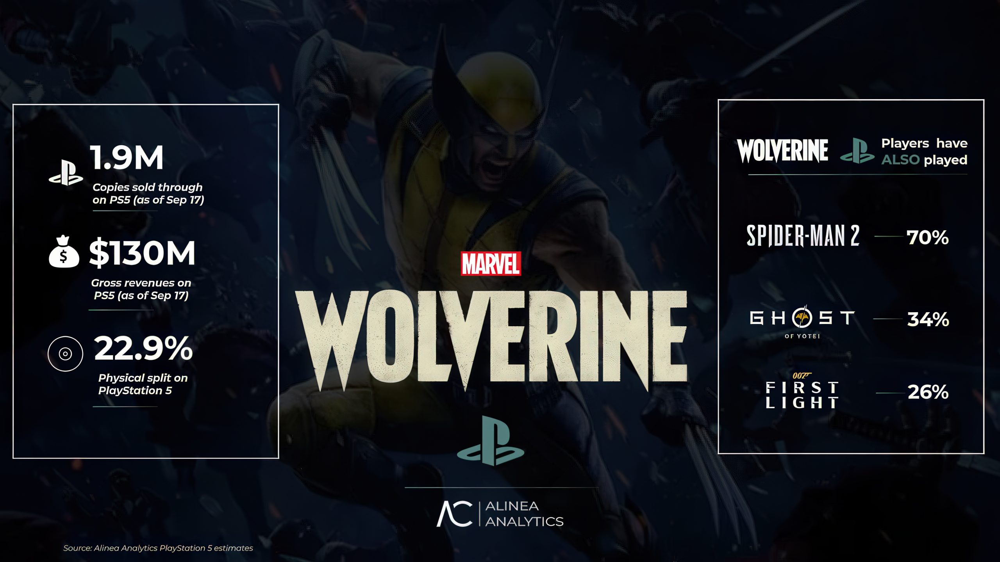
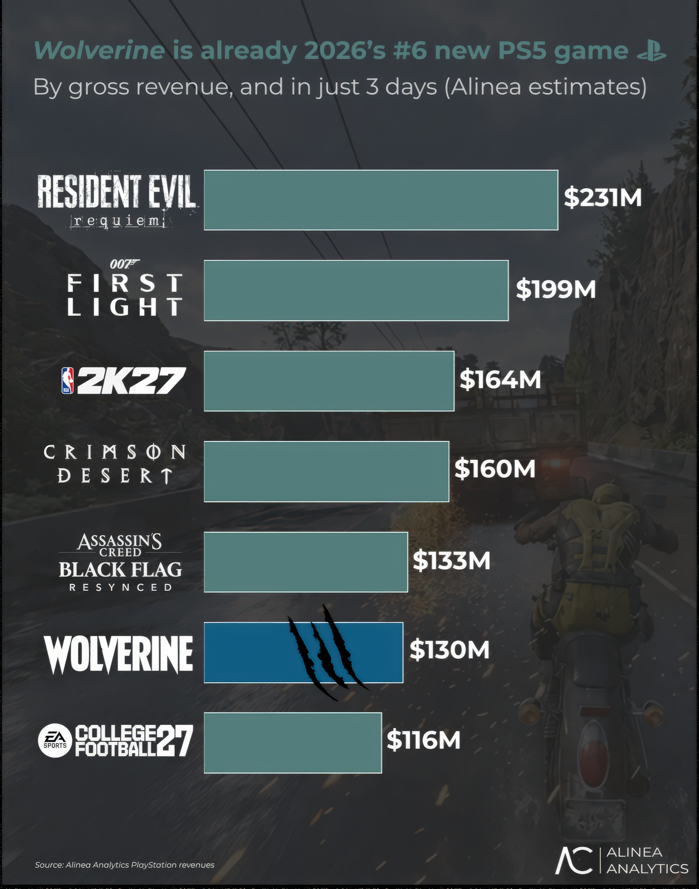
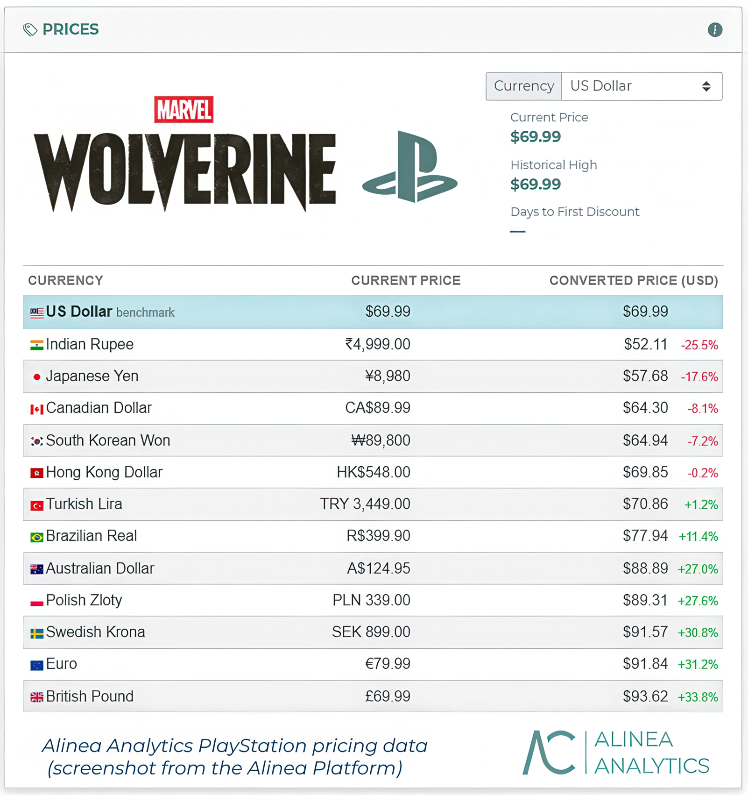

El desempeño comercial de **Marvel's Wolverine** empieza a dejar cifras concretas. Según los primeros cálculos publicados por **Alinea Analytics**, el título de **Insomniac Games** vendió **1,9 millones de copias** en sus **tres primeros días** en el mercado y generó unos **130 millones de dólares** en ingresos. De ese total, **1 millón corresponden a reservas digitales** previas al lanzamiento, y el **22,9 % de la facturación procede de ventas físicas**, una proporción alta para un lanzamiento de 2026.

La firma de seguimiento de mercado —que dirige el analista **Rhys Elliott**— publicó estas estimaciones en su boletín, y el medio especializado Wccftech se hizo eco de ellas. Conviene subrayar el origen: **son estimaciones de un tercero**, no cifras oficiales de Sony ni de Insomniac.

## Un arranque por delante de casi todos los exclusivos de PS5

El dato más llamativo es la comparación con otros exclusivos de consola de **PlayStation 5** medidos en el mismo tramo de tres días desde su lanzamiento. Según Alinea, Wolverine solo queda por detrás de **Marvel's Spider-Man 2**, también de Insomniac, que casi duplicó su rendimiento con unos **250 millones de dólares** en el mismo periodo.

El resto de la lista aparece bastante más atrás:

| Exclusivo de PS5 | Ingresos a tres días | Diferencia frente a Wolverine |
| --- | --- | --- |
| Ghost of Yōtei | 121,9 M$ | −6,3 % |
| Death Stranding 2 | 51,7 M$ | −60,3 % |
| Astro Bot | 34,6 M$ | −73,3 % |
| Stellar Blade | 32,7 M$ | −74,9 % |
| Rise of the Ronin | 25,7 M$ | −80,3 % |
| Helldivers 2 | 18,9 M$ | −85,5 % |

En cifras acumuladas, apunta Alinea, Wolverine ya habría rebasado la **recaudación total de Death Stranding 2 en PS5** (129 millones de dólares y 1,8 millones de copias a lo largo de toda su vida en la consola) y se habría convertido en el **nuevo juego de PlayStation Studios con mejor rendimiento en PS5 en lo que va de año**. Con solo tres días en las tiendas, figura además en el **sexto puesto por ingresos entre los lanzamientos de PS5 de 2026**.

## Estimaciones, copias vendidas y el matiz de la ventana temporal

Hay que leer estas cifras con dos precauciones. La primera es metodológica: Alinea trabaja con datos de **ventas netas al consumidor** (*sell-through*), es decir, copias que ya están en manos de los jugadores, y **no incluye el inventario no vendido en tiendas**. Los fabricantes suelen comunicar cifras de *sell-in* (unidades distribuidas a las tiendas), que tienden a inflar el número. La segunda es temporal: se trata del arranque, no del recorrido completo.

Sobre el recorrido habla la propia Alinea, que apunta que el juego seguirá vendiendo, aunque probablemente no al ritmo excepcional de Marvel's Spider-Man. La firma atribuye esa cola más corta a una recepción mediática templada —**77 de nota media en Metacritic**, la más baja de Insomniac sin contar contenidos descargables en más de una década— y a la polémica generada en redes. Su lectura es que buena parte de las compras viene de un público más casual, ajeno a ese debate, que compra por la marca Marvel y no por las notas.

## Dónde se vende y cuánto cuesta

El reparto regional que maneja Alinea se concentra en **Estados Unidos**, que aglutina el **53 % de la base de jugadores**, seguido del **Reino Unido (7 %), Francia (5 %) y Canadá (4 %)**. Son porcentajes de la base jugadora estimada, no de unidades absolutas por país, y dejan fuera a buena parte de los mercados de habla hispana, por lo que no deben leerse como una foto global completa.

El apartado de precios sí resulta ilustrativo para el comprador europeo. Según estos datos, el juego cuesta **70 dólares en Estados Unidos**, pero el equivalente a **93,62 dólares en el Reino Unido (+33,8 %)** y a **91,84 dólares en la eurozona (+31,2 %)**. En Canadá baja hasta los **64,30 dólares (−7,2 %)**. Es decir, quien compra en España paga hoy cerca de un tercio más que un jugador estadounidense por el mismo título.

Con estos números, el caso de Wolverine deja una conclusión poco habitual: un juego con una acogida crítica discreta y una conversación pública hostil puede, aun así, firmar uno de los mejores arranques de la generación en PlayStation 5. Queda por ver si ese tirón inicial se sostiene durante la campaña navideña y con la llegada de los X-Men al universo cinematográfico, los dos vientos a favor que la propia firma de análisis señala como claves para su cola comercial.
