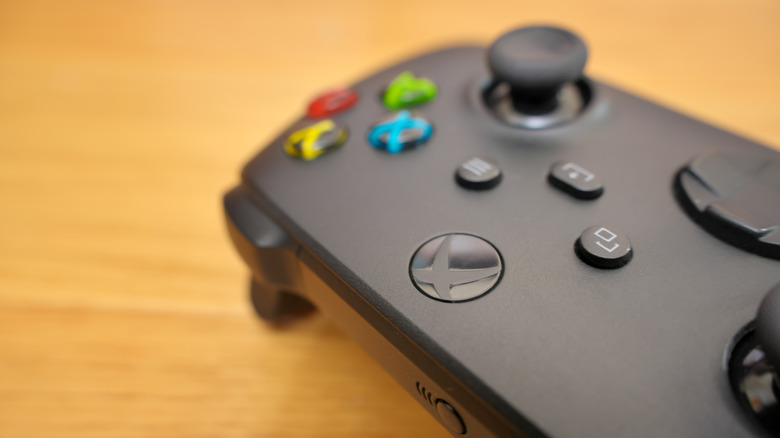
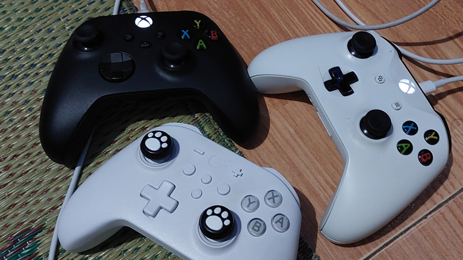
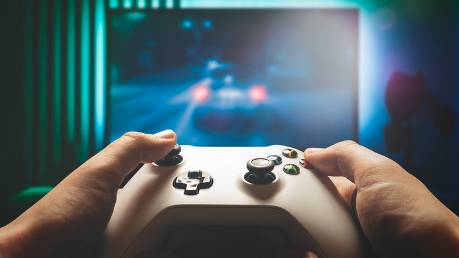
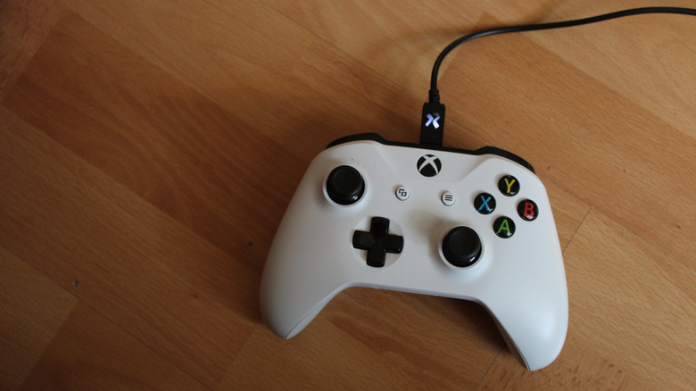

Xbox, como la mayoría de las consolas de las últimas décadas, incluye de serie un mando inalámbrico. La razón es sencilla: la comodidad. Sin embargo, conectar el gamepad por USB sigue teniendo defensores, y no siempre por los motivos que uno imagina. Repasamos los factores que de verdad marcan la diferencia al elegir entre cable e inalámbrico.

## La latencia no es el argumento decisivo que parece

El primer reflejo del jugador competitivo es pensar que el cable ofrece una respuesta más rápida. Los datos que cita Engadget apuntan a lo contrario: Polling Rate Test registra una tasa de sondeo similar en los mandos de Xbox tanto por USB como a través del adaptador inalámbrico oficial, en torno a 125 Hz en ambos casos. Eso equivale a un retardo máximo de unos ocho milisegundos, aproximadamente medio fotograma en un juego a 60 fps, un valor que la mayoría de las personas no percibe.

A ello se suma el Dynamic Latency Input que Microsoft emplea en Xbox Series X y Series S, que envía las pulsaciones más recientes justo antes de que el juego las necesite. La situación cambia al conectar por Bluetooth a un PC, tableta o teléfono: ahí el sondeo añade entre cuatro y ocho milisegundos extra, aunque el resultado depende del entorno, por ejemplo de cuántos dispositivos inalámbricos haya cerca. Si el mando responde con lentitud, probar el cable es un buen diagnóstico, pero conviene recordar que la pantalla y el propio juego también influyen en la sensación final.

## Baterías: la ventaja más clara del cable

Donde el cable gana sin discusión es en la alimentación. Un mando con cable recibe energía por USB, así que no hay pilas que cambiar ni un momento concreto para recargar. Cualquier cable USB de datos adecuado sirve, por lo que resulta práctico tener uno a mano para las emergencias.

Quien prefiera jugar sin cables tendrá que planificarse algo más. Microsoft estima hasta 40 horas de uso con pilas AA en un mando estándar, una cifra que varía según el tipo de pilas y los accesorios conectados, como un auricular o el teclado enchufable. Mantener un par de AA recargables listas para el cambio es un compromiso razonable. La otra opción es la batería recargable oficial, que se coloca donde irían las pilas y se carga con un cable USB-C de 2,7 metros incluido, lo bastante largo para enchufarlo a la consola si la carga se agota a mitad de partida.

## Libertad de movimiento frente a la gestión del cable

La incomodidad del cable depende mucho de dónde se juega. En un escritorio, donde nadie va a pasar por delante, un cable no supone un tropiezo ni un objeto que los niños puedan tirar. En el salón, en cambio, las probabilidades de que se convierta en un obstáculo son mayores: hay que calcular la distancia necesaria para sentarse cómodo y dejar algo de holgura, sin tanta como para que se enrede en los muebles o se quede atrapado al levantarse. Pasar el cable por debajo de una alfombra o junto al rodapié ayuda, aunque no siempre es posible.

El mando inalámbrico elimina todas esas preocupaciones. Basta con sentarse en cualquier punto de la sala desde el que se vea bien la pantalla, y además facilita intercambiar mandos cuando se juega con amigos o familiares.

## Más baratos y sencillos, con matices de compatibilidad

Existen numerosos mandos de terceros con soporte únicamente por cable, de marcas como PowerA o PDP, que tienen sentido como repuesto económico. Su ventaja se acentúa en un gamepad de uso esporádico: no hay que preocuparse por pilas agotadas en un mando que lleva meses guardado y se saca un par de veces al año para jugar a pantalla dividida.

Algunos modelos de terceros incorporan además ajustes sobre el diseño oficial, como botones adicionales en la parte trasera para acciones que normalmente se ejecutan con el pulgar, o joysticks con sensores magnéticos tipo Hall effect en lugar de los convencionales, que pueden acabar desarrollando deriva con el tiempo. La compatibilidad, sin embargo, no está garantizada aunque el diseño imite el de Xbox: conviene comprobarla antes de comprar, porque hay mandos que funcionan de forma inalámbrica en PC pero quedan limitados al USB en la consola.

En resumen, para la mayoría de la gente la latencia inalámbrica de Xbox no resulta perceptible y la comodidad de prescindir de cables pesa más. Si se juega en PC, el cable evita el retardo añadido del Bluetooth. La decisión de fondo es si se prefiere la libertad de movimiento o un mando que no obligue a cambiar pilas, y la única forma de saberlo con certeza es probar cómo encaja un gamepad con cable en cada configuración.
