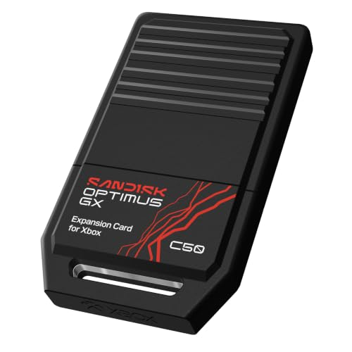
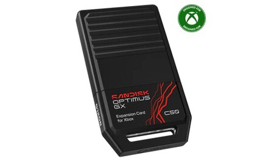

SanDisk ha puesto a la venta sus nuevas tarjetas de expansión Optimus GX C50 para Xbox Series X y Series S, con capacidades de 512 GB, 1 TB y 2 TB. Llegan en un momento en el que ampliar el almacenamiento sale caro en 2026, y lo hacen con unos precios que quedan muy por debajo de las alternativas de Seagate que dominaban hasta ahora este accesorio.

## Precios y capacidades de las SanDisk Optimus GX C50

En la tienda oficial de SanDisk, la Optimus GX C50 de 512 GB cuesta 132,99 euros, la de 1 TB sale por 257,99 euros y la de 2 TB alcanza los 507,99 euros. En Amazon España, según recoge Xataka, el modelo de 1 TB baja hasta los 212,99 euros y el de 2 TB hasta los 299,99 euros, aunque estos precios de mercado pueden variar.

La comparación con la competencia es lo que hace interesantes estas cifras: la tarjeta de 1 TB de Seagate para Xbox Series tiene un precio recomendado de 607,99 euros en su propia tienda, más del doble que la nueva propuesta de SanDisk de la misma capacidad.

## Por qué importan en pleno encarecimiento del almacenamiento

2026 está siendo un año duro para quien quiere ampliar o renovar el hardware: las memorias RAM y las unidades SSD se han encarecido de forma notable, en parte por la demanda que genera el auge de la inteligencia artificial. En ese contexto, que aparezcan nuevas opciones oficiales para consola a precios claramente inferiores a los habituales es una noticia relevante para el lector español que lleva tiempo esperando para ampliar su equipo.

Para los suscriptores de Game Pass, con su amplio catálogo digital, el almacenamiento extra es casi una necesidad, sobre todo en el modelo de 512 GB de Xbox Series S, donde el espacio de serie se agota con pocos juegos instalados.

## Qué cambia para quien tiene una Xbox Series

Estas tarjetas se conectan al puerto de expansión dedicado de Xbox Series X y Series S y se comportan como el almacenamiento interno de la consola: conservan funciones como Quick Resume y los tiempos de carga reducidos de la generación actual. No son unidades USB externas genéricas, sino ampliaciones oficiales que rinden al mismo nivel que el SSD de serie.

Hay dos límites a tener en cuenta: aunque resultan más asequibles que las alternativas, siguen siendo un desembolso considerable en 2026, y solo sirven para las consolas Xbox Series, por lo que no se pueden reutilizar en otras consolas o en el PC. Quienes jueguen sobre todo a títulos ya optimizados para la generación actual, como el [Fallout 76 nativo para Xbox Series](/noticias/fallout-76-xbox-series-native/), son quienes más partido sacarán a este almacenamiento adicional.
