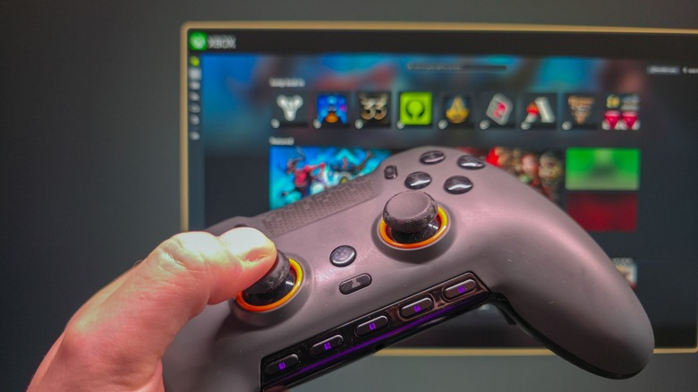
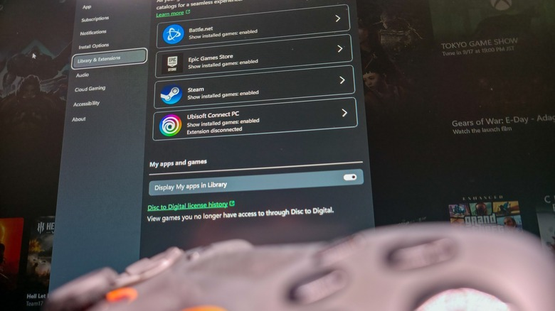

El modo Xbox llegó a Windows 11 para acercar el PC a la experiencia de una consola: al activarlo, Windows deja atrás la barra de tareas y muestra una interfaz a pantalla completa pensada para manejarse con mando, con la aplicación Xbox como centro y las bibliotecas de juegos a mano. Es la respuesta de Microsoft al [modo Big Picture de Steam](/noticias/steam-big-picture-big-art-beta/) y resulta especialmente útil en equipos portátiles y en PCs conectados a un televisor. Esta guía repasa cómo activarlo, las distintas formas de entrar y salir y qué se puede esperar realmente de la función.

## Requisitos previos

- Un PC con Windows 11 actualizado. El modo Xbox empezó a distribuirse en mayo de 2026, así que debería estar disponible si el equipo recibe las actualizaciones con normalidad.
- Un mando conectado al equipo. Según las pruebas de Engadget funcionan los mandos de Xbox, los genéricos de PC y los de PlayStation. Si dudas entre conexión con cable o inalámbrica, aquí tienes una comparativa de [mando de Xbox por cable o sin cables](/noticias/xbox-controller-wired-wireless/).
- Tener abierta la tienda digital que uses habitualmente (Steam, Epic Games, Battle.net, etc.) acelera los pasos posteriores.

## Paso 1: Activa el modo Xbox en Ajustes

El modo Xbox no siempre viene habilitado de fábrica, así que conviene comprobarlo antes de nada:

1. Abre **Configuración** con el atajo **Win + I**.
2. Entra en **Gaming > Xbox mode**.
3. Si aparece el interruptor **Enable Xbox mode**, actívalo.
4. En la sección **Choose home app**, selecciona **Xbox**.
5. Si quieres un acceso más rápido desde el escritorio, activa también **Show Xbox mode in Task View**.
6. Si usas el PC casi en exclusiva para jugar, activa **Enter Xbox mode on startup** para ahorrar tiempo en cada arranque.

## Paso 2: Abre el modo Xbox

Una vez habilitado, hay varias vías para entrar. Cualquiera de ellas sirve:

- El atajo **Win + F11** alterna entre el escritorio y el modo Xbox.
- **Win + G** abre la Game Bar; haz clic en el icono de engranaje de la barra centrada en la parte superior de la pantalla y elige **Enter Xbox mode**.
- Desde la aplicación Xbox, hay un acceso directo en la esquina superior derecha de la pantalla de inicio.
- Si activaste **Show Xbox mode in Task View**, pulsa **Win + Tab** y verás el acceso a **Xbox mode** a la derecha de los escritorios abiertos, en la parte inferior de la pantalla.

## Paso 3: Muévete por el modo Xbox y sal cuando quieras

Con el modo en marcha, el manejo está pensado para no tener que tocar el escritorio. Mientras juegas, pulsar la tecla **Windows** abre una vista de tareas desde la que puedes acceder al escritorio de Windows y a los accesos situados en la parte superior de la pantalla.

Para salir, vuelve a la pantalla de inicio de la aplicación Xbox y pulsa **Exit Xbox mode** en la esquina superior derecha. También puedes usar **Win + F11** otra vez.

## Paso 4: Unifica tus bibliotecas de juegos

El modo Xbox concentra en un mismo lugar los juegos de varias plataformas. Además de los títulos propios de Microsoft, muestra los de Steam, Epic Games, Battle.net, Ubisoft Connect y Humble Launcher. Engadget no probó otros lanzadores como la EA App, así que la cobertura puede variar según la tienda.

Si un título no aparece en la lista, se puede añadir a la aplicación Xbox pulsando el icono **+** situado en la esquina superior derecha de la pestaña **Library**.

Al lanzar un juego desde la aplicación Xbox, esta apunta directamente al ejecutable del título y arranca en segundo plano el software necesario, lo que evita tener que abrir el lanzador correspondiente. Eso sí: en las pruebas de Engadget el proceso no fue el más rápido ni el más fluido. Los juegos arrancaban siempre, pero la recomendación es abrir antes los lanzadores de terceros para acelerar la puesta en marcha.

## Paso 5: Aprovecha Game Pass y el juego en la nube

Si tienes una suscripción a Xbox Game Pass, podrás acceder a su catálogo desde el propio modo Xbox. Y la pestaña **Cloud Gaming** no obliga a quedarse en los servicios de Microsoft: en los ajustes de la aplicación Xbox se puede fijar Nvidia GeForce Now como servicio de transmisión predeterminado.

## Cómo verificar que funciona

Tras pulsar **Win + F11**, la barra de tareas debe desaparecer y dejar paso a la aplicación Xbox a pantalla completa, navegable con el mando. Si además compruebas que el icono **+** de la pestaña **Library** está disponible y que el atajo **Win + F11** vuelve al escritorio, el modo está correctamente configurado.

## Advertencias y limitaciones

- **No mejora el rendimiento.** Es un error común pensar que el modo Xbox trae mejoras internas mientras se juega, pero Microsoft no ha hecho ninguna afirmación en ese sentido. De eso se encarga un interruptor distinto: **Settings > Gaming > Game Mode**, que desactiva procesos en segundo plano para mejorar la experiencia. Conviene activarlo si no lo está.
- **Es, sobre todo, una aplicación Xbox mejorada.** En su forma actual añade mapeo de mando y algunos ajustes extra para no tener que interactuar con Windows, más que un cambio profundo del sistema.
- **Rinde más en unos equipos que en otros.** Resulta más útil en consolas portátiles y en PCs de salón que en un equipo de sobremesa dedicado exclusivamente a jugar.
- **El lanzamiento de juegos puede no ser inmediato.** Abrir antes los lanzadores de terceros ayuda a que el arranque sea más ágil.
