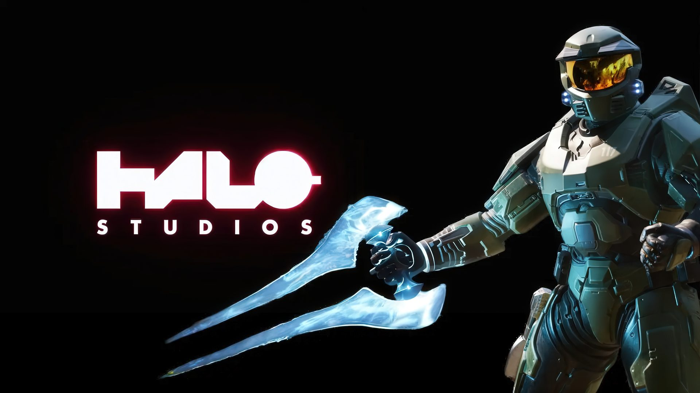
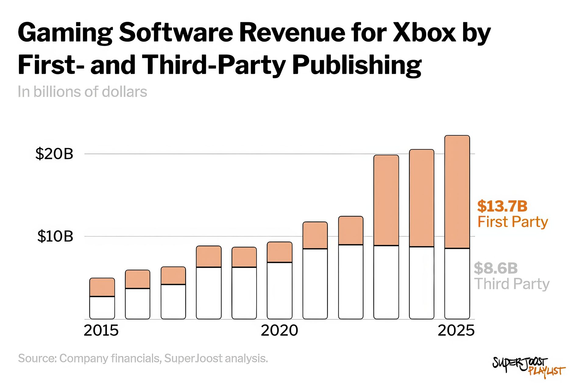

Joost van Dreunen, profesor de la escuela de negocios Stern de la Universidad de Nueva York y fundador de SuperData Research, describe la última reestructuración de Xbox como una «adquisición inversa a cámara lenta». En su boletín SuperJoost Playlist sostiene que las editoras que Microsoft compró por unos 76.500 millones de dólares —ZeniMax en 2020 por 7.500 millones y Activision Blizzard en 2023 por unos 69.000— han terminado por convertirse en las divisiones mejor preparadas para dirigir los estudios y las sagas que la propia Microsoft creó.

El análisis llega tras el anuncio de la reorganización del negocio de videojuegos de Microsoft, comunicada por el director de contenidos Matt Booty junto con 268 despidos adicionales, dentro del recorte de 3.200 puestos previsto para este ejercicio fiscal y en la línea de [los despidos y fusiones de estudios adelantados esta misma semana](/noticias/xbox-layoffs-studio-mergers/).

## El nuevo mapa: Activision se queda con Halo, Bethesda con Obsidian

El reparto confirma la tesis del profesor: las editoras adquiridas no se integran en la estructura de Xbox, sino que los estudios propios de Xbox pasan a depender de ellas.

- **Activision** asume World's Edge (responsable de Age of Empires), Rare (Sea of Thieves) y el desarrollo y la publicación del próximo Halo insignia. Halo Studios queda relegado a dar soporte a los títulos ya publicados.
- **Bethesda** absorbe a Obsidian, que trabaja en un nuevo juego de Fallout en colaboración con Bethesda Game Studios.
- **King** se hace cargo de Microsoft Casual Games, hogar del Solitario y el Buscaminas.
- **Playground y Turn 10**, que ya comparten el motor de Forza, se fusionan en un único estudio.
- **Mojang y Blizzard** son las únicas divisiones que no se ven afectadas por el ajuste.

## Los ingresos de Xbox explican el movimiento

Van Dreunen apoya su lectura en la evolución de los ingresos. El software propio de Xbox se mantuvo por debajo de los 2.000 millones de dólares anuales hasta 2019 y, tras la compra de Activision Blizzard, se disparó hasta los 13.700 millones en 2025, por encima de los ingresos de terceros. El contenido propio representa ya el 61 % de los ingresos de software de juegos de Xbox, más del doble que el 29 % de Sony.

El profesor traza además un paralelismo con Disney: en 2006 compró Pixar y puso a sus directivos al frente de su propio estudio de animación. Su conclusión es que las compras de Microsoft trataban menos de quedarse con sagas que de incorporar talento gestor. Si Activision será el Pixar de Xbox es, admite, algo que solo responderán los lanzamientos de los próximos años.

## Qué cambia para el jugador

A corto plazo, el cambio más simbólico es el de Halo: la saga insignia de Xbox pasa a manos de la maquinaria de Activision, la misma que publica Call of Duty cada año, mientras el estudio creado para custodiarla pierde el protagonismo. Para los aficionados a Fallout, la noticia es más amable: Obsidian, el estudio de Fallout: New Vegas, desarrolla el nuevo Fallout bajo el paraguas de Bethesda, dueña de la licencia.

Conviene leer la pieza con cautela: no es un anuncio oficial de Microsoft, sino el análisis de un académico con datos de ingresos. Pero marca el rumbo de Xbox para esta generación: menos estudios propios dispersos y más franquicias concentradas en las editoras que demostraron saber publicar a tiempo.
