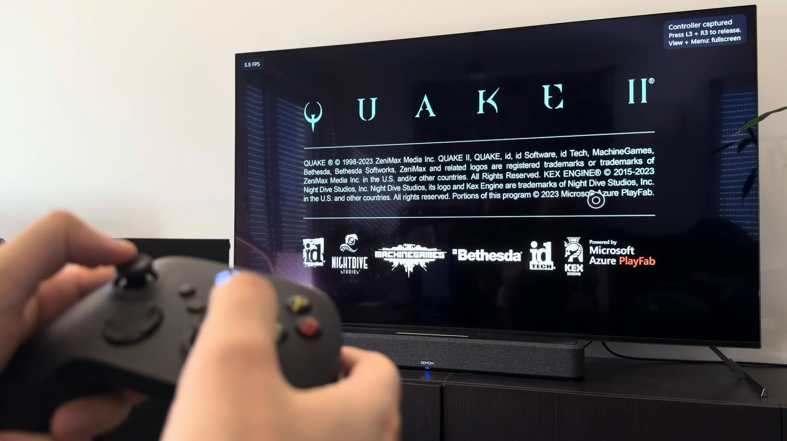
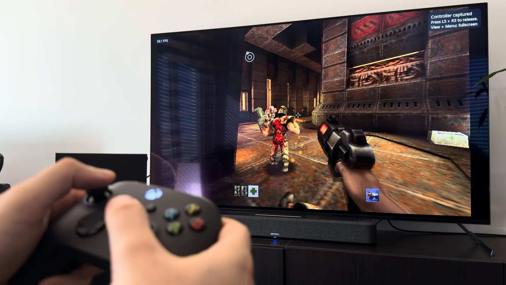

Un desarrollador ha mostrado un emulador de PlayStation 5 en fase experimental ejecutándose sobre una Xbox Series X. Devran Cosmo Uenal publicó el 8 de septiembre un vídeo en YouTube en el que presenta su trabajo como un proyecto de investigación que adapta el emulador de código abierto KytyPS5 a la consola de Microsoft a través del Modo Desarrollador. En la biblioteca de la demo aparecen GEX Trilogy, Hellboy: Web of Wyrd, Marvel Cosmic Invasion y Quake II.

## Un port experimental a través del modo desarrollador

KytyPS5 es un emulador de PS5 de código abierto, escrito en C++ y distribuido bajo licencia GPL v2, derivado de una versión muy modificada del proyecto Kyty. Uenal describe su port como una investigación y no como un producto: la interfaz que se ve en la consola está etiquetada como «PS5X / PlayStation 5 on Xbox».

El obstáculo técnico principal está en el gráfico. El entorno de Xbox no admite Vulkan, la API que KytyPS5 usa para renderizar, de modo que la parte de gráficos debe adaptarse a DirectX. Según el propio autor, eso implica que el avance del proyecto original para PC probablemente no se traslade de forma automática. Uenal también señala que utilizó herramientas de inteligencia artificial, aunque no queda claro qué proporción del código escribieron esas herramientas.

## Quake II y otros tres títulos, con muchas salvedades

El autor afirma que los cuatro juegos de su biblioteca responden al mando, y que en algunos de ellos también funciona el sonido. Sin embargo, la compatibilidad es muy limitada y, en sus propias palabras, queda mucho trabajo por delante. No hay cifras de rendimiento publicadas.

Lo único medible por ahora es lo que se ve en las capturas del vídeo, donde Quake II se mueve aproximadamente entre 25 y 45 FPS, con caídas por debajo de 20 FPS en algunas escenas, sobre todo al arrancar. Los fotogramas de la demo reflejan esa irregularidad: la pantalla de inicio del juego marca 5,9 FPS, mientras que una escena de partida llega a 38,1 FPS. También se aprecia un aumento notable de la latencia de entrada, aunque tampoco hay números que lo respalden.

## Por qué importa (y por qué no promete nada)

Que una consola emule a otra no es nuevo, pero hacerlo entre Xbox Series X y PlayStation 5 es llamativo porque ambas comparten un hardware muy similar. La emulación suele tener un coste de rendimiento elevado, así que mover los juegos más pesados de PS5 por esta vía será un desafío considerable; los títulos más ligeros sí podrían llegar a funcionar.

El contexto del propio KytyPS5 ayuda a calibrar expectativas. El emulador sigue en una fase temprana, aunque avanza rápido: en pocos días pasó de no poder arrancar Demon's Souls Remake a moverlo a 30 FPS, y también logró ejecutar la versión de PS5 de GTA 5 a hasta 60 FPS en un PC de gama alta. Aun así, se trata de otro hardware y de otro tipo de esfuerzo.

## Qué cambia para el jugador

A día de hoy, nada práctico. No hay un método público pensado para el usuario final, la vía pasa por el Modo Desarrollador de Xbox y el material muestra un experimento con muy poca compatibilidad. Es, en esencia, una demostración técnica que sirve para medir el ritmo al que avanza la emulación de PS5, no una forma realista de jugar títulos de PlayStation en una consola de Microsoft.

TechPowerUp dio a conocer el proyecto citando el vídeo de Uenal como origen.
