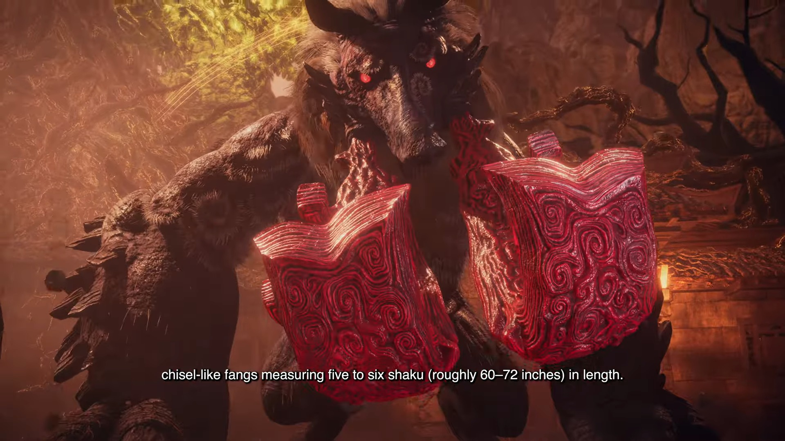

El directo de Xbox en Tokyo Game Show 2026 ya es historia. La retransmisión del **17 de septiembre** sirvió para cerrar el 25.º aniversario de la marca con una avalancha de tráilers: desde pesos pesados como **Call of Duty: Modern Warfare 4** y **Persona 4 Revival** hasta apuestas más pequeñas con soporte de Xbox Play Anywhere. Windows Central ha recopilado todos los anuncios, y esto es lo que efectivamente se mostró, ordenado por fecha de lanzamiento.

## Los estrenos confirmados para 2026

La parte más cercana del calendario se reparte entre octubre y noviembre:

- **Once Human: Isles of Abyss** — la expansión del juego de supervivencia gratuito llega el **22 de octubre de 2026** con exploración marítima y criaturas abisales. Plataformas: Xbox Series X|S, Xbox Game Pass, PlayStation 5 y PC.
- **Call of Duty: Modern Warfare 4** — nuevo tráiler cinemático de su campaña, ambientada en una guerra brutal en la península de Corea. Sale el **23 de octubre de 2026** para Xbox Series X|S, Xbox Cloud Gaming, PlayStation 5, Nintendo Switch 2 y PC.
- **Edge of Memories** — el action-RPG en el que el jugador arriesga convertirse en monstruo mientras combate la corrupción estrena fecha: **5 de noviembre de 2026** en Xbox Series X|S, PlayStation 5 y PC.
- **Hope in the City** — aventura narrativa sobre una adolescente que busca a sus padres desaparecidos. Llega el **10 de noviembre de 2026** a Xbox Series X|S, PC y Xbox Game Pass, con Xbox Play Anywhere.
- **Fallout 76** — el spin-off multijugador de Fallout ya recibió la actualización temática de Halloween **"The Slasher"**, con una casa siniestra y un asesino en serie como amenaza.

## La agenda de 2027 y lo que sigue sin fecha

El grueso de las novedades apunta a 2027, con varias fechas ya cerradas:

- **Persona 4 Revival** — tráiler centrado en Naoto, la detective privada del Persona 4 original. Se estrena el **18 de febrero de 2027** en Xbox Series X|S (con Xbox Play Anywhere), Xbox Cloud Gaming, Xbox Game Pass, PlayStation 5 y PC. En Nintendo Switch 2 llegará algo más tarde, el **20 de mayo de 2027**.
- **Atelier Karia: The Night Kingdom & the Guide of Memories** — nuevo tráiler de Rutger y Lenja, personajes jugables que vienen de Atelier Yumia. Fecha: **25 de febrero de 2027** en Xbox Series X|S, PlayStation 5, Nintendo Switch 2 y PC.
- **Wo Long 2: Wings of Ember** — Koei Tecmo y Team Ninja mostraron un avance con el jefe Zuochi y la nueva mecánica **Insight Skills**, que premia el parry o la esquiva en el último instante. Sale el **4 de marzo de 2027** en Xbox Series X|S (con Xbox Play Anywhere), Xbox Game Pass, PlayStation 5, Nintendo Switch 2 y PC.
- **Gachiakuta: Breakout** — action-RPG con elementos de supervivencia ambientado en el universo del anime Gachiakuta. Previsto para **2027** en Xbox Series X|S, PlayStation 5 y PC.
- **Crazy Taxi: World Tour** — el regreso de la saga de SEGA mostró un nivel ambientado en Japón. **2027** en Xbox Series X|S, PlayStation 5, Nintendo Switch 2 y PC.
- **Bloodstained: The Scarlet Engagement** — secuela de Ritual of the Night (2019) de los creadores de Castlevania: Symphony of the Night. **2027** en Xbox Series X|S, Xbox Cloud Gaming, PlayStation 5 y PC.
- **Faraday Blues** — novela visual y juego de cartas estratégico con **64 finales** repartidos en tres historias. **2027** en Xbox Series X|S, Xbox Cloud Gaming, Xbox Game Pass, PlayStation 5 y PC.

Otros títulos mostrados aún no tienen ventana de lanzamiento. **Shape of Dreams**, un action-roguelike de 2025 en PC, ya está disponible en Xbox Series X|S (con Xbox Play Anywhere), Xbox Cloud Gaming y Xbox Game Pass, con ocho viajeros y cooperativo para cuatro jugadores. Sin fecha quedan **Bloomwalker** (aventura de creación sobre devolver la naturaleza a un mundo contaminado), **Raji: Kaliyuga** (aventura de acción con los hermanos Raji y Darsh) y **Genigods Nezha** (action-RPG inspirado en la mitología china). Todos apuntan a Xbox Series X|S, Xbox Cloud Gaming, Xbox Game Pass, PlayStation 5 y PC.

## El cierre de Kojima: OD y Physint

El directo terminó con Hideo Kojima. El creativo confirmó que el desarrollo de **OD**, su propuesta de terror, avanza sin contratiempos y desveló que el actor sueco **Bill Skarsgård** pondrá voz al protagonista de **Physint**, su juego de acción y sigilo. Ambos títulos llegarán a Xbox y PC en una fecha aún por determinar.

## Por qué importa

La cita sirve para ordenar el calendario de Xbox de aquí a 2027 y confirma una estrategia clara: pocas exclusivas y muchos lanzamientos simultáneos en PlayStation y Nintendo Switch 2, con Xbox Play Anywhere y Game Pass como reclamo. Para el jugador hispanohablante, lo relevante es que la mayoría de estos títulos se podrán jugar en la consola que ya tenga en casa, y varios entrarán directamente en Game Pass. Kojima vuelve a ser el nombre que más ruido genera, aunque esta vez sin fecha ni material de juego, solo con la confirmación de reparto.
